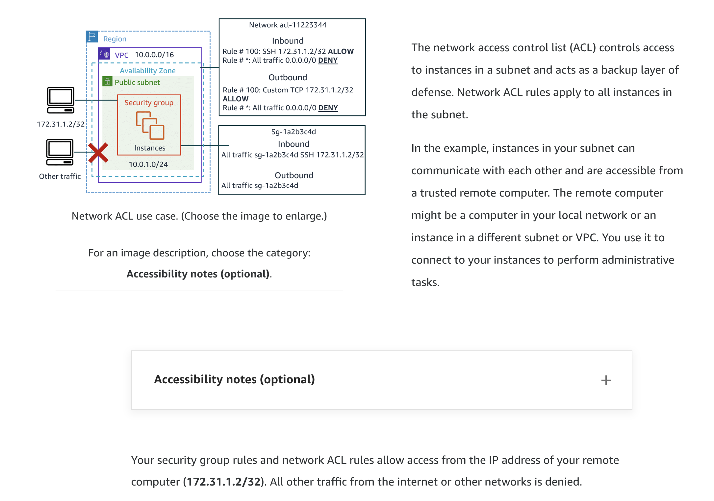
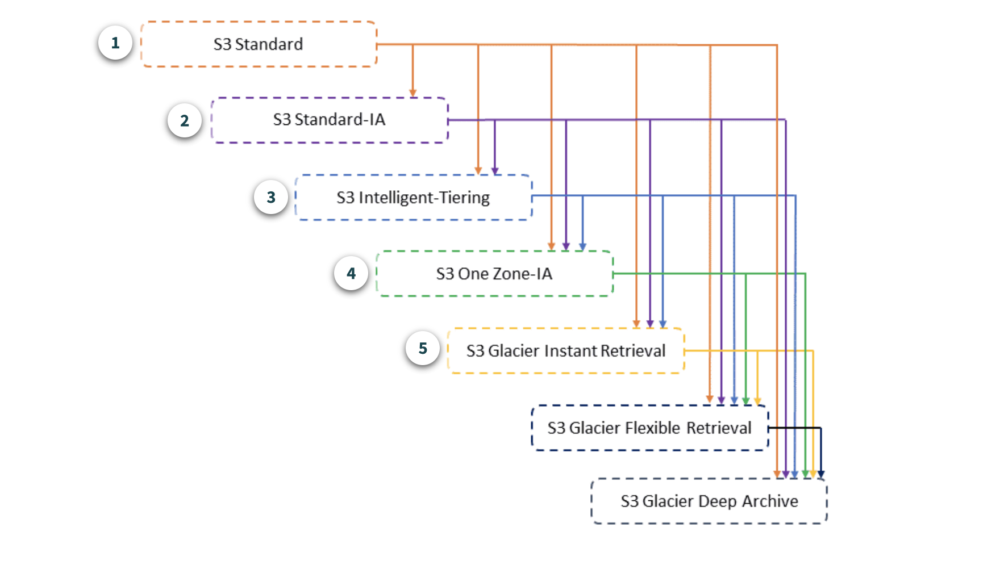
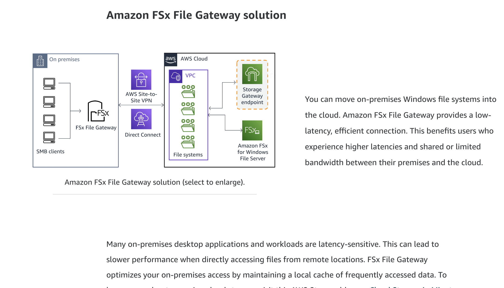
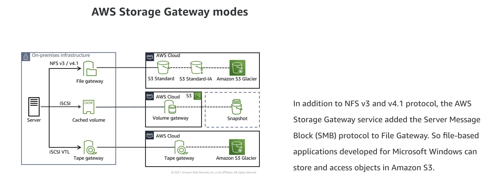
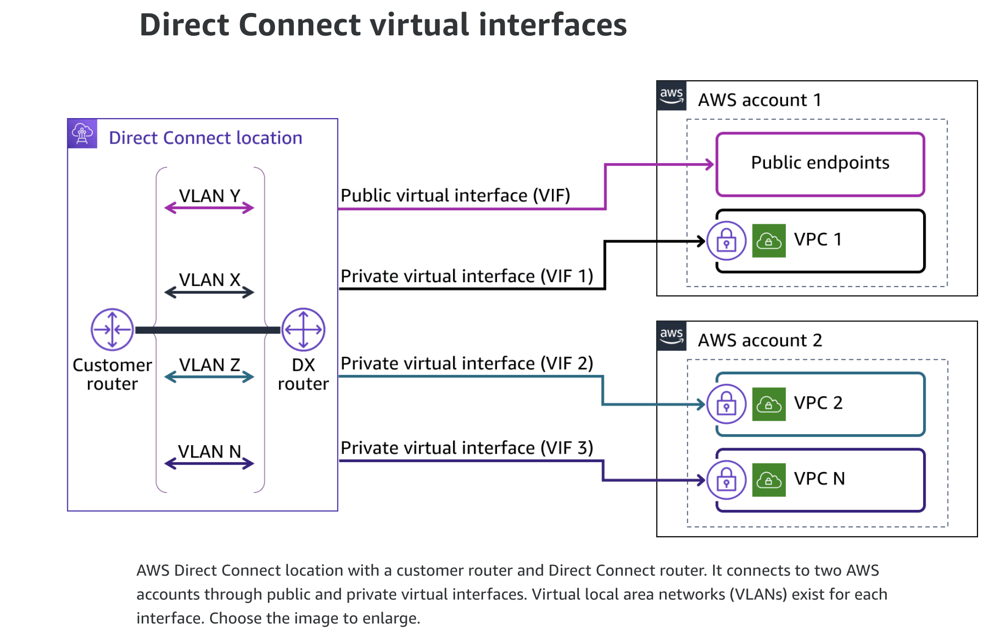

### General AWS

- [AWS Whitepapers & Guides](https://aws.amazon.com/whitepapers/?whitepapers-main.sort-by=item.additionalFields.sortDate&whitepapers-main.sort-order=desc)
- [The Amazon Builders' Library](https://aws.amazon.com/builders-library/?cards-body.sort-by=item.additionalFields.customSort&cards-body.sort-order=asc&awsf.filter-content-level=*all)
- [AWS Compute Services](https://aws.amazon.com/products/compute/)
- [AWS Compute Services Whitepapers](https://docs.aws.amazon.com/whitepapers/latest/aws-overview/compute-services.html)
- **LR** [The Hitchhiker's Guide to AWS ECS and Docker](https://start.jcolemorrison.com/the-hitchhikers-guide-to-aws-ecs-and-docker/#)
- **SR** [AWS Services list](https://adayinthelifeof.nl/2020/05/20/aws.html)
- **DD** [Cloud Diagrams and notes](https://www.awsgeek.com/)

### Tools

- [Instances](https://instances.vantage.sh/)
- [Cloudping](https://www.cloudping.info/)

### Architecting Fundamentals

- [AWS Infrastructure](https://youtu.be/UObQZ3R9_4c)
- [AWS Services](https://youtu.be/qKJ5U1ETDJI)
- [Securing Resources](https://youtu.be/hWq5DIyk_Y8)
- [Well-Architected Framework](https://youtu.be/UczdYkCJV18)

#### Resources

- **AWS infrastructure**
  - [Leveraging AWS Global Backbone for Data Center Migration and Global Expansion](https://aws.amazon.com/blogs/architecture/leveraging-aws-global-backbone-for-data-center-migration-and-global-expansion/)
  - [Building a Self-Service, Secure, and Continually Compliant Environment on AWS](https://aws.amazon.com/blogs/architecture/building-a-self-service-secure-continually-compliant-environment-on-aws/)
- **AWS services**
  - [Building Your Hybrid Cloud Strategy with AWS](https://pages.awscloud.com/rs/112-TZM-766/images/Building-Your-Hybrid-Cloud-Strategy-eBook.pdf)
  - [How to Accelerate Your WordPress Site with Amazon CloudFront](https://aws.amazon.com/blogs/startups/how-to-accelerate-your-wordpress-site-with-amazon-cloudfront/)
  - [Infrastructure as Code Testing Strategies with AWS CloudFormation](https://www.youtube.com/watch?v=JSfqUCIK_OA)
- **Securing resources**
  - [Applying the AWS Shared Responsibility Model to your GxP Solution](https://aws.amazon.com/blogs/industries/applying-the-aws-shared-responsibility-model-to-your-gxp-solution/)
- **Well-Architected Framework**
  - [AWS Well Architected Framework: Best Practices for Building and Deploying an Optimized Cloud Environment](https://aws.amazon.com/blogs/publicsector/aws-well-architected-framework-best-practices-for-building-and-deploying-an-optimized-cloud-environment/)
  - [Are You Well-Architected?](https://www.youtube.com/watch?v=gjNPpjYNiow)
  - [Security Best Practices the Well Architected Way](https://www.youtube.com/watch?v=vqvdMvqs82M)
  - [AWS Summit Brussels 2022 - AWS Well-Architected Framework for Sustainability](https://www.youtube.com/watch?v=IHJkbg3jqVg)

### Account Security

- [Security Principals](https://youtu.be/rFHnZkx7nqY)
- [Security Policies](https://youtu.be/Ry_a_PvXmX8)
- [Managing Multiple Accounts](https://youtu.be/T86rapsuXPk)

#### Resources

- **Principals and Identities**
  - [Easily Control the Naming of Individual IAM Role Sessions](https://aws.amazon.com/blogs/security/easily-control-naming-individual-iam-role-sessions/)
- **Security policies**
  - [Techniques for Writing Least Privilege IAM Policies](https://aws.amazon.com/blogs/security/techniques-for-writing-least-privilege-iam-policies/)
  - [IAM Access Analyzer Makes It Easier to Implement Least Privilege Permissions by Generating IAM Policies Based on Access Activity](https://aws.amazon.com/blogs/security/iam-access-analyzer-makes-it-easier-to-implement-least-privilege-permissions-by-generating-iam-policies-based-on-access-activity/)
  - [AWS re:Invent 2018: [REPEAT 1] Become an IAM Policy Master in 60 Minutes or Less (SEC316-R1)](https://www.youtube.com/watch?v=YQsK4MtsELU)
- **Managing multiple accounts**
  - [Best Practices for Organizational Units with AWS Organizations](https://aws.amazon.com/blogs/mt/best-practices-for-organizational-units-with-aws-organizations/)
  - [How to Use Service Control Policies in AWS Organizations](https://aws.amazon.com/blogs/security/how-to-use-service-control-policies-in-aws-organizations/)
  - [Control VPC Sharing in an AWS Multi-Account Setup with Service Control Policies](https://aws.amazon.com/blogs/security/control-vpc-sharing-in-an-aws-multi-account-setup-with-service-control-policies/)

### Networking

- [IP Addressing](https://youtu.be/rvJMCdjSZxU)
- [VPC Fundamentals](https://youtu.be/jZAvKgqlrjY)
- [VPC Traffic Security](https://youtu.be/zPovlZxuZ-c)

#### Resources

- [AWS Networking Fundamentals](https://www.youtube.com/watch?v=hiKPPy584Mg)
- **IP addressing**
  - [VPCs and Subnets](https://docs.aws.amazon.com/vpc/latest/userguide/how-it-works.html#how-it-works-subnet)
  - [How Do I Modify the IPv4 CIDR Block of My Amazon VPC?](https://aws.amazon.com/premiumsupport/knowledge-center/vpc-ip-address-range/)
  - [Bring Your Own IP Address to the Cloud](https://www.youtube.com/watch?v=6G54JaQq5Go)
- **VPC fundamentals**
  - [One to Many: Evolving VPC Design](https://aws.amazon.com/blogs/architecture/one-to-many-evolving-vpc-design/)
  - [VPC Sharing: Key Considerations and Best Practices](https://aws.amazon.com/blogs/networking-and-content-delivery/vpc-sharing-key-considerations-and-best-practices/)
  - [Field Notes: Launch Amazon EMR with a Static Private IP in a Private Subnet](https://aws.amazon.com/blogs/architecture/field-notes-launch-amazon-emr-with-a-static-private-ip-in-a-private-subnet/)
  - [Advanced VPC Design and New Capabilities for Amazon VPC](https://www.youtube.com/watch?v=tkaMmFoWwaA)
  - [Secure Your Workloads with NAT Gateway](https://www.youtube.com/watch?v=SwZoQZi-eYk)
- **VPC traffic security**
  - [VPC Traffic Mirroring – Capture & Inspect Network Traffic](https://aws.amazon.com/blogs/aws/new-vpc-traffic-mirroring/)

### Compute

- [High Performance Computing](https://youtu.be/Us9ZGtzZRk8)
- [AWS Lambda](https://youtu.be/9IYpGTS7Jy0)

#### Resources

- **High performance computing**
  - [FORMULA 1 Transfers Race Car Data into AWS Using AWS DataSync](https://aws.amazon.com/blogs/storage/formula-1-transfers-race-car-data-into-the-aws-cloud-using-aws-datasync/)
  - [Enabling Job Accounting for HPC with AWS ParallelCluster and Amazon RDS](https://aws.amazon.com/blogs/compute/enabling-job-accounting-for-hpc-with-aws-parallelcluster-and-amazon-rds/)
  - [Orchestrating an Application Process with AWS Batch Using AWS CloudFormation](https://aws.amazon.com/blogs/compute/orchestrating-an-application-process-with-aws-batch-using-aws-cloudformation/)
- **AWS Lambda**
  - [Issues to Avoid When Implementing Serverless Architecture with AWS Lambda](https://aws.amazon.com/blogs/architecture/mistakes-to-avoid-when-implementing-serverless-architecture-with-lambda/)
  - [Introducing Amazon S3 Object Lambda – Use Your Code to Process Data as It Is Being Retrieved from S3](https://aws.amazon.com/blogs/aws/introducing-amazon-s3-object-lambda-use-your-code-to-process-data-as-it-is-being-retrieved-from-s3/)
  - [Building Microservices with AWS Lambda](https://www.youtube.com/watch?v=TOn0xhev0Uk)
  - [AWS Lambda Under the Hood](https://www.youtube.com/watch?v=xmacMfbrG28)
- **Amazon EC2 pricing options**
  - [Savings Plans FAQ](https://aws.amazon.com/savingsplans/faq/?nc1=h_ls)
  - [Save Up to 90% and Run Production Workloads on Spot Instances](https://www.youtube.com/watch?v=7q5AeoKsGJw)

### Storage

- [Storage Services](https://youtu.be/qlAw07o5l00)
- [Amazon S3](https://youtu.be/N_3IaOVcIO0)
- [Shared File Systems](https://youtu.be/IMDWTIShlyI)
- [AWS DataSync](https://youtu.be/_qhTF-gB-JE)

- **S3 Standard** Use S3 Standard for general-purpose storage of frequently accessed data. It delivers low latency and high throughput.
- **S3 Standard IA** Use S3 Standard Infrequent-Access for long-lived but less frequently accessed data that requires rapid access when needed. It offers the high durability, high throughput, and low latency of S3 Standard, with a low per-GB storage price and per-GB retrieval fee. This combination of low cost and high performance make S3 Standard-IA ideal for long-term storage and backups, and as a data store for disaster recovery files.
- **S3 Intelligent Tiering** Use S3 Intelligent Tiering storage class for data with unknown or changing access patterns. It delivers automatic cost savings by moving objects between four access tiers when access patterns change.
- **S3 One Zone-IA** Use the S3 1Zone-IA storage class for long-lived data that requires rapid access when needed. S3 1Z-IA stores data in a single AZ and costs 20% less than S3 Standard-IA. It is ideal for customers who want a lower-cost option for storing secondary backup copies of on-premises data or data that can be re-created.
- **S3 Glacier** Use the S3 Glacier storage classes for long-term archive and digital preservation at a drastically reduced cost.

- [Cloud Storage in Minutes with AWS Storage Gateway](https://aws.amazon.com/blogs/storage/cloud-storage-in-minutes-with-aws-storage-gateway-updated/)
- [AWS Storage Gateway Adds SMB Support to Store and Access Objects in Amazon S3 Buckets](https://aws.amazon.com/about-aws/whats-new/2018/06/aws-storage-gateway-adds-smb-support-to-store-objects-in-amazon-s3/)

#### Resources

- **Storage services**
  - [AWS Storage – EBS vs S3 vs EFS](https://www.youtube.com/watch?v=6vNC_BCqFmI)
  - [Comparing Your On-Premises Storage Patterns with AWS Storage Services](https://aws.amazon.com/blogs/storage/comparing-your-on-premises-storage-patterns-with-aws-storage-services/)
  - [Storage Options and Designs for VMware Cloud on AWS – Direct Attached Storage](https://aws.amazon.com/blogs/storage/storage-options-and-designs-for-vmware-cloud-on-aws/)
- **Amazon S3**
  - [S3 Encryption and Networking with S3 PrivateLink and S3 Bucket Keys](https://www.youtube.com/watch?v=qvXEJwnJXRA)
  - [Amazon S3 Block Public Access – Another Layer of Protection for Your Accounts and Buckets](https://aws.amazon.com/blogs/aws/amazon-s3-block-public-access-another-layer-of-protection-for-your-accounts-and-buckets/)
  - [Changing Your Amazon S3 Encryption from S3-Managed to AWS KMS](https://aws.amazon.com/blogs/storage/changing-your-amazon-s3-encryption-from-s3-managed-encryption-sse-s3-to-aws-key-management-service-sse-kms/)
- **Shared file systems**
  - [Get Started Using Amazon FSx File Gateway for Fast, Cached Access to File Server Data in the Cloud](https://aws.amazon.com/blogs/aws/get-started-using-amazon-fsx-file-gateway-for-fast-cached-access-to-file-server-data-in-the-cloud/)
  - [What's New with Amazon FSx](https://www.youtube.com/watch?v=Fm_aaDdROyk)
  - [High-Performance HDD Storage for Amazon FSx for Lustre File Systems](https://aws.amazon.com/blogs/aws/new-high-performance-hdd-storage-for-amazon-fsx-for-lustre-file-systems/)
  - [Windows Home Directories Made Easy with Amazon FSx](https://aws.amazon.com/blogs/storage/windows-home-directories-and-file-shares-made-easy-with-amazon-fsx/)
  - [Using Microsoft Windows File Shares](https://docs.aws.amazon.com/fsx/latest/WindowsGuide/using-file-shares.html)
  - [Creating and Activating File Gateway on VMware](https://aws.amazon.com/blogs/storage/creating-and-activating-aws-file-gateway-on-vmware/)

### Database Services

- [Amazon RDS](https://youtu.be/igRfulrrYCo)
- [Amazon DynamoDB](https://youtu.be/DIQVJqiSUkE)
- [Amazon Redshift](https://youtu.be/dfo4J5ZhlKI)
- [Database caching](https://youtu.be/OWLGK-eVrTw)
- [Database migration tools](https://youtu.be/zb4GcjEdl8U)
- [AWS databases](https://youtu.be/7OI3C7TwW64)

#### Resources

- **Amazon RDS**
  - [Implementing a Disaster Recovery Strategy with Amazon RDS](https://aws.amazon.com/blogs/database/implementing-a-disaster-recovery-strategy-with-amazon-rds/)
- **Amazon DynamoDB**
  - [Build with DynamoDB | S1 E1 – Intro to Amazon DynamoDB](https://www.youtube.com/watch?v=W3S1OnDqWl4)
- **Amazon Aurora**
  - [Amazon Aurora Under the Hood](https://aws.amazon.com/jp/blogs/database/amazon-aurora-under-the-hood-quorum-and-correlated-failure/)
- **Amazon Redshift**
  - [Deep Dive and Best Practices for Amazon Redshift](https://www.youtube.com/watch?v=lj8oaSpCFTc)
  - [Top 10 Performance Tuning Techniques for Amazon Redshift](https://aws.amazon.com/blogs/big-data/top-10-performance-tuning-techniques-for-amazon-redshift/)
  - [Automate Amazon Redshift Cluster Creation Using AWS CloudFormation](https://aws.amazon.com/blogs/big-data/automate-amazon-redshift-cluster-creation-using-aws-cloudformation/)
- **Database caching**
  - [Automated Query Caching into Amazon ElastiCache for Amazon RDS, Amazon Aurora and Amazon Redshift](https://aws.amazon.com/blogs/database/automating-sql-caching-for-amazon-elasticache-and-amazon-rds/)
  - [Caching for Performance with Amazon DocumentDB and Amazon ElastiCache](https://aws.amazon.com/blogs/database/caching-for-performance-with-amazon-documentdb-and-amazon-elasticache/)
  - [Database Caching Strategies Using Redis](https://docs.aws.amazon.com/whitepapers/latest/database-caching-strategies-using-redis/database-caching-strategies-using-redis.pdf)
- **Database migration tools**
  - [Top 10 Data Migration Best Practices](https://www.youtube.com/watch?v=i0-pSHQJ7pA)
  - [Standardizing Database Migrations with AWS Database Migration Service and AWS Service Catalog](https://aws.amazon.com/blogs/mt/standardizing-database-migrations-with-aws-database-migration-service-and-aws-service-catalog/)

### Monitoring and Scaling

- [Monitoring](https://youtu.be/_eWaPVski6o)
- [Load Balancing](https://youtu.be/VIgAT7vjol8)
- [Auto Scaling](https://youtu.be/9BlsFNBnKHc)

#### Resources

- **Monitoring**
  - [How Amazon CloudWatch Works](https://docs.aws.amazon.com/AmazonCloudWatch/latest/monitoring/cloudwatch_architecture.html)
  - [Amazon CloudWatch Concepts](https://docs.aws.amazon.com/AmazonCloudWatch/latest/monitoring/cloudwatch_concepts.html)
  - [Creating Metrics from Log Events Using Filters](https://docs.aws.amazon.com/AmazonCloudWatch/latest/logs/MonitoringLogData.html)
  - [Monitor Resource Changes with Amazon CloudWatch Events](https://www.youtube.com/watch?v=-rQku_AeN_Y)
- **Load balancing**
  - [Get the Most from Elastic Load Balancing for Different Workloads](https://www.youtube.com/watch?v=HKh54BkaOK0)
  - [Building with AWS PrivateLink, Gateway Load Balancer, and AWS Partners](https://www.youtube.com/watch?v=09Fvr796SVQ)
  - [AWS Elastic Load Balancer Demonstrations](https://mv.exampleloadbalancer.net/)
- **Auto scaling**
  - [Scaling Up to Your First 10 Million Users](https://www.youtube.com/watch?v=kKjm4ehYiMs)

### Automation

- [Elastic BeanStalk](https://youtu.be/o4clRJuH9xU)
- [Cloudformation](https://youtu.be/1h-GPXQrLZw)
- [Systems Manager](https://youtu.be/2efz7EH4czQ)

#### Resources

- **Elastic Beanstalk**
  - [Introducing a New Generation of AWS Elastic Beanstalk Platforms](https://aws.amazon.com/blogs/compute/introducing-a-new-generation-of-aws-elastic-beanstalk-platforms/)
  - [Optimizing the Cost of Running AWS Elastic Beanstalk Workloads](https://aws.amazon.com/blogs/devops/optimizing-the-cost-of-running-aws-elastic-beanstalk-workloads/)
- **CloudFormation**
  - [AWS Container Day – Amazon EKS and AWS Fargate: Better Together](https://www.youtube.com/watch?v=-xMNbys0tF8)
  - [Best Practices for Authoring AWS CloudFormation](https://www.youtube.com/watch?v=bJHHQM7GGro)
- **Systems Manager**
  - [AWS Systems Manager Operational Capabilities](https://docs.aws.amazon.com/whitepapers/latest/aws-systems-manager-operational-capabilities/aws-systems-manager-operational-capabilities.html)
  - [What Is AWS Systems Manager?](https://docs.aws.amazon.com/systems-manager/latest/userguide/getting-started.html)
  - [Manage Instances Using AWS Systems Manager Quick Setup Across AWS Organization](https://aws.amazon.com/jp/blogs/mt/manage-instances-using-aws-systems-manager-quick-setup-across-aws-organization/)
  - [AWS Systems Manager: Gain Operational Insights and Take Action on AWS Resources](https://www.youtube.com/watch?v=2efz7EH4czQ)
  - [Automate Anything with AWS Systems Manager](https://www.youtube.com/watch?v=AaI2xkW85yE)

### Containers

- [Microservices](https://youtu.be/_ep_yKuDWkE)
- [Container Services](https://youtu.be/Vtymod0nPBo)

#### Resources

- **Microservices**
  - [Migrating Applications from Monolithic to Microservice on AWS](https://aws.amazon.com/blogs/apn/migrating-applications-from-monolithic-to-microservice-on-aws/)
  - [Application Modernization Using Microservices Architecture with VMware Cloud on AWS](https://aws.amazon.com/blogs/apn/application-modernization-using-microservices-architecture-with-vmware-cloud-on-aws/)
- **Containers**
  - [Getting Started with Amazon ECS Anywhere](https://aws.amazon.com/blogs/aws/getting-started-with-amazon-ecs-anywhere-now-generally-available/)
  - [AWS Container Day – Amazon EKS and AWS Fargate: Better Together](https://www.youtube.com/watch?v=-xMNbys0tF8)
  - [AWS Fargate Under the Hood](https://www.youtube.com/watch?v=Hr-zOaBGyEA)

### Networking 2

- [VPC Endpoints](https://youtu.be/TqApkvJx5hw)
- [Transit GW](https://youtu.be/Z6LD59s_wJo)
- [Hybrid Networking](https://youtu.be/eqW6CPb58gs)

- A public virtual interface (VIF) gives you access to all Amazon public IP addresses for the associated AWS Region. Even though you are accessing public endpoints for services such as Amazon S3, public VIF traffic remains in the AWS Cloud. This has the impact of reducing security threats from internet communication and creating cost savings when downloading data from services like Amazon S3.
  - When exchanging public IP prefixes over the Border Gateway Protocol (BGP) session, use public IPs for the session and as the announcement from the customer side of the connection.
  - Use public IP addresses that you already own. If you don’t have any or they don’t fit well with your network architecture, open a case with AWS Support. You will be assigned a /31 CIDR that can be used.
  - If you want to use a public Autonomous System Number (ASN), it must be owned by you. Otherwise, a private ASN is fine. AWS Direct Connect locations can access the public resources in any AWS Region using a public VIF.
- [AWS Direct Connect Virtual Interfaces](https://docs.aws.amazon.com/directconnect/latest/UserGuide/WorkingWithVirtualInterfaces.html)

#### Resources

- **VPC endpoints**
  - [Centralize Access Using VPC Interface Endpoints to Access AWS Services Across Multiple VPCs](https://aws.amazon.com/blogs/networking-and-content-delivery/centralize-access-using-vpc-interface-endpoints/)
  - [Establish Private Connectivity with AWS PrivateLink](https://www.youtube.com/watch?v=weN2sCKFquA)
  - [Access virtual appliances through AWS PrivateLink](https://docs.aws.amazon.com/vpc/latest/privatelink/vpce-gateway-load-balancer.html)
- **Transit Gateway**
  - [Common Use Cases for Transit Gateways](https://docs.aws.amazon.com/vpc/latest/tgw/TGW_Scenarios.html)
  - [AWS Transit Gateway Reference Architectures for Many VPCs](https://www.youtube.com/watch?v=9Nikqn_02Oc)
- **Hybrid networking**
  - [Adding MACsec Security to AWS Direct Connect Connections](https://aws.amazon.com/blogs/networking-and-content-delivery/adding-macsec-security-to-aws-direct-connect-connections/)
  - [AWS Direct Connect Integration with VMware Cloud on AWS](https://aws.amazon.com/blogs/apn/aws-direct-connect-integration-with-vmware-cloud-on-aws/)
  - [AWS App Mesh – Application-Level Networking for Cloud Applications](https://aws.amazon.com/blogs/aws/aws-app-mesh-application-level-networking-for-cloud-applications/)
  - [Set Up DNS Resolution for Hybrid Networks in a Multi-Account AWS Environment](https://docs.aws.amazon.com/prescriptive-guidance/latest/patterns/set-up-dns-resolution-for-hybrid-networks-in-a-multi-account-aws-environment.html)
  - [How Do I Set Up Routing My AWS Direct Connect Private Virtual Interfaces to Access My VPC Resources?](https://youtu.be/mj5V3_-QEW0)
  - [What's the Difference Between a Hosted Virtual Interface \(VIF\) and a Hosted Connection?](https://youtu.be/2e34hUCXly8)

### Serverless

- [API GW](https://youtu.be/yfJZc3sJZ8E)
- [Amazon SQS](https://youtu.be/-yJqBuwouZ4)
- [Amazon SNS](https://youtu.be/8zysQqxgj0I)
- [Kinesis](https://youtu.be/hLLgkTUmwOU)
- [Step Functions](https://youtu.be/2zCvMcZTr1E)

#### Resources

- **API Gateway**
  - [Introducing Amazon API Gateway Service Integration for AWS Step Functions](https://aws.amazon.com/blogs/compute/introducing-amazon-api-gateway-service-integration-for-aws-step-functions/)
  - [Best Practices for Building Enterprise Grade APIs with Amazon API Gateway](https://www.youtube.com/watch?v=9ElpSPXk-g8)
  - [How Do I Restrict Access to My API Gateway via API Gateway Resource Policies?](https://www.youtube.com/watch?v=VUxCJR1UG-Y)
  - [I Didn’t Know Amazon API Gateway Did That](https://www.youtube.com/watch?v=yfJZc3sJZ8E)
- **Amazon SQS**
  - [Application Integration Using Queues and Messages](https://aws.amazon.com/blogs/architecture/application-integration-using-queues-and-messages/)
  - [Simple Two-Way Messaging Using the Amazon SQS Temporary Queue Client](https://aws.amazon.com/blogs/compute/simple-two-way-messaging-using-the-amazon-sqs-temporary-queue-client/)
- **Amazon SNS**
  - [Building event-driven architectures with Amazon SNS FIFO](https://aws.amazon.com/blogs/compute/building-event-driven-architectures-with-amazon-sns-fifo/)
  - [Application integration patterns for microservices: Running distributed RFQs](https://aws.amazon.com/blogs/compute/application-integration-patterns-running-distributed-rfqs/)
- **Kinesis**
  - [Stream Data to an HTTP Endpoint with Amazon Kinesis Data Firehose](https://aws.amazon.com/blogs/big-data/stream-data-to-an-http-endpoint-with-amazon-kinesis-data-firehose/)
  - [Under the Hood: Scaling Your Kinesis Data Streams](https://aws.amazon.com/blogs/big-data/under-the-hood-scaling-your-kinesis-data-streams/)
- **Step Functions**
  - [Manage a Batch Job \(AWS Batch, Amazon SNS\)](https://docs.aws.amazon.com/step-functions/latest/dg/batch-job-notification.html)
- **Serverless applications**
  - [Building Modern Applications at AWS](https://www.youtube.com/watch?v=szsdJ8kbXq0)
  - [Choosing Events, Queues, Topics, and Streams in Your Serverless Application](https://www.youtube.com/watch?v=d9Jb1WKCLd8)

### Edge Services

- [Edge fundamentals](https://youtu.be/hms0IkNqNJo)
- [Amazon Route 53](https://youtu.be/E33dA6n9O7I)
- [Amazon CloudFront](https://youtu.be/DeygvViFlXQ)
- [AWS Global Accelerator](https://youtu.be/rqQUHDj1K_o)
- [DDoS protection](https://youtu.be/0xlwLEccRe0)
- [AWS Outposts](https://youtu.be/Q6OgRawyjIQ)
- [AWS Shield](https://youtu.be/lU_zPruIL9w)

#### Resources

- **Edge fundamentals**
  - [The Extended Cloud: AWS Powers Edge-to-Cloud Applications](https://www.youtube.com/watch?v=o70tW8JB1Bw)
  - [AWS Wavelength - Edge Computing for 5G Networks](https://www.youtube.com/watch?v=EhMqwPqPzcY)
- **Route 53**
  - [Using Route 53 Private Hosted Zones for Cross-Account Multi-Region Architectures](https://aws.amazon.com/blogs/architecture/using-route-53-private-hosted-zones-for-cross-account-multi-region-architectures/)
  - [Creating Amazon Route 53 Health Checks and Configuring DNS Failover](https://docs.aws.amazon.com/Route53/latest/DeveloperGuide/dns-failover.html)
  - [Deep Dive on DNS in the Hybrid Cloud](https://www.youtube.com/watch?v=_Z5jAs2gvPA)
- **CloudFront**
  - [How to Accelerate Your WordPress Site with Amazon CloudFront](https://aws.amazon.com/blogs/startups/how-to-accelerate-your-wordpress-site-with-amazon-cloudfront/)
  - [How to Prevent Hotlinking by Using AWS WAF, Amazon CloudFront, and Referer Checking](https://aws.amazon.com/blogs/security/how-to-prevent-hotlinking-by-using-aws-waf-amazon-cloudfront-and-referer-checking/)
- **Global Accelerator**
  - [AWS Global Accelerator](https://aws.amazon.com/global-accelerator/)
  - [Create Your First Accelerator](https://intro-to-global-accelerator.workshop.aws/en/create-accelerator.html)
  - [Improving the Player Experience by Leveraging AWS Global Accelerator and Amazon GameLift FleetIQ](https://aws.amazon.com/blogs/gametech/improving-the-player-experience-by-leveraging-aws-global-accelerator-and-amazon-gamelift-fleetiq/)
- **DDoS protection**
  - [High-Performance DDoS Protection with AWS](https://www.youtube.com/watch?v=d0EE1HuZSEU)
  - [DDoS Attack Detection at Scale](https://www.youtube.com/watch?v=2lAcE3NA2UU)
  - [Get Ahead of the Curve with DDoS Response Team Escalations](https://www.youtube.com/watch?v=Ftxtn5Ng_4s)
- **AWS Outposts**
  - [Cloud Where You Want It](https://www.youtube.com/watch?v=VcMdq_j34dA)
  - [Networking Foundations](https://www.youtube.com/watch?v=mrnkvuH0--E)
  - [Storage Foundations](https://www.youtube.com/watch?v=A_khazmf6jU)
  - [An In-Depth Look at Hybrid Cloud Use Cases](https://www.youtube.com/watch?v=ET_knLLb3HI)
  - [Extend the AWS Experience to On-Premises Environments](https://www.youtube.com/watch?v=n7AWdZVCq7g)
  - [How to Order AWS Outposts in 7 Minutes](https://youtu.be/lhXuJwhZHUY)
  - [Outpost Hardware Maintenance](https://docs.aws.amazon.com/outposts/latest/userguide/outpost-maintenance.html)
  - [AWS Outposts Support and Maintenance](https://aws.amazon.com/outposts/faqs/#Support_.26_maintenance)
- **AWS Shield**
  - [Protect Your Applications from DDoS Attacks](https://aws.amazon.com/blogs/aws/aws-shield-protect-your-applications-from-ddos-attacks/)
  - [Advanced Techniques for Securing Your Web Applications with AWS WAF and AWS Shield](https://www.youtube.com/watch?v=lU_zPruIL9w)
- **AWS Snow Family**
- [Edge Computing Innovation with the AWS Snow Family](https://aws.amazon.com/blogs/storage/aws-reinvent-recap-edge-computing-innovation-with-the-aws-snow-family/)

### Backup and Recovery

- [Recover Strategies](https://youtu.be/cJZw5mrxryA)
- [AWS Backup](https://youtu.be/dCy7ixko3tE)
- [Disaster Planning](https://youtu.be/hxox0lB6ynA)
- [High Availability](https://youtu.be/rwjXqEUiJps)

#### Resources

- **Recovery strategies**
  - [Plan for Disaster Recovery](https://docs.aws.amazon.com/wellarchitected/latest/reliability-pillar/plan-for-disaster-recovery-dr.html)
  - [AWS Direct Connect Resiliency Recommendations](https://aws.amazon.com/directconnect/resiliency-recommendation/)
- **AWS Backup**
  - [Introducing AWS Backup: Automate and Centralize Data Protection in the AWS Cloud](https://www.youtube.com/watch?v=AI8hKeh7yCs)
  - [Point-in-Time Recovery and Continuous Backup for Amazon RDS with AWS Backup](https://aws.amazon.com/blogs/storage/point-in-time-recovery-and-continuous-backup-for-amazon-rds-with-aws-backup/)
  - [Managing Backups at Scale in Your AWS Organizations Using AWS Backup](https://aws.amazon.com/blogs/storage/managing-backups-at-scale-in-your-aws-organizations-using-aws-backup/)
  - [Secure Data Recovery with Cross-Account Backup and Cross-Region Copy Using AWS Backup](https://aws.amazon.com/blogs/storage/secure-data-recovery-with-cross-account-backup-and-cross-region-copy-using-aws-backup/)
- **Disaster planning**
  - [Disaster Recovery Architecture on AWS](https://aws.amazon.com/blogs/architecture/disaster-recovery-dr-architecture-on-aws-part-i-strategies-for-recovery-in-the-cloud/)
  - [Making Application Failover Seamless by Failing Over Your Private Virtual IP Across Availability Zones](https://aws.amazon.com/blogs/apn/making-application-failover-seamless-by-failing-over-your-private-virtual-ip-across-availability-zones/)
  - [Field Notes: Setting Up Disaster Recovery in a Different Seismic Zone Using AWS Outposts](https://aws.amazon.com/blogs/architecture/field-notes-setting-up-disaster-recovery-in-a-different-seismic-zone-using-aws-outposts/)
  - [Disaster Recovery of Workloads on AWS: Recovery in the Cloud](https://docs.aws.amazon.com/whitepapers/latest/disaster-recovery-workloads-on-aws/disaster-recovery-workloads-on-aws.html)
- **High availability**
  - [Architecting for High Availability on Amazon S3](https://aws.amazon.com/blogs/storage/architecting-for-high-availability-on-amazon-s3/)
  - [High Availability and Scalability on AWS](https://docs.aws.amazon.com/whitepapers/latest/real-time-communication-on-aws/high-availability-and-scalability-on-aws.html)
  - [Floating IP Pattern for HA Between Active–Standby Stateful Servers](https://docs.aws.amazon.com/whitepapers/latest/real-time-communication-on-aws/floating-ip-pattern-for-ha-between-activestandby-stateful-servers.html)
  - [Cross-Region DNS-Based Load Balancing and Failover](https://docs.aws.amazon.com/whitepapers/latest/real-time-communication-on-aws/cross-region-dns-based-load-balancing-and-failover.html)
  - [Data Durability and HA with Persistent Storage](https://docs.aws.amazon.com/whitepapers/latest/real-time-communication-on-aws/data-durability-and-ha-with-persistent-storage.html)
  - [Dynamic Scaling with AWS Lambda, Amazon Route 53, and AWS Auto Scaling](https://docs.aws.amazon.com/whitepapers/latest/real-time-communication-on-aws/dynamic-scaling-with-aws-lambda-amazon-route-53-and-aws-auto-scaling.html)
  - [Multi-Region Deployment – Part 2: Architectural Best Practices](https://www.youtube.com/watch?v=sBvIphOw_FQ&t=1320s)

### Notes

- [AWS Notes](notes.md)
