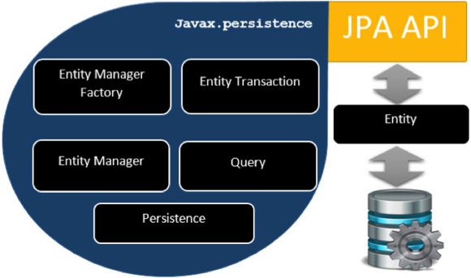

### What is N+1 problem in Hibernate? Explain

- The N+1 SELECT problem is a result of lazy loading and load on demand fetching strategy. In this case, Hibernate ends up executing N+1 SQL queries to populate a collection of N elements. For example, if you have a List of N Items where each Item has a dependency on a collection of Bid object. Now if you want to find the highest bid for each item then Hibernate will fire 1 query to load all items and N subsequent queries to load Bid for each item. So in order to find the highest bid for each item your application end up firing N+1 queries.

### Explain light object mapping.

- The entities are represented as classes that are mapped manually to relational tables. The code is hidden from the business logic using specific design patterns. This approach is good for applications with a less number of entities or applications with common, metadata-driven data models.

### Mention the differences between JPA and Hibernate?

- JPA is a specification for accessing, persisting and managing the data between Java objects and the relational database.
- Where as, Hibernate is the actual implementation of JPA guidelines. When hibernate implements the JPA specification, this will be certified by the JPA group upon following all the standards mentioned in the specification. For example, JPA guidelines would provide information of mandatory and optional features to be implemented as part of the JPA implementation.

| Hibernate                                                                                           | JPA                                                                                     |
| --------------------------------------------------------------------------------------------------- | --------------------------------------------------------------------------------------- |
| Hibernate is the object-relational mapping framework which helps to deal with the data persistence. | It is the Java specification to manage the java application with relational data.       |
| It’s is one of the best JPA providers.                                                              | It is the only specification which doesn’t deal with any implementation.                |
| In this, we use Session for handling the persistence in an application.                             | In this, we use the Entity manager.                                                     |
| It is used to map Java data types with database tables and SQL data types.                          | It is the standard API which allows developers to perform database operations smoothly. |
| The Query language in this is Hibernate Query Language.                                             | The query language of JPA is JPQL (Java Persistence Query Language)                     |

### What is HQL and what are its benefits?

- Hibernate Query Language (HQL) is an object-oriented query language, similar to SQL, but instead of operating on tables and columns, HQL works with persistent objects and their properties. HQL queries are translated by Hibernate into conventional SQL queries, which in turns perform action on database.
- **Advantages Of HQL:**
  - HQL is database independent, means if we write any program using HQL commands then our program will be able to execute in all the databases with out doing any further changes to it
  - HQL supports object oriented features like Inheritance, polymorphism,Associations(Relation ships)
  - HQL is initially given for selecting object from database and in hibernate 3.x we can doDML operations ( insert, update…) too

### Mention the Key components of Hibernate?

- **hibernate.cfg.xml**: This file has database connection details
- **hbm.xml or Annotation**: Defines the database table mapping with POJO. Also defines the relation between tables in java way.
- **SessionFactory**:
  - There will be a session factory per database.
  - The SessionFacory is built once at start-up
  - It is a thread safe class
  - SessionFactory will create a new Session object when requested
- **Session**:
  - The Session object will get physical connection to the database.
  - Session is the Java object used for any DB operations.
  - Session is not thread safe. Hence do not share hibernate session between threads
  - Session represents unit of work with database
  - Session should be closed once the task is completed

### Explain Session object in Hibernate?

- A Session is used to get a physical connection with a database. The Session object is lightweight and designed to be instantiated each time an interaction is needed with the database. Persistent objects are saved and retrieved through a Session object.
- The lifecycle of a Session is bounded by the beginning and end of a logical transaction. The main function of the Session is to offer create, read and delete operations for instances of mapped entity classes. Instances may exist in one of three states:
  - **transient** − A new instance of a persistent class, which is not associated with a Session and has no representation in the database and no identifier value is considered transient by Hibernate.
  - **persistent** − You can make a transient instance persistent by associating it with a Session. A persistent instance has a representation in the database, an identifier value and is associated with a Session.
  - **detached** − Once we close the Hibernate Session, the persistent instance will become a detached instance.

### How transaction management works in Hibernate?

- A **Transaction** is a sequence of operation which works as an atomic unit. A transaction only completes if all the operations completed successfully. A transaction has the Atomicity, Consistency, Isolation, and Durability properties (ACID).
- In hibernate framework, **Transaction interface** that defines the unit of work. It maintains abstraction from the transaction implementation (JTA, JDBC). A transaction is associated with Session and instantiated by calling **session.beginTransaction()**.

| Transaction interface                           | Description                                                                                               |
| ----------------------------------------------- | --------------------------------------------------------------------------------------------------------- |
| void begin()                                    | starts a new transaction.                                                                                 |
| void commit()                                   | ends the unit of work unless we are in FlushMode.NEVER.                                                   |
| void rollback()                                 | forces this transaction to rollback.                                                                      |
| boolean isAlive()                               | checks if the transaction is still alive.                                                                 |
| boolean wasCommited()                           | checks if the transaction is commited successfully.                                                       |
| boolean wasRolledBack()                         | checks if the transaction is rolledback successfully.                                                     |
| void setTimeout(int seconds)                    | It sets a transaction timeout for any transaction started by a subsequent call to begin on this instance. |
| void registerSynchronization(Synchronization s) | registers a user synchronization callback for this transaction.                                           |

### Explain the Criteria object in Hibernate?

- The Criteria API allows to build up a criteria query object programmatically; the `org.hibernate.Criteria` interface defines the available methods for one of these objects. The Hibernate Session interface contains several overloaded `createCriteria()` methods.
- The Criteria API provides the **org.hibernate.criterion.Order** class to sort your result set in either ascending or descending order, according to one of your object's properties.
- The Criteria API provides the **org.hibernate.criterion.Projections** class, which can be used to get average, maximum, or minimum of the property values. The Projections class is similar to the Restrictions class, in that it provides several static factory methods for obtaining **Projection** instances.

### What is a One-to-One association in Hibernate?

- A **One-to-One** Association is similar to Many-to-One association with a difference that the column will be set as unique i.e. Two entities are said to be in a One-to-One relationship if one entity has only one occurrence in the other entity. For example, an address object can be associated with a single employee object. However, these relationships are rarely used in the relational table models and therefore, we won’t need this mapping too often.
- In One-to-One association, the source entity has a field that references another target entity. The `@OneToOne` JPA annotation is used to map the source entity with the target entity.

### What is hibernate caching? Explain Hibernate first level cache?

- Hibernate Cache can be very useful in gaining fast application performance if used correctly. The idea behind cache is to reduce the number of database queries, hence reducing the throughput time of the application.
- Hibernate comes with different types of Cache:
  - **First Level Cache**: Hibernate first level cache is associated with the **Session object**. Hibernate uses this cache by default. Here, it processes one transaction after another one, means wont process one transaction many times. Mainly it reduces the number of SQL queries it needs to generate within a given transaction. That is instead of updating after every modification done in the transaction, it updates the transaction only at the end of the transaction.
  - **Second Level Cache**: Second-level cache always associates with the **Session Factory object**. While running the transactions, in between it loads the objects at the Session Factory level, so that those objects will be available to the entire application, not bound to single user. Since the objects are already loaded in the cache, whenever an object is returned by the query, at that time no need to go for a database transaction. In this way the second level cache works. Here we can use query level cache also.
- Hibernate Second Level cache is disabled by default but we can enable it through configuration. Currently EHCache and Infinispan provides implementation for Hibernate Second level cache and we can use them. We will look into this in the next tutorial for hibernate caching.
- **Query Cache**: Hibernate can also cache result set of a query. Hibernate Query Cache doesn’t cache the state of the actual entities in the cache; it caches only identifier values and results of value type. So it should always be used in conjunction with the second-level cache.

### What is second level cache in Hibernate?

- **Hibernate second level cache** uses a common cache for all the session object of a session factory. It is useful if you have multiple session objects from a session factory. **SessionFactory** holds the second level cache data. It is global for all the session objects and not enabled by default.
- Different vendors have provided the implementation of Second Level Cache.
  - EH Cache
  - OS Cache
  - Swarm Cache
  - JBoss Cache
- Each implementation provides different cache usage functionality. There are four ways to use second level cache.
  - **read-only**: caching will work for read only operation.
  - **nonstrict-read-write**: caching will work for read and write but one at a time.
  - **read-write**: caching will work for read and write, can be used simultaneously.
  - **transactional**: caching will work for transaction.
- The cache-usage property can be applied to class or collection level in hbm.xml file.

### What are concurrency strategies?

- The READ_WRITE strategy is an asynchronous cache concurrency mechanism and to prevent data integrity issues (e.g. stale cache entries), it uses a locking mechanism that provides unit-of-work isolation guarantees.
- In hibernate, cache concurrency strategy can be set globally using the property hibernate.cache. default_cache_concurrency_strategy. The allowed values are,
  - **read-only**: caching will work for read only operation. supported by ConcurrentHashMap, EHCache, Infinispan
  - **nonstrict-read-write**: caching will work for read and write but one at a time. supported by ConcurrentHashMap, EHCache.
  - **read-write**: caching will work for read and write, can be used simultaneously. supported by ConcurrentHashMap, EHCache.
  - **transactional**: caching will work for transaction. supported by EHCache, Infinispan.

Example: Inserting data ( READ_WRITE strategy )

```java
@Override
public boolean afterInsert(
    Object key, Object value, Object version) throws CacheException {
    region().writeLock( key );
    try {
        final Lockable item = (Lockable) region().get( key );
        if ( item == null ) {
            region().put( key, new Item( value, version, region().nextTimestamp()));
            return true;
        } else {
            return false;
        }
    } finally {
        region().writeUnlock( key );
    }
}
```

- For an entity to be cached upon insertion, it must use a SEQUENCE generator, the cache being populated by the EntityInsertAction:

```java
@Override
public void doAfterTransactionCompletion(boolean success, SessionImplementor session) throws HibernateException {

    final EntityPersister persister = getPersister();
    if (success && isCachePutEnabled( persister, getSession())) {
        final CacheKey ck = getSession().generateCacheKey(getId(), persister.getIdentifierType(), persister.getRootEntityName());
        final boolean put = cacheAfterInsert(persister, ck);
    }
    postCommitInsert( success );
}
```

### What is Lazy loading in hibernate?

- Hibernate defaults to a lazy fetching strategy for all entities and collections. Lazy loading in hibernate improves the performance. It loads the child objects on demand. To enable lazy loading explicitly you must use **fetch = FetchType.LAZY** on a association which you want to lazy load when you are using hibernate annotations.

Example:

```java
@OneToMany( mappedBy = "category", fetch = FetchType.LAZY )
private Set<ProductEntity> products;
```

### Explain the persistent classes in Hibernate?

- Persistence class are simple POJO classes in an application. It works as implementation of the business application for example Employee, department etc. It is not necessary that all instances of persistence class are defined persistence.
- There are following main rules of persistent classes
  - A persistence class should have a default constructor.
  - A persistence class should have an id to uniquely identify the class objects.
  - All attributes should be declared private.
  - Public getter and setter methods should be defined to access the class attributes.

### Explain some of the elements of hbm.xml?

- Hibernate mapping file is used by hibernate framework to get the information about the mapping of a POJO class and a database table.
- It mainly contains the following mapping information:
  - Mapping information of a POJO class name to a database table name.
  - Mapping information of POJO class properties to database table columns.
- Elements of the Hibernate mapping file:
  - **hibernate-mapping**: It is the root element.
  - **Class**: It defines the mapping of a POJO class to a database table.
  - **Id**: It defines the unique key attribute or primary key of the table.
  - **generator**: It is the sub element of the id element. It is used to automatically generate the id.
  - **property**: It is used to define the mapping of a POJO class property to database table column.

Syntax

```xml
<hibernate-mapping>

 <class name="POJO class name" table="table name in database">
  <id name="propertyName" column="columnName" type="propertyType" >
	<generator class="generatorClass"/>
  </id>
  <property name="propertyName1" column="colName1" type="propertyType " />
  <property name="propertyName2" column="colName2" type="propertyType " />
   . . . . .
 </class>

</hibernate-mapping>
```

### What is Java Persistence API (JPA)?

- Java Persistence API is a collection of classes and methods to persistently store the vast amounts of data into a database.
  The Java Persistence API (JPA) is one possible approach to ORM. Via JPA the developer can map, store, update and retrieve data from relational databases to Java objects and vice versa. JPA can be used in Java-EE and Java-SE applications.
- JPA metadata is typically defined via annotations in the Java class. Alternatively, the metadata can be defined via XML or a combination of both. A XML configuration overwrites the annotations.

**Relationship Mapping**

JPA allows to define relationships between classes. Classes can have one to one, one to many, many to one, and many to many relationships with other classes. A relationship can be bidirectional or unidirectional, e.g. in a bidirectional relationship both classes store a reference to each other while in an unidirectional case only one class has a reference to the other class.

Relationship annotations:

- @OneToOne
- @OneToMany
- @ManyToOne
- @ManyToMany



**JPA - Architecture**

| Units                | Description                                                                                                                      |
| -------------------- | -------------------------------------------------------------------------------------------------------------------------------- |
| EntityManagerFactory | This is a factory class of EntityManager. It creates and manages multiple EntityManager instances.                               |
| EntityManager        | It is an Interface, it manages the persistence operations on objects. It works like factory for Query instance.                  |
| Entity               | Entities are the persistence objects, stores as records in the database.                                                         |
| EntityTransaction    | It has one-to-one relationship with EntityManager. For each EntityManager, operations are maintained by EntityTransaction class. |
| Persistence          | This class contain static methods to obtain EntityManagerFactory instance.                                                       |
| Query                | This interface is implemented by each JPA vendor to obtain relational objects that meet the criteria.                            |

### Name some important interfaces of Hibernate framework?

- **Session Interface**: This is the primary interface used by hibernate applications. The instances of this interface are lightweight and are inexpensive to create and destroyHibernate sessions are not thread safe
- **Session Factory Interface**: This is a factory that delivers the session objects to hibernate application.
- **Configuration Interface**: This interface is used to configure and bootstrap hibernate. The instance of this interface is used by the application in order to specify the location of hbm documents
- **Transaction Interface**: This interface abstracts the code from any kind of transaction implementations such as JDBC transaction, JTA transaction
- **Query and Criteria Interface**: This interface allows the user to perform queries and also control the flow of the query execution

### What is Hibernate SessionFactory and how to configure it?

- SessionFactory can be created by providing Configuration object, which will contain all DB related property details pulled from either hibernate.cfg.xml file or hibernate.properties file. SessionFactory is a factory for Session objects.
- We can create one SessionFactory implementation per database in any application. If your application is referring to multiple databases, then we need to create one SessionFactory per database.
- The SessionFactory is a heavyweight object; it is usually created during application start up and kept for later use. The SessionFactory is a thread safe object and used by all the threads of an application.

### What is the difference between opensession and getcurrentsession in hibernate?

- Hibernate SessionFactory getCurrentSession() method returns the session bound to the context. Since this session object belongs to the hibernate context, we don't need to close it. Once the session factory is closed, this session object gets closed.
- Hibernate SessionFactory openSession() method always opens a new session. We should close this session object once we are done with all the database operations.

| Parameter       | openSession                                                          | getCurrentSession                                                                                                                                         |
| --------------- | -------------------------------------------------------------------- | --------------------------------------------------------------------------------------------------------------------------------------------------------- |
| Session object  | It always create new Session object                                  | It creates a new Session if not exists , else use same session which is in current hibernate context                                                      |
| Flush and close | You need to explicitly flush and close session objects               | You do not need to flush and close session objects, it will be automatically taken care by Hibernate internally                                           |
| Configuration   | You do not need to configure any property to call this method        | You need to configure additional property “hibernate.current_session_context_class” to call getCurrentSession method, otherwise it will throw exceptions. |
| Performance     | In single threaded environment , It is slower than getCurrentSession | In single threaded environment , It is faster than getOpenSession                                                                                         |

Example: openSession()

```java
Transaction transaction = null;
Session session = HibernateUtil.getSessionFactory().openSession();
try {
    transaction = session.beginTransaction();
    // do Some work

    session.flush(); // extra work
    transaction.commit();
} catch(Exception ex) {
    if(transaction != null) {
        transaction.rollback();
    }
    ex.printStackTrace();
} finally {
    if(session != null) {
        session.close(); // extra work
    }
}
```

Example: getCurrentSession()

```java
Transaction transaction = null;
Session session = HibernateUtil.getSessionFactory().getCurrentSession();
try {
    transaction = session.beginTransaction();
    // do Some work

    // session.flush(); // no need
    transaction.commit();
} catch(Exception ex) {
    if(transaction != null) {
        transaction.rollback();
    }
    ex.printStackTrace();
} finally {
    if(session != null) {
        // session.close(); // no need
    }
}
```

### What is difference between Hibernate Session get() and load() method?

- Hibernate Session class provides two method to access object e.g. `session.get()` and `session.load()`.The difference between get() vs load() method is that get() involves database hit if object doesn't exists in **Session Cache** and returns a fully initialized object which may involve several database call while load method can return proxy in place and only initialize the object or hit the database if any method other than getId() is called on persistent or entity object. This lazy initialization can save couple of database round-trip which result in better performance.

| load()                                                                                             | get()                                                                          |
| -------------------------------------------------------------------------------------------------- | ------------------------------------------------------------------------------ |
| Only use the load() method if you are sure that the object exists.                                 | If you are not sure that the object exists, then use one of the get() methods. |
| load() just returns a proxy by default and database won't be hit until the proxy is first invoked. | get() will hit the database immediately.                                       |
| load() method will throw an exception if the unique id is not found in the database.               | get() method will return null if the unique id is not found in the database.   |

### What are different states of an entity bean?

1. **Transient**: Transient objects exist in heap memory. Hibernate does not manage transient objects or persist changes to transient objects. Whenever pojo class object created then it will be in the Transient state.

- Transient state Object does not represent any row of the database, It means not associated with any Session object or no relation with the database its just an normal object.

2. **Persistent**: Persistent objects exist in the database, and Hibernate manages the persistence for persistent objects. If fields or properties change on a persistent object, Hibernate will keep the database representation up to date when the application marks the changes as to be committed.

- Any instance returned by a **get()** or **load()** method is persistent state object.

3. **Detached**: Detached objects have a representation in the database, but changes to the object will not be reflected in the database, and vice-versa. A detached object can be created by closing the session that it was associated with, or by evicting it from the session with a call to the session's `evict()` method.

Example:

```java
import org.hibernate.Session;
import org.hibernate.Transaction;
import org.hibernate.cfg.AnnotationConfiguration;

import com.example.hibernate.Student;

public class ObjectStatesDemo {

    public static void main(String[] args) {

        // Transient object state
        Student student = new Student();
        student.setId(101);
        student.setName("Alex");
        student.setRoll("10");
        student.setDegree("B.E");
        student.setPhone("9999");

        // Transient object state
        Session session = new AnnotationConfiguration().configure()
                .buildSessionFactory().openSession();
        Transaction t = session.beginTransaction();

        // Persistent object state
        session.save(student);
        t.commit();

        // Detached object state
        session.close();
    }
}
```

Output

```
Hibernate:
    insert
    into
        STUDENT
        (degree, name, phone, roll, id)
    values
        (?, ?, ?, ?, ?)
```

In The Database :

```sql
mysql> select * from student;
+-----+--------+--------+-------+------+
| id  | degree | name   | phone | roll |
+-----+--------+--------+-------+------+
| 101 | B.E    | Alex   | 9999  | 10   |
+-----+--------+--------+-------+------+
1 row in set (0.05 sec)
```

### What is difference between merge() and update() methods in Hibernate?

- Both update() and merge() methods in hibernate are used to convert the object which is in detached state into persistence state. But there are different situation where we should be used update() and where should be used merge() method in hibernate

```java
Employee emp1 = new Employee();
emp1.setEmpId(100);
emp1.setEmpName("Alex");
//create session
Session session1 = createNewHibernateSession();
session1.saveOrUpdate(emp1);
session1.close();
//emp1 object in detached state now

emp1.setEmpName("Alex Rajput");// Updated Name
//Create session again
Session session2 = createNewHibernateSession();
Employee emp2 =(Employee)session2.get(Employee.class, 100);
//emp2 object in persistent state with id 100

/**
Try to make on detached object with id 100 to persistent state by using update method of hibernate
It occurs the exception NonUniqueObjectException because emp2 object is having employee with same
empid as 100. In order to avoid this exception we are using merge like given below instead of
**/
session2.update(emp1);
session.update(emp1);

session2.merge(emp1); //it merge the object state with emp2
session2.update(emp1); //Now it will work with exception
```

- In the hibernate session we can maintain only one employee object in persistent state with same primary key, while converting a detached object into persistent, if already that session has a persistent object with the same primary key then hibernate throws an Exception whenever update() method is called to reattach a detached object with a session. In this case we need to call **merge()** method instead of **update()** so that hibernate copies the state changes from detached object into persistent object and we can say a detached object is converted into a persistent object.

### What is difference between Hibernate save(), saveOrUpdate() and persist() methods?

### What will happen if we don’t have no-args constructor in Entity bean?

### What is difference between sorted collection and ordered collection, which one is better?

### What are the collection types in Hibernate?

### How to implement Joins in Hibernate?

### Why we should not make Entity Class final?

### What is the benefit of native sql query support in hibernate?

### What is Named SQL Query? What are the benefits of Named SQL Query?

### How to log hibernate generated sql queries in log files?

### What is cascading and what are different types of cascading?

### How to integrate log4j logging in hibernate application?

### What is HibernateTemplate class?

### How to integrate Hibernate with Servlet or Struts2 web applications?

### Which design patterns are used in Hibernate framework?

### What is Hibernate Validator Framework?

### What is the benefit of Hibernate Tools Eclipse plugin?

### What are the technologies that are supported by Hibernate?

### What is your understanding of Hibernate proxy?

### Can you explain Hibernate callback interfaces?

### How to create database applications in Java with the use of Hibernate?

### Can you share your views on mapping description files?

### What are your thoughts on file mapping in Hibernate?

### Can you explain version field?

### What are your views on the function addClass?

### Can you explain the role of addDirectory() and addjar() methods?

### What do you understand by Hibernate tuning?

### What is your understanding of Light Object Mapping?

### How does Hibernate create the database connection?

### What are possible ways to configure object-table mapping?

### Which annotation is used to declare a class as a hibernate bean?

### How do I specify table name linked to an entity using annotation?

### How does a variable in an entity connect to the database column?

### How do we specify a different column name for the variables mapping?

### How do we specify a variable to be primary key for the table?

### How do you configure the dialect in hibernate.cfg.xml?

### How to configure the connection pool size?

### How do you configure folder scan for Hibernate beans?

### How to configure hibernate beans without Spring framework?

### Is it possible to connect multiple database in a single Java application using Hibernate?

### Does Hibernate support polymorphism?

### How many Hibernate sessions exist at any point of time in an application?

### What is N+1 SELECT problem in Hibernate? What are some strategies to solve the N+1 SELECT problem in Hibernate?

### What is the requirement for a Java object to become a Hibernate entity object?

### How do you log SQL queries issued by the Hibernate framework in Java application?

### What is the difference between the transient, persistent and detached state in Hibernate?

### How properties of a class are mapped to the columns of a database table in Hibernate?

### What is the usage of Configuration Interface in hibernate?

### How can we use new custom interfaces to enhance functionality of built-in interfaces of hibernate?

### What are POJOs and what is their significance?

### How can we invoke stored procedures in hibernate?

### What are the benefits of using Hibernate template?

### How can we get hibernate statistics?

### How can we reduce database write action times in Hibernate?

### When an instance goes in detached state in hibernate?

### What the four ORM levels are in hibernate?

### What is the default cache service of hibernate?

### What are the two mapping associations used in hibernate?

### What is the usage of Hibernate QBC API?

### In how many ways, objects can be fetched from database in hibernate?

### How primary key is created by using hibernate?

### How can we reattach any detached objects in Hibernate?

### What are different ways to disable hibernate second level cache?

### What is ORM metadata?

### Which one is the default transaction factory in hibernate?

### What is the role of JMX in hibernate?

### In how many ways objects can be identified in Hibernate?

### What different fetching strategies are of hibernate?

### How mapping of java objects is done with database tables?

### What are derived properties in hibernate?

### What is the use of version property in hibernate?

### What is attribute oriented programming?

### What is the use of session.lock() in hibernate?

### What the three inheritance models are of hibernate?

### What is general hibernate flow using RDBMS?

### What is difference between managed associations and hibernate associations?

### What are the inheritance mapping strategies?

### What is automatic dirty checking in hibernate?

### Explain Hibernate configuration file and Hibernate mapping file?
