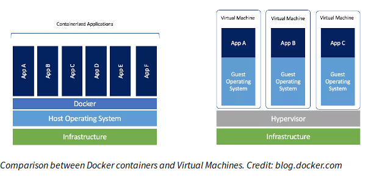

### Virtual Machines and Containers

- Virtual machines are simulated computers.
- Hypervisor - this is a barebones operating system designed to have virtual machines on it, such as esxi or Hyper-V
- Suppose I need 5 programs to run in my datacenter which have slightly different - but conflicting - software dependencies. It can run on one hypervisor but effectively a lot of resources - RAM and CPU usage - will be wasted. This is one of the problems docker aims to fix.
- Docker works by sandboxing programs and abstracting the parts of the os they need to talk to.(eg file system access to write and read data)
- Another key benefit of docker is scaling. With docker you can design your containers to be independent of each other, but capable of working together.

##### Useful features

- **Isolation**: hypervisors do a pretty good job of isolating the guest from the host, so one can use VMs to run buggy or untrusted software reasonably safely
- **Snapshots**: you can take "snapshots" of your virual machine, capturing the entire state (disk, memory, etc.) make changes to your machine, and then restore to earlier state. This is useful for testing out potentially destructive actions, among other things.
- [libvirt](https://wiki.libvirt.org/page/UbuntuKVMWalkthrough) toolkit allows you to manage multiple different virtualization providers/hypervisors

#### Containers

- Containers are _mostly_ just an assembly of various Linux security features,like virtual file system, virtual network interfaces, chroots, virtual memory tricks, and the like, that together give the appearsance of virtualization.
- Eg. Amazon Firecracker, Docker, rkt, lxc
- Containers share the linux kernel with the host.
  
- Containers are handy for when you want to run an automated task in a standardized setup:
  - Build systems
  - Development environments
  - Pre-packaged servers
  - Running untrusted programs
  - Continuous integration
    - Travis CI
    - Github Actions
- Container software like Docker has also been extensively used as a solution for [dependency hell](https://en.wikipedia.org/wiki/Dependency_hell). If a machine needs to be running many services with conflicting dependencies they can be isolated using containers.
- Usually, you write a file that defines how to construct your container.
- Start with some minimal _base image_, and then a list of commands to run to set up the environment you want (install packages, copy files, build stuff, write config files, etc.)
- Normally, there's also a way to specify any external ports that should be available, and an _entrypoint_ that dictates what command should be run when the container is started.
- [DockerHub](https://hub.docker.com/) container repository website where many software services have prebuilt images that one can easily deploy.

### Shell and Scripting

- `for i in $(seq 1 5); do echo hello; done`
- `for f in $(ls); do echo $f; done`
- Can also set variables using = (no space!) `foo=bar; echo $foo`
- There are bunch of "special" variables too:
  - `$1` to `$9`: arguments to the script
  - `$0` name of the script itself
  - `$#` number of arguments
  - `$$` process ID of current shell
- To only print directories :
  - `for f in $(ls); do if test -d $f; then echo dir $f; fi; done`
- test is equivalent to `[ -d $f]`
- `if [ $foo = "bar" ]; then` if $foo is empty? then arguments to `[` are `=` and `bar`. To work around use `[[` bash built-in comparator, also allows `&&` instead of `-a`, `||` over `-o` etc.

#### Other ways to compose programs other than |

- You can group commands with `(a; b) | tac` run a then b and send their output to `tac` which prints its input in reverse order
- A lesser-known, but super useful one is _process substitution_. `b <(a)` will run `a`, generate a temporary file-name for its output stream, and pass that file-name to `b`. For example

```bash
diff <(journalctl -b -1 | head -n20) <(journalctl -b -2 | head -n20)
```

- `ps -A`: print processes from all users (also `ps ax`)
- `pgrep` == `ps -A | grep`
  - `pgrep -af`: search and display with arguments
- SIGKILL (-9 or -KILL) : exit now
- SIGTERM (-15 or -TERM) : exit gracefully
- A double dash `--` is used in built-in commands and many other commands to signify the end of command options
- `echo $PATH | tr -s ':' '\n'` for pretty printing the current path
- `xargs` build and execute command lines from standard input eg `ls | xargs file`
- Sometimes you want to keep STDIN and still pipe it to a file. Try running `echo HELLO | tee hello.txt`

### Command Line Environment

- In many scenarios aliases can be limiting, specially when you are trying to write chain commands together that take the same arguments
- An alternative exists which is **functions** which are a midpoint between aliases and custom shell scripts.

```bash
mcd() {
    mkdir -p $1
    cd $1
}
```

- `git show $commit_id | bat -l rs` : shows the changes in the commit
- `git show $commit_id:path_to_file | bat -l rs` : shows the version of the file at the given commit
- **mosh** is a handy tool that works allows roaming, supports intermittent connectivity, and provides intelligent local echo.
- The [atool](https://www.nongnu.org/atool/) package provides the `aunpack` command which will figure out the correct options and always put the extracted archives in a new folder.
- [packages](https://packages.azlux.fr/)

#### Shells & Frameworks

- `zsh` shell is a superset of `bash` and provides many convenient features out of the box such as:
  - Smarter globbing, `**`
  - Inline globbing/wildcard expansion
  - Spelling correction
  - Better tab completion/selection
  - Path expansion (`cd /u/lo/b` will expand as `/usr/local/bin`

### Data Wrangling

- The `s` command is written on the form : `s/REGEX/SUBSTITUTION/`
- `sed 's/.\*Disconnected from //'` - substitutes whatever matches the pattern between the first and the second slash with contents between the second and third slash.
- sed can also do other handy things like print lines following a given match, do multiple substitutions per invocation, search for things
- `sed -E 's/a*b+(c|d)//'` assumes all special characters are special or you have to write `sed 's/a*b\+\(c\|d\)//'`
- here’s an article on how you might match an [e-mail address](https://www.regular-expressions.info/email.html). It’s [not easy](https://emailregex.com/). And there’s [lots of discussion](https://stackoverflow.com/questions/201323/how-to-validate-an-email-address-using-a-regular-expression/1917982). And people have [written tests](https://fightingforalostcause.net/content/misc/2006/compare-email-regex.php). And [test matrices](https://mathiasbynens.be/demo/url-regex). You can even write a regex for determining if a given number [is a prime number.](https://www.noulakaz.net/2007/03/18/a-regular-expression-to-check-for-prime-numbers/)
- sed can inject lines in the file (with the `i` command) explicitly print the lines (with the `p` command), select lines by index
- `uniq -c` : unique value with count
- `sort -n -k1,1` : sort from 1st column to 1st column
- awk operates on fields unlike sed
- `paste`: it lets you combine lines (`-s`) by a given single-character delimiter (`-d`). `paste -sd,`
- `awk '{print $2}'`
- \[PATTERN] {BLOCK}
- $0 entire line
- default awk split by whitespace
- `awk -F$'\t'`, `awk -F$'\n'`
- `awk '$1 == 1 && $2 ~ /^c[^ ]\*e$/ {print 2}'` - find the user names whose count in one and which starts with c and ends with e

```
BEGIN {rows = 0}
$1 != 1 && $2 ~ /^c/ {rows += 1}
END {print rows}
```

- first set the var rows to 0 then for every line when the count is not one and the username starts with c then add one to rows.
- awk [can do it all](https://backreference.org/2010/02/10/idiomatic-awk/)
- xargs : take all the lines of my input and make them arguments of the following command
- Find an online data set like [this one](https://stats.wikimedia.org/EN/TablesWikipediaZZ.htm) or [this one](https://ucr.fbi.gov/crime-in-the-u.s/2016/crime-in-the-u.s.-2016/topic-pages/tables/table-1). Maybe another one [from here](https://www.springboard.com/blog/free-public-data-sets-data-science-project/). Fetch it using curl and extract out just two columns of numerical data. If you’re fetching HTML data, [pup](https://github.com/EricChiang/pup) might be helpful. For JSON data, try [jq](https://stedolan.github.io/jq/). Find the min and max of one column in a single command, and the sum of the difference between the two columns in another.
- [GitHub does dotfiles](http://dotfiles.github.io/)

### Backups

- The [3-2-1 rule](https://www.us-cert.gov/sites/default/files/publications/data_backup_options.pdf) is a general recommended strategy for backing up your data. It states that you should have:
  - at least **3 copies** of your data
  - **2** copies in **different mediums**
  - **1** of the copies being **offsite**
- Some good backup programs and services
  - [Tarsnap](https://www.tarsnap.com/) - deduplicated, encrypted online backup service for the truly paranoid.
  - [Borg Backup](https://borgbackup.readthedocs.io/)
  - [rsync](https://rsync.samba.org/) is a utility that provides fast incremental file transfer.
  - [rclone](https://rclone.org/) like rsync but for cloud storage providers.

### Automation

- The configuration file for cron can be displayed running `crontab -l` edited running `crontab -e`
- [crontab guru](https://crontab.guru/examples.html)
- [anacron](https://linux.die.net/man/8/anacron) works similar to cron except that the frequency is specified in days

### Machine Introspection

- dmesg : gives all the message the kernel has printed since boot
- For `journalctl`, you should be aware of these flags in particular
  - `-u UNIT`: show only messages related to the given systemd service
  - `--full` : don't truncate long lines
  - `-b`: only show messages from the latest boot
  - `-n100`: show only last 100 entries
- `journalctl -u systemd-logind -b` (only the last boot)
- `journalctl -u systemd-logind -b -3` (3rd from last boot)
- `journalctl -u systemd-logind -b 1` (1st boot you know about)
- `journalctl --full` : to see the full log message
- `journalctl -n100`: last 100 lines
- `pstree` to see process tree
- `pstree -p` include the PIDs also
- `htop (type t)` to view in tree mode
- `journalctl -f` : prints the last few messages and keep the log terminal open. Equivalently `dmesg -w`
- [`dstat`](http://dag.wiee.rs/home-made/dstat/): monitors all sorts of subsystems on machine and prints all sorts of information about them
- `ss`: looking at what is connected to what in the machine. By default it shows all connections in the machine in all the protocols. (basically all open sockets)
- `ss -t` (open tcp connection)
- `ss -tl` (listening ports)
- `ss -tlp` (listening ports and which program is doing that listening)
- `ss -tlpn` (listening ports and which program is doing that listening, shows the raw port number)
- `ip`: let's configure pretty much everything that has to do with the machine
- `ip addr`: all the interfaces you have
- enp5s0: things that start with e are ethernet ports
- wlp9s0: things that start with w are wireless ports
- `ip route`: tells how your computer is gonna communicate with other machines
- `ip help`: will get you pretty far
- Also `iw` for managing wireless network interfaces
- To configure services, you pretty much have to interact with `systemd`
- Most services will have a systemd service file that defines a systemd _unit_
- `systemctl enable UNIT` will set the service to start on boot
- `systemctl status`: to see how all your system services are doing
- `systemctl start/stop/restart` service_name
- `systemctl enable service`: run at boot
- `systemd-analyze`: shows how long your boot took
- `systemd-analyze blame`: how long which thing took
- `dmidecode`: parses all of the ? on your machine and tells different things like what hardware you are running and what are its capabilities
- `lstopo`: shows entire physical layout of your cpu
- L1i: instruction cache, L1d: data cache
- `hwloc-bind` : run programs on only certain cpus or cores, useful for benchmarking
- **/sys** and **/proc**: managed by the kernel. they are sort of meta information
- in **/sys/class/backlight/intel_backlight** : we can set value of current backlight
- way to cause the kernel to do things by changing the parameters
- **/proc** contains information about all the processes that are running
- **/boot** : where all the files when we boot our computer goes
- vmlinuz-linux: a boot image of linux
- initramfs-linux.img : same as above, set up hardware on the machine and starts the actual kernel
- `iptables` : firewall
- `sudo wg-quick up wg0` : start wireguard vpn
- `sudo wg-quick down wg0` : stop wireguard vpn
- `tcpdump`?

### Program introspection

- `gcc -g -o example example.c`
- `run`: for running the program
- b for break point `b main`
- `b {file}:{line}` - set a breakpoint
- After setting the break point and run the code stops at the break point. Now we can inspect the variables
- `c` continue: will keep going until a new break point is present
- `step` / `next`/ `finish` - step in / step over/ step out
- `p {variable}` - print value of variable
- `watch {expression}` - set a watchpoint that triggers when the value of the epression changes
- info breakpoints: prints the details about the breakpoints
- step: continue execution by a single line of C code
- next: to go to the next line of C code, it skips function calls
- finish: step out of the function, go back to the caller
- rwatch `value`: stop execution whenever I read from the given `value`
- layout split: puts gdb into text user mode with C, assembly both window
- layout regs: shows what's in the registers
- strace: run a program, and while the program is running for every system call that program makes it will print out what arguments were pass to that system call
- Profiling is done for: CPU usage, how much memory is my program using
- **perf**
  - Basic perfomance stats: `perf stat {command}`
  - Run a program with the profiler: `perf record {command}`
  - Analyze profile: `perf report`
- profiling can help us figure out what is worth optimizing and what is not
- Go profiler
  - Run test code with CPU profiler: `go test -cpuprofile=cpu.out`
  - Analyze profile: `go tool pprof -web cpu.out`
  - Run test code with CPU profiler: `go test -memprofile=cpu.out`
  - Analyze profile: `go tool pprof -web mem.out`

### Package management and dependency management

- [Semantic versioning](https://semver.org/)
- x.y.z
  | | +- patch
  | +--- minor
  +----- major
- Increment **major** version when you make incompatible API changes
- Increment **minor** version when you add functionality in a backward-compatible manner
- Increment **patch** when you make backward-compatible bug fixes
- Another very different approach to dependency management is **vendoring**

### OS Customization

- [Tiling window management](https://en.wikipedia.org/wiki/Tiling_window_manager) is one approach to window management, where you organize windows into non-overlapping frames
- Remap Caps Lock key to (Escape or Ctrl or BackSpace)

### Remote machines

- For generating a pair of key `ssh-keygen -t rsa -b 4096`
- `ssh-agent` for managing shell sessions
- ssh-agent asks for password once and remembers for some time
- To copy a public key over we can use `ssh-copy-id`
- There are many ways to copy files over ssh:
  - `ssh+tee`, `cat localfile | ssh remote_server tee serverfile`
  - `scp path/to/local_file remote_host:path/to/remote_file`
  - `rsync` improves upon `scp` by detecting identical files in local and remote and preventing copying them again. It also provides more fine grained control over symlinks, permissions and has extra features like the `--partial` flag that can resume from a previously interrupted copy

#### Backgrounding processes

- `nohup` - the `nohup` tool effectiely allows for a process to live when the terminal gets killed. More details [here](https://unix.stackexchange.com/questions/3886/difference-between-nohup-disown-and)

#### Port Forwarding

- In many scenarios you will run into software that works by listening to ports in the machine
- what do you do with a remote server that does not have its ports directly available through the network/internet?. This is called port forwarding and it comes in two flavors: **Local Port Forwarding** and **Remote Port Forwarding**
- [this SO post](https://unix.stackexchange.com/questions/115897/whats-ssh-port-forwarding-and-whats-the-difference-between-ssh-local-and-remot)
- For example if we execute `jupyter notebook` in the remote server that listens to the port `8888`. Thus to forward that to the local port `9999` we would do `ssh -L 9999:localhost:8888 foobar@remote_server` and then navigate to `localhost:9999` in our local machine.
- Graphics Forwarding
- Using the `-X` flag tells SSH to forward
- For trusted X11 forwarding the `-Y` flag can be used
- For this to work the `sshd_config` on the server must have the following options

```
X11Forwarding yes
X11DisplayOffset 10
```

- Client side configuration is specified in `~/.ssh/config`
- Server side configuration is specified in `/etc/ssh/sshd_config`
- [sshfs](https://github.com/libfuse/sshfs) can mount a folder on a remote server locally.
- sshfs vm:Downloads Downloads - mount remote Downloads to my Downloads
- proxy jumping
- [SSH Hacks](http://matt.might.net/articles/ssh-hacks/)
- [Secure Secure Shell](https://stribika.github.io/2015/01/04/secure-secure-shell.html)

### Web and Browsers

- middle click a tab, it will close the table
- (electronics | circuits) notes
- uBlock origin: you can even install filters from [around the web](https://github.com/gorhill/uBlock/wiki/Filter-lists-from-around-the-web)
- privacy [add ons](https://www.privacytools.io/browsers/#addons)
- `curl ipinfo.io`
- Web APIs can be useful for very many reasons:
  - **Retrieval**: Web APIs can quite easily provide you information such as maps, weather or what your public ip address
  - **Interaction**. Web API endpoints can also be used to trigger actions. For example performing the following `curl -X POST -H 'Content-type: application/json' --data '{"text":"Hello, World!"}' "https://hooks.slack.com/services/$SLACK_TOKEN"` will send a `Hello, World!` message in a channel.
  - **Piping** common web API “gluing” has already been implemented and is provided with server included. This is the case for services like [If This Then That](https://ifttt.com/) and [Zapier](https://zapier.com/)
- WebDriver software like [Selenium](https://docs.seleniumhq.org/) for automating tasks

### Security and Privacy

- See [this list](https://heimdalsecurity.com/blog/best-twitter-cybersec-accounts/) for improving security know-how
- Get a [USB data blocker](https://www.amazon.com/dp/B00QRRZ2QM), because [USB is scary](https://www.bleepingcomputer.com/news/security/heres-a-list-of-29-different-types-of-usb-attacks/)
- Some good password managers
  - [1password](https://1password.com/)
  - [KeePass](https://keepass.info/)
  - [BitWarden](https://bitwarden.com/)
  - [pass](https://www.passwordstore.org/)
- switch on two-factor authentication, ideally with a [FIDO/U2F](https://fidoalliance.org/) dongle (a [YubiKey](https://www.yubico.com/quiz/) for example)
- Use [Signal](https://www.signal.org/)\([setup instructions](https://medium.com/@mshelton/signal-for-beginners-c6b44f76a1f0))
- [Wire](https://wire.com/en/) is [fine too](https://www.securemessagingapps.com/)
- Turn on full disk encryption [cryptesetup + LUKS](https://wiki.archlinux.org/index.php/Dm-crypt/Encrypting_a_non-root_file_system)
- Use file encryption:
  - Encrypted volumes: use something like [eCryptfs or Encfs](https://wiki.archlinux.org/index.php Disk_encryption#Stacked_filesystem_encryption) to create a "filesystem in a file", which is then encrypted.
  - Encrypted files: encrypt individual files with symmetric encryption (see `gpg -c`) and a secret key. Or, like `pass`, also encrypt the key with your public key so only you can read it back later with your private key
- [Vercrypt](https://www.veracrypt.fr/en/Home.html)
- Open WiFi networks [are](https://www.troyhunt.com/the-beginners-guide-to-breaking-website/)[scary](https://www.troyhunt.com/talking-with-scott-hanselman-on/).
- Or set up [WireGuard](https://www.wireguard.com/) for yourself – it’s [excellent](https://latacora.singles/2018/05/16/there-will-be.html)!
- There are also secure configuration settings for a lot of internet-enabled applications at [cipherli.st](https://cipherli.st/). If you’re particularly privacy-oriented, [privacytools.io](https://privacytools.io/) is also a good resource.
- SSL/TLS is [critical](https://www.troyhunt.com/ssl-is-not-about-encryption/), and it’s not just about encryption, but also about being able to verify that you’re talking to the right service in the first place! If you run your own web server, [test it](https://ssldecoder.org/) and [test it again](https://www.ssllabs.com/ssltest/index.html). TLS configuration [can get hairy](https://wiki.mozilla.org/Security/Server_Side_TLS).
- Install [uBlock Origin](https://github.com/gorhill/uBlock). It is a [wide-spectrum blocker](https://github.com/gorhill/uBlock/wiki/Blocking-mode) that doesn’t just stop ads, but all sorts of third-party communication a page may try to do. And inline scripts and such. If you’re willing to spend some time on configuration to make things work, go to [medium mode](https://github.com/gorhill/uBlock/wiki/Blocking-mode:-medium-mode) or even [hard mode](https://github.com/gorhill/uBlock/wiki/Blocking-mode:-hard-mode)
- If you're using Firefox, enable [Multi-Account Containers](https://support.mozilla.org/en-US/kb/containers)

### Travel advice

- Often Guards would want you to open the laptop
- 0% battery means 0% hassle.
- Carry wiped/blank devices
- Detecting lies by amateurs is fairly simple. For example, have them repeat the story over and over again and keep detailed notes (people tend to forget the lies they’ve told after about 20 minutes, so the details will change.) Have them describe the story in reverse chronological order (lies are harder to keep straight when they’re told backwards.)
- TSA respects a locked suitcase “oh noes! we can’t open it, better let it go.”

### GDB

- `r[un]` [*args*] : Begin program execution. If the program normally takes command-line arguments, specify them here (e.g.,run hi 3)
- `b[reak]` [*address*] : Set a breakpoint at the specified address.
- `c[ontinue]` : Continue execution after stopping at a breakpoint
- `i[nfo] b[reak]` : Display numbered list of all breakpoints currently set
- `d[elete] b[reakpoints]` _number_ : Delete specified breakpoint number
- `p[rint]` [/*format*] _expr_ : Print the value of an expression using the specified format. Expressions can involve program variables or registers, specified using a `$`. Useful formats include: `d`, `x`, `t` - binary, `f`, `i`-instruction, `c`
- `i[nfo] r[egisters]` _register_ : print the value of the register
- x/[_count_][*format*][*address*] : Examine the contents of a specified memory address, or the current address ifnone specified. If count is specified, displays specified number of word. particularly useful for printing the program text, e.g `x/100i foo` disassembles and prints 100 instructions starting a `foo`
- `disas[semble]` _address_[,*address*] : Another way to print the assembly program text surrounding an address, or be-tween two addresses
- `set` _var_ = _expr_ : Set specified register or memory location to value of expression
- `s[tep] i` : Execute a single instruction and then return to the command line interpreter.
- `n[ext] i` " Like `step i`, except that if the instruction is a subroutine call, the entire subrou-tine is executed before control returns to the interpreter.
- `whe[re]` : show current activation stack, to find out where we are in call stack
- `q[uit]` : exit from gdb
- `x/10cb 0x40061c` show 10 values stored in location 0x40061c
- print (int) 2147483648
- print &i
- print sizeof(i), print sizeof(int), print sizeof(double)
- x/4xb &i : examine 4 values, formatted as x numerals, one b byte at a time.
- `ptype` command tells you the type of a C expression.
- `ptype &i`, `ptype main`, `ptype i`
- `ptype &a` : where a is an array gives `int (*) [3]`
- In GDB you can write scripts to automate.
- set environment LD_PRELOAD=./mylibrary.so
- set logging file output.txt
- set loggin on
- gdb ./test -x init.gdb (the script file to be used)
- .gdbinit if always want to be run when running GDB
- `run input.txt` giving the command line argument in gdb
- `delete breakpoints`
- break icorruptmem.c:30 if (x> 255)
- set follow-fork-mode child/parent
- set follow-exec-mode new
- info threads : shows what threads are running and which thread we are currently in
- LWP : Light-Weight process
- thread 1 : switch to thread 1
- thread 2 : switch to thread 2
- watch counter >= 4500 (hex 4500) : setting a watch point to a variable
- break count_to_big thread 2 : setting a break point to a specific thread (id = 2)
- thread apply all backtrace :
- thread apply all f : apply printing stack frame
- set disassembly-flavour intel

### TMUX

#### Learning the basics

- Tmux has sessions, windows, and panes.
- Tmux could have multiple sessions, a session could have multiple windows, a window could have multiple panes.
- In the Tmux terminal, we could call out Tmux console by `PREFIX + :` and run all the commands available for the local terminal without tmux prefix. e.g. in local terminal `tmux xxxxx` equivalent to `:xxxxx` in tmux terminal
- In the Tmux terminal, to create Tmux sessions, first call out the Tmux console by hitting `PREFIX + :`.
- `:new` for creating a new tmux session.
- `tmux new -s [session-name]` create session with the given session name.
- `tmux rename-session [-t session-name] [new-session-name]` to rename session from local terminal
- `PREFIX + d` to detach and return to the local terminal from tmux.
- `tmux attach -t [session-name]` to attach to the given session name.
- `tmux kill-session -t [session-name]` to kill the session with given session name.
- `tmux ls` or `tmux list-sessions` to view sessions from local terminal.
- `tmux new -s windows -n shell` using the -n flag tells tmux to name the first window so we can identify it easily.
- `PREFIX + c` to create a window in a current session.
- `PREFIX + ,` to rename the current window.
- `PREFIX + n` to move to the next window.
- `PREFIX + p` to move to the previous window.
- `PREFIX + [0-9]` to move between 0 to 9 numbered windows.
- `PREFIX + w` to display a visual menu of windows.
- `PREFIX + &` to kill the current window.
- `PREFIX + %` to split the pane vertically.
- `PREFIX + "` to split the pane horizontally
- `PREFIX + window id` to select a specific window.
- `PREFIX + x` to close the current pane.
- `PREFIX + ↑/↓/←/→` to toggle between panes.
- `PREFIX + q` momentarily displays pane numbers in each pane.
- **Layouts**
  - `even-horizontal` stacks all panes horizontally, L to R.
  - `even-vertical` stacks all panes vertically, top to bottom
  - `main-horizontal` creates one larger pane on the top and smaller panes underneath.
  - `main-vertical` creates one large pane on the left side of the screen, and stacks the rest of the panes vertically on the right.
  - `tiled` arranges all panes evenly on the screen.
- `PREFIX + spacebar` cycles through the layouts.
- `:new-window -n console` creates a new window named console in cmd mode.
- `PREFIX + c` creates a new windows from withing an existing tmux session.
- `:new-window -n processes "top"` creates a new window with top application running.
- `PREFIX + ?` list all associated predefine keybindings and commands.
- `PREFIX + s` to check sessions in tmux terminal
- `PREFIX + $` to rename the current session in the Tmux terminal.
- `tmux kill-server` to kill all sessions.

#### Configuring tmux

- `set` command sets options for the tmux session.
- `setw` command sets options for windows
- `bind` command to define a new keybinding
- we can bind a key to a series of commands by separating the commands with the `\;` character combination.
- If we use the flag `-r` we specify that we want the key to be _repeatable_.
- We use the `status-bg` and `status-fg` options to set the foreground and background colors of the status bar
- `set -g status-interval 60` this would refresh the status bar every 60 seconds.
- With commands such as `send-keys`, we can specify not only the target session, but also the target window and pane.
- `[session]:[window].[pane]` format to target a pane
- We can specify a configuration file when we start up an instance of tmux, by using the -f flag
- tmuxinator list : lists all current projects.
- tmuxinator implode : deletes all current projects.
- tmuxinator open [configuration file name]
- tmuxinator [name] : loads the tmux session for the given project.
- tmuxinator delete [name] : deletes the specified project.

#### Working with Text and Buffers

- `PREFIX + [` places in copy mode.
- `CTRL + b` up one page
- `CTRL + f` down one page.
- `g` : top of buffer history
- `G` : bottom of buffer history.
- `?` : by pressing in copy mode we can search upwards for phrases or keywords. `n` next, `N` previous occurrence
- `/` : searc downwards
- move the cursor to where we want to start selecting text. Press `SPACE` and move the cursor to the end of the text. Press `ENTER` and the selected text gets copied.
- To paste the contents : `PREFIX + ]`
- `:capture-pane`
- `tmux show-buffer` display the contents of our paste buffer.
- `tmux capture-pane && tmux save-buffer buffer.txt`

#### Pair programming with tmux

- Using a shared account is the simplest way to work with another user.
- Enable SSH access on the machine that will act as the host, install and configure tmux on the that machine and then create a tmux session there.
- **Steps**
  1. `adduser tmux` create a tmux user that everyone will use for pairing session.
  2. configure the account to take SSH keys from other developers to log into this account. Create a file ~/.ssh/authorized_keys under the `tmux` account. We copy the public key from our desktop machine to the server and add it to the `authorized_keys` file.
- Using "grouped sessions"
- Using tmux's support for sockets, we can create sessions that multiple users can connect to with ease.
- **Steps**
  1. create two new users.
  2. create "tmux" group and the /var/tmux folder to hold the shared sessions.
  3. We create sessions using the `-S` switch.
- `tmux -S [socket]` creates a new session using a socket instead of a name.
- `tmux -S [socket] attach` attaches to an existing session using a socket instead of a name.
- `tmux new-session -t [existing session] -s [new session]` creates a connection to a grouped session.

#### Workflows

- Inside any pane, press `PREFIX !` will create a new window from that pane.
- `join-pane` command to take a window and turn it into a pane.
- `break-pane` to make a pane go full-screen.
- When we create a new session, we can pass the command we want to execute as the last argument.
- `PREFIX (` to go to the previous session and `PREFIX )` to the next session.
- `PREFIX s` to display a list of sessions.
- the `has-session` command returns a boolean value.
- the `move-window` command is mapped to `PREFIX .`
- `tmux move-window -s processes:1 -t editor` move the first window of the "processes" session to the "editor" session.
- tmux can record the activity in a pane right to a text file with the `pipe-pane` command.
- enter command mode and type `pipe-pane -o "mylog.txt"`

### SSH

- [SSH Tunneling](https://linuxize.com/post/how-to-setup-ssh-tunneling/)
- [Password-less SSH login](https://linuxize.com/post/how-to-setup-passwordless-ssh-login/)
- [SSH client configuration](https://linuxize.com/post/using-the-ssh-config-file/)
- [Server Best Practices](http://www.cyberciti.biz/tips/linux-unix-bsd-openssh-server-best-practices.html)
- [Detailed Guide to SSH](https://grahamhelton.com/blog/ssh-cheatsheet/)
- ssh -p port username@server
- Wrapping a command in '' will pass it to the ssh directly
- the port specification in SCP is done using -P as -p is used to 'preserve' things like ownership, permissions, and creation dates.
- limiting bandwidth is done this way `scp -l bandwidth_limit uname@server:/home/uname/* .`
- The bandwidth is specified in Kbit/second
- `ssh-keygen` : generate key pairs. default RSA. Once done it generates two files one with the key other with key.pub, hence key pairs.
- `ssh-keygen -R <host>` : When remote host identification has changed we can issue the following command to remove all keys belonging to hostname for which the identification changed.
- key.pub is what we will place on our remote server to enable key based authentication.
- The way key based authentication works is: the server sends a random message to client, the client encrypts it with its private key and sends the encrypted message back to server. Server then decrypts the message with its public key and checks if the message is same as the one it sent in first place. If they are same the client has authenticated itself.
- to put the public key on server : create .ssh/authorizedKeys, copy the key in key.pub to authorizedKeys and set .ssh permissions to 700 and authorizedKeys permissions to 644.
- `ssh user@ip -p port_num -i ~/.ssh/key` to log in to server.
- To force users to login using key pairs only : edit /etc/ssh/sshd_config - which is the service running on server listening for all ssh connections. Then do `sudo service ssh restart`
- `ssh-copy-id user@ip_address` : copies the public key to the host we are trying to connect to and adds it in authorized keys. Now we can simply do `ssh user@ip`. We won't be prompted to enter our password. This is key based authentication.
- `sytemctl start sshd.service` - arch
- stat -c '%a' hello.sh

### Infer (Static Code Analyzer)

- infer run -- javac Hello.java
- infer run -- gcc/clang -c hello.c
