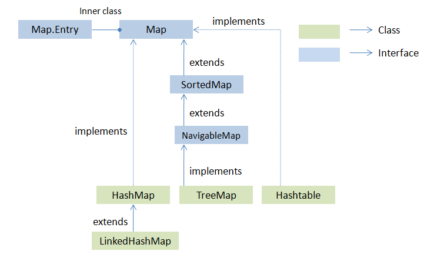

+++
title = 'Collections Framework Notes'
date = 2024-02-11

+++

- The `collect` operation takes three arguments :
  - supplier : for the collect operation, it creates instances of the result container
  - accumulator
  - combiner : takes two result containers and merges their contents.
- Avoid using _stateful lambda expressions_ as parameters in stream operations. A stateful lambda expression is one whose result depends on any state that might change during the execution of a pipeline.
- SortedSet and SortedMap interfaces have one impl. TreeSet and TreeMap respectively.
- If you accept the default load factor but want to specify an initial capacity, pick a number that's about twice the size to which you expect the set to grow.
- There are three special-purpose Map implementations - EnumMap, WeakHashMap and IdentityHashMap
- The threshold of switching to the balanced tree is defined as **TREEIFY_THRESHOLD** constant in java.util.HashMap JDK 8 code. Currently, it's value is 8, which means if there are more than 8 elements in the same bucket than HashMap will use a tree instead of linked list to hold them in the same bucket.
- If internal capacity is 16 and load factor is 0.75 then, number of buckets will automatically get increased when table has 12 elements in it.

### What is Java Collections Framework?

- `s1.containsAll(s2)` : returns true if s2 is a **subset** of s1.
- `s1.addAll(s2)` : transforms s1 into the **union** of s1 and s2.
- `s1.retainAll(s2)` : transforms s1 into the intersection of s1 and s2
- `s1.removeAll(s2)` : transforms s1 into the (asymmetric) set difference of s1 and s2.
- PriorityQueue is **not thread safe**. Use `PriorityBlockingQueue` in concurrent environment.

### What will be the problem if you do not override hashcode() method?

- Some collections, like HashSet, HashMap or HashTable use the hashcode value of an object to find out how the object would be stored in the collection. Hashing retrieval involves:
  - First, find out the right bucket using hashCode().
  - Secondly, search the bucket for the right element using equals()
- If hashcode() in not overridden then the default implementation in Object class will be used by collections. This implementation gives different values for different objects, even if they are equal according to the equals() method.

### What are different Collection views provided by Map interface?

### What is `EnumMap`?

- EnumMap is specialized implementation of Map interface for enumeration types. It extends AbstractMap and implements Map Interface in Java.
- **Features**
  - All keys used in EnumMap must be from same Enum type which is specified while creating EnumMap in Java
  - EnumMap is ordered collection and they are maintained in the natural order of their keys (natural order of keys means the order on which enum constant are declared inside enum type)
  - It’s a high performance map implementation, much faster than HashMap.
  - EnumMap doesn’t allow null key and throw NullPointerException, at same time null values are permitted.

### What is `EnumSet`?

- EnumSet is one of the specialized implementation of Set interface for an enumeration type. It extends AbstractSet and implements Set Interface in Java.
- `public abstract class EnumSet<E extends Enum<E>>` Here, E specifies the elements. E must extend Enum, which enforces the requirement that the elements must be of specified enum type.
- EnumSet is a special Set implementation, only applicable for Enums in Java, but you can only store instances of thesingle enum type. Adding an instance of different enum will result in compile time error, as EnumSet provide type-safety.
- Iterator returned by EnumSet traverse the elements in their natural order, i.e. the order on which enum constants aredeclared, or the order returned by ordinal() method.
- EnumSet is also not synchronized in Java. Though if you need, you can make EnumSet synchronized similar to other collection by using utility methods from Collections class.
- EnumSet is an abstract class, which means you cannot create its instance using new() operator. This is actually carefully thought to provide special implementation, and that's why EnumSet provides several static factory methods for creating instance e.g. noneOf() returns an empty EnumSet with specified enum type, EnumSet.of(....) returns Set of specified enum constants and allOf()method creates an enum set containing all elements of specified enum.

### What is CopyOnWriteArrayList in java?

- CopyOnWriteArrayList is a thread safe variant of ArrayList in which all mutative operations like add or set are implemented by creating a fresh copy of the underlying array.
- It guaranteed not to throw ConcurrentModificationException. It permits all elements including null
