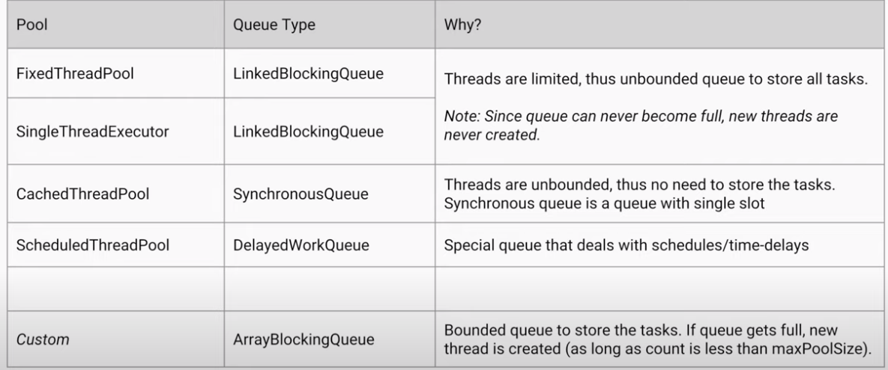

+++
title = 'Concurrency in Java'
date = 2024-02-11

+++

- A process has a self-contained execution environment. A process generally has a complete, private set of basic run-time resources; in particular, each process has its own memory space, registers, PC, stack memory, heap memory - assigned by the OS
- Both processes and threads provide an execution environment, but creating a new thread requires fewer resources than creating a new process. Threads exist within a process — every process has at least one
- A _process_ runs independently and isolated of other processes. It cannot directly access shared data in other processes. The resources of the process, e.g. memory and CPU time, are allocated to it via the operating system.
- A _thread_ is a so called lightweight process. It has its own call stack, but can access shared data of other threads in the same process. Every thread has its own memory cache. If a thread reads shared data, it stores this data in its own memory cache.
- In Java we can create processes with the help of `ProcessBuilder` class.
- A thread **cannot acquire a lock owned by another thread**. But a given thread **can acquire a lock that it already owns**. Allowing a thread to acquire the same lock more than once is called _re-entrant synchronization_. For instance, if a given thread calls a recursive and synchronized method several times then it is fine.
- Object level lock is a mechanism when we want to synchronize a non-static method or non-static code block such that only one thread will be able to execute the code block on given instance of the class. This should always be done to make instance level data thread safe.
- Class level lock prevents multiple threads to enter in synchronized block in any of the all available instances of the class on runtime. Class level locking should always be done to make static data thread safe.
- `wait` and `notify` must happen in a synchronized block on the monitor object whereas `sleep` does not.
- `wait` and `notify` can be interrupted where as `sleep` cannot
- Java doesn't notify the other thread immediately.
- `ReentrantLock`
  - It has the same behaviour as the "synchronized approach" with some extended features
  - `new ReentrantLock(boolean fairnessParameter)`
  - fairness parameter : if true, then the longest waiting thread will get the lock. If false, then there is no access order !!!
- We can make a lock fair : **prevent thread starvation**. synchronized blocks are **unfair** by default.
- We can check whether the given lock is held or not with reentrant locks.
- We can get the **list of threads waiting** for the given lock with reentrant locks.
- synchronized blocks are nicer : we don't need the try-catch-finally block
- Every read of a `volatile` variable will be read from RAM and not from cache.
- Livelock threads are unable to make further progress. They are too busy responding to each other to resume work.
- How to handle deadlock and livelock
  - We should ensure that a thread doesn't block infinitely if it is unable to acquire a lock. This is why using `Lock` interface's `tryLock()` method is convenient
  - We should ensure that each thread acquires the locks in the same order to avoid any cyclic dependency in lock acquisition.
  - Livelock can be handled with the methods above and some randomness.
- Semaphore maintains a set of permits.
  - `acquire()` -> if a permit is available then take it
  - `release()` -> adds a permit
  - Semaphore just keeps count of the number available. `new Semaphore(int permits, boolean fair)`
- Java provides its own multi-threading framework the so-called **Executor Framework**.
- With the help of this framework we can manage worker threads more efficiently because of **thread pools**.
- Thread pools can reuse threads by keeping the threads alive and reusing them (thread pools are usually **queues**)
- There are 4 types of executors
  - `SingleThreadExecutor` : This executor has a single thread so we can execute processes in a sequential manner. Every task is executed by a new thread.
  - `FixedThreadPool(n)` : This is how we can create a thread pool with **n** threads. Usually `n` is the number of cores in CPU. If there's more tasks than `n`, then these tasks are stored with a **LinkedBlockingQueue**
  - `CachedThreadPool` : The number of threads is not bounded - if all threads are busy and a new task comes the pool will create and add a new thread to the executor. If a thread remains idle for **60** secs then it is removed. It is used for short parallel tasks.
  - `ScheduledExecutor` : We can execute a given operation at regular intervals or we can use this executor if we wish to delay a certain task
- `Callable<T>` : We use `call()` method if we want to return a given value from the given thread
  - `Callable` interface will not return the value : this is why we need `Future<T>`
  - Calling thread will be blocked till the `call()` method is executed and `Future<T>` returns the results.
  - `T` is the expected return type of `Callable`
- `executorService.submit()` can handle `Runnable` and `Callable` both.
- `RecursiveTask<T>` will return a `T` type. All the tasks we want to execute in parallel is a subclass of this class. Override the `compute` method that will return the solution of the subproblem
- `RecursiveAction` : it is a task, but w/o any return value
- `ForkJoinPool` : it is a thread pool for executing fork-join tasks.
- `CopyOnWriteArrayList` is ideal for read-often, write-rarely collections such as `Listeners` for a JavaBean event
- `BlockingQueue` neatly solves the problem of how to "hand off" items gathered by one thread to another thread for processing, without explicit concern for synchronization issues.
- `BlockingQueue` also supports methods that take a time parameter, indicating how long the thread should block before returning to signal failure to insert or retrieve the item in question.
- `SynchronousQueue` is a blocking queue in which each insert operation must wait for a corresponding remove operation by another thread, and vice versa. It gives us an extremely lightweight way to exchange single elements from one thread to another.
- `SynchronousQueue` will allow an insert into the queue only if there is a thread waiting to consume it.
- `CountDownLatch` holds all threads at bay until a particular condition is met, at which point it releases them all at once.
- The `synchronized` keyword is not considered to be part of a method's signature. So the synchronized modifier is not automatically inherited when subclasses override superclass methods, and methods in interfaces cannot be declared as `synchronized`.
- Also, constructors cannot be qualified as `synchronized` (although block synchronization can be used within constructors)

### Virtual Threads

- Operating systems typically allocate thread stacks as monolithic blocks of memory at thread creation time that cannot be resized later. This means that threads carry with them megabyte-scale chunks of memory to manage the native and Java call stacks.
- We generally lean towards overprovisioning thread stacks as being the lesser of evils, but the result is a relatively low limit on how many concurrent threads we can have for a given amount of memory.
- Virtual threads are an alternative implementation of `java.lang.Thread` which store their stack frames in Java's garbage-collected heap rather than in monolithic blocks of memory allocated by the operating system. The memory footprint for a virtual thread starts out at only a few hundred bytes, and is expanded and shrunk automatically as the call stack expands and shrinks.
- Virtual threads allow IO-bound thread-per-task applications to scale better by removing the most common scaling bottleneck - the maximum number of threads - which in turn enables better hardware utilization.
- For CPU-bound workloads, we already have tools to get to optimal CPU utilization, such as the fork-join framework and parallel streams. Virtual threads offer a complementary benefit to these. Parallel streams make it easier to scale CPU-bound workloads, but offer relatively little for IO-bound workloads; virtual threads offer a scalability benefit for IO-bound workloads, but relatively little for CPU-bound ones.
- But when it comes to virtual threads, pooling becomes an antipattern
- If it is necessary to limit concurrency to bound consumption of some resource other than the threads themselves, such as database connections, we can use a Semaphore and have each virtual thread that needs the scarce resource acquire a permit.
- One of the ways in which ThreadLocal is sometimes used (some would say abused) is to cache resources that are expensive to allocate, not thread-safe, or simply to avoid repeated allocation of a commonly used object
- A more serious problem with async/await is the "function color" problem, where methods are divided into two kinds - one designed for threads and another designed for async methods - and the two do not interoperate perfectly.
- Because acquiring an intrinsic lock (synchronized) currently pins a virtual thread to its carrier, critical intrinsic locks were replaced with `ReentrantLock`, which does not share this behavior.

### Java Multithreading

- **Concurrency issues** : There are two basic problems, visibility and access problems.
- A _visibility_ problem occurs if thread A reads shared data which is later changed by thread B and thread A is unaware of this change.
- An _access_ problem can occur if several threads access and changes the same shared data at the same time.
- Visibility and access problem can lead to:
  - _Liveness failure_ : The program doesn't react anymore , e.g. deadlocks.
  - _Safety failure_ : The program creates incorrect data.
- If a variable is declared with _volatile_ keyword then it is guaranteed that any thread that reads the field will see the most recently written value.
- The _volatile_ keyword will not perform any mutual exclusive lock on the variable.
- An _atomic operation_ is an operation which is performed as a single unit of work without the possibility of interference from other operations.
- The idiom, which employs a `Runnable` object is more general because a `Runnable` object can subclass a class other than `Thread`.
- The `Runnable` is the task to perform and `Thread` is the worker doing this task.
- Thread pools manage a pool of worker threads. The thread pools contain a work queue which holds tasks waiting to be executed.
- A thread pool can be described as a collection of `Runnable` objects (work queue) and a connection of running threads.
- These threads are constantly running and are checking the work queue for new work. If there is new work to be done they execute this `Runnable`.
- A compare-and-swap (CAS) operation checks if a variable has a certain value and if it has that value it will perform an operation.
- Threads can be in one of six states: New, Runnable, Blocked, Waiting, Timed Waiting, Terminated
- When a thread is created with the `new` operator - the thread is not yet running. It is in the _new_ state.
- Once `start` method is invoked the thread is in the _runnable_ state. A runnable thread may or may not actually be running at any given time.
- When a thread is blocked or waiting, it is temporarily inactive. It is upto the thread scheduler to reactivate it.
- When the thread tries to acquire an intrinsic object lock that is currently held by another thread, it becomes _blocked_.
- When the thread waits for another thread to notify the scheduler of a condition, it enters the _waiting_ state.
- Several methods have a timeout parameter. Calling them causes the thread to enter the _timed waiting_ state.
- A daemon is simply a thread that has no other role than to serve others. Examples are timer threads that send regular "timer ticks" or threads that clean up stale cache entries.
- A thread can only call `await`, `signalAll`, or `signal` on a condition if it owns the lock of the condition.
- A lock protects sections of code, allowing only one thread to execute the code at a time.
- A lock manages threads that are trying to enter a protected code segment.
- A lock can have one or more associated condition objects.
- Each condition object manages threads that have entered a protected code section but that cannot proceed.
- If a method is declared with the `synchronized` keyword, the object's lock protects the entire method.
- It is also legal to declare static methods as synchronized.
- A monitor has these properties:
  - A monitor is a class with only private fields.
  - Each object of that class has an associated lock.
  - All methods are locked by that lock. In other words, if a client calls `obj.method()`, then the lock for `obj` is automatically acquired at the beginning of the method call and relinquished when the method returns.
  - The lock can have any number of associated conditions
- In more complex applications it makes more sense to throw an `InterruptedException` when a thread is interrupted.
- The interrupt mechanism is implemented using an internal flag known as the _interrupt status_. Invoking `Thread.interrupt` sets this flag. When a thread checks for an interrupt by invoking the static method `Thread.interrupted`, interrupt status is cleared. The non-static `isInterrupted` method, which is used by one thread to query the interrupt status of another, does not change the interrupt status flag.
- The class `java.lang.Thread` provides the static method `Thread.holdsLock(Object)` that returns true iff the current thread holds the lock on the object given as argument to the method invocation.
- `ConcurrentHashMap` uses different locks to guard different buckets. Hence one thread that tries to access the first bucket can acquire the lock for this bucket, while another thread can simultaneously access a second bucket. In contrast to a synchronized version of `Hashmap` this technique can increase the performance when different threads work on different buckets.
- By convention, any method that exits by throwing an `InterruptedException` clears interrupt status when it does so.

### What is difference between user Thread and daemon Thread?

- When we create a Thread in Java program, it’s known as **user** thread. A daemon thread runs in background and doesn’t prevent JVM from terminating. When there are no user threads running, JVM shutdown the program and quits. A child thread created from daemon thread is also a daemon thread.
- **Daemon** thread in Java is a service provider thread that provides services to the user thread. Its life depend on the mercy of user threads i.e. when all the user threads dies, JVM terminates this thread automatically.
- There are many Java daemon threads running automatically e.g. gc, finalizer etc.

### What happens when an uncaught exception leaves the `run()` method?

- It can happen that an unchecked exception escapes from the `run()` method. In this case the thread is stopped by the JVM. It is possible to catch this exception by registering an instance that implements the interface `UncaughtExceptionHandler` as an exception handler.
- This is either done by invoking the static method `Thread.setDefaultUncaughtExceptionHandler(Thread.UncaughtExceptionHandler)`, which tells the JVM to use the provided handler in case there was no specific handler registered on the thread itself, or by invoking `setUncaughtExceptionHandler(Thread.UncaughtExceptionHandler)` on the thread instance itself.
- A shutdown hook is a thread that gets executed when the JVM shuts down. It can be registered by invoking `addShutdownHook(Runnable)` on the Runtime instance.

### Which rules do you have to follow in order to implement an immutable class?

- All fields should be final and private.
- There should be not setter methods.
- The class itself should be declared final in order to prevent subclasses to violate the principle of immutability
- If fields are not of a primitive type but a reference to another object:
  - There should not be a getter method that exposes the reference directly to the caller.
  - Don't change the referenced objects (or at least changing these references is not visisble to clients of the object).

### What is the relation between the two interfaces `Executor` and `ExecutorService`?

- The interface `Executor` only defines one method: `execute(Runnable)`. Implementations of this interface will have to execute the given Runnable instance at some time in the future.
- The `ExecutorService` interface is an extension of the `Executor` interface and provides additional methods to shut down the underlying implementation, to await the termination of all submitted tasks and it allows submitting instances of `Callable`.

### What is a `CountDownLatch` ?

- The SDK class `CountDownLatch` provides a synchronization aid that can be used to implement scenarios in which threads have to wait until some other threads have reached the
  same state such that all thread can start. This is done by providing a synchronized counter that is decremented until it reaches the value zero. Having reached zero the `CountDownLatch` instance lets all threads proceed. This can be either used to let all threads start at a given point in time by using the value 1 for the counter or to wait until a number of threads has finished. In the latter case the counter is initialized with the number of threads and each thread that has finished its work counts the latch down by one.

### What is the difference between a `CountDownLatch` and a `CyclicBarrier` ?

- Both SDK classes maintain internally a counter that is decremented by different threads. The threads wait until the internal counter reaches the value zero and proceed from there on. But in contrast to the `CountDownLatch` the class `CyclicBarrier` resets the internal value back to the initial value once the value reaches zero. As the name indicates instances of `CyclicBarrier` can therefore be used to implement use cases where threads have to wait on each other again and again.

### What is the difference between the two classes `RecursiveTask` and `RecursiveAction`?

- In contrast to `RecursiveTask` the method `compute()` of `RecursiveAction` does not have to return a value. Hence `RecursiveAction` can be used when the action works directly on
  some data structure without having to return the computed value.

### What is the difference between calling `wait()` and `sleep()` method ?

- Though both `wait()` and `sleep()` introduce some form of pause in Java application, they are tools for different needs
- `wait()` method is used for inter thread communication, it relinquishes lock if waiting for a condition is true and waits for notification when, due to an action of another thread waiting condition becomes false.
- `sleep()` method is used just to relinquish CPU or stop execution of current thread for specified time duration. Calling sleep method doesn't release the lock held by current thread
- Also, wait for method in Java should be called from synchronized method or block while there is no such requirement for sleep() method.

### How exceptions are handled in case of Multithreading scenario? who will handle Exceptions if there is no handler?

- Exceptions that are thrown from Thread can be handled in 3 different ways,
  1. **At Thread Level** : Each threads have there own Exception handling mechanism
  2. **At ThreadGroup Level** : Each ThreadGroup have there own Exception handling mechanism which will be applicable to all thread within group.
  3. **At Global Thread Level** : Default Exception Handler can be configured at Global thread level which will be applicable to all the threads.
- When an uncaught exception occurs from a particular Thread, the JVM looks for handler in way shown below,
  1. First JVM will look whether **UncaughtExceptionHandler** (setUncaughtExceptionHandler) for the current **Thread** is set or not. If set than exception will be catch by Thread handler. If not set than exception will be propagated up the call stack.
  2. Second JVM will check whether uncaughtException of ThreadGroup is overriden or not, JVM will not only check uncaughtException handler of direct ThreadGroup of which Thread is part of, but JVM will also look at all the parent ThreadGroups as well. If uncaughtException is overriden by any one of ThreadGroup handler than exception will be caught by that ThreadGroup handler. If not set than exception will be propagated up the call stack.
  3. Third JVM will check whether DefaultUncaughtExceptionHandler (setDefaultUncaughtExceptionHandler) at JVM level(Global Thread level) is configured or not, It will act as handler for all the Threads in JVM. If set than exception will be catch by Global Thread handler. If not set than exception will be propagated up the call stack.
  4. When there is no handler configured, Threadgroup class ("main" threadgroup to which main thread is part of) provide default implementation of uncaughtException() method that is called which prints Exception as shown below and JVM shutdowns.

### Why wait, notify and notifyAll is defined in Object Class and not on Thread class in Java?

- First of all, let us know what purpose do these mehods fulfil
  - `wait()` - Tells the current thread to release the lock and go to sleep until some other thread enters the same monitor and calls `notify()`
  - `notify()` - Wakes up the single thread that is waiting on this object's monitor.
  - `notifyAll()` - It wakes up all the threads that called `wait()` on the same object.
- Following above definition, we can conclude that wait() and notify() work at the monitor level and monitor is assigned to an object not to a particular thread. Hence, wait() and notify() methods are defined in Object class rather than Thread class. If wait() and notify() were on the Thread instead then each thread would have to know the status of every other thread and there is no way to know thread1 that thread2 was waiting for any resource to access.Hence, notify, wait, notifyAll methods are defined in object class in Java.
