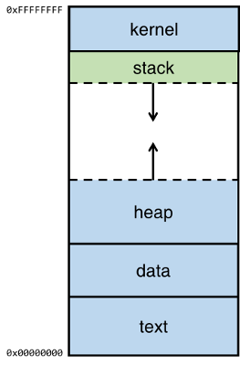
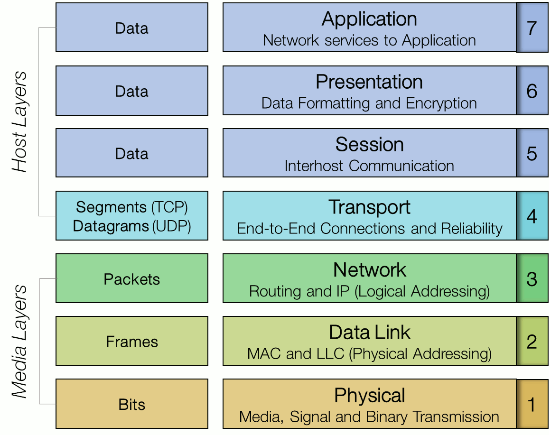

### Buffer exploit

- A buffer overflow occurs when a program or process attempts to write more data to a fixed length block of memory (a buffer), than the buffer is allocated to hold
- [Address Space Layout Randomization](https://en.wikipedia.org/wiki/Address_space_layout_randomization)
- When a program is run by the operating system (OS), the executable will be held in memory in a very specific way that's consistent between different processes.

- The top of the **memory** is the kernel area, which contains the command-line parameters that are passed to the program and the environment variables.
- The bottom area of the memory is called **text** and contains the actual code, the compiled machine instructions, of the program. It is a read-only area.
- Above the text is the **data**, where uninitialized and initialized variables are stored.
- On top of the data area, is the **heap**. This is a big area of memory where large objects are allocated (like images, files, etc.)
- Below the kernel is the **stack**. This holds the local variables for each of the functions. When a new function is called, these are pushed on the end of the stack
- Note that the heap grows up (from low to higher memory) when more memory is required by an application and the stack grows downwards (from high to lower memory).
- `gcc -g -o buf buf.c -m32 (-mpreferred-stack-boundary=2)`
- In gdb, we can use the list command to display the code. This works because we have compiled it with debug information
- The command disas func will show the assembler code for the method func
- **Segmentation fault** is an error the CPU produces when something tries to access a part of the memory it should not be accessing.
- Let's see what the stack looks like in memory in gdb, by executing the command `x/100x $sp-200`. The first part of this command `x/100x` reads the memory in a block of 100 bytes in hexadecimal format. `$sp-200` will tell it to read the memory from the stackpointer ($sp) position offset by -200 bytes:
- check out the registers by entering the command `info registers` in gdb
- The EIP (Extended Instruction Pointer) contains the address of the next instruction to be executed,
- In order to exploit the problem with the buffer we aim to change the return address to somewhere we would have some code that, when executed, could do something beneficial to us as an attacker; like launching a shell.
- A shellcode is a small piece of code used as the payload in the exploitation of a software vulnerability. It is called "shellcode" because it typically starts a command shell from which the attacker can control the compromised machine
- Many samples of shellcode can be found on the Internet ([exploit-db](https://www.exploit-db.com/shellcodes/))
- Our goal is to get the faulty program `buf` to execute the shellcode. In order to do this, we will pass the shellcode as the command-line parameter so it will eventually end up in the buffer. We then overwrite the return address (the C's in the previous example) so it will point back to a memory address somewhere in the buffer. This will make the program jump to the shellcode and execute that code instead of the regular program.
- A NOP-sled is a sequence of NOP (no-operation) instructions meant to "slide" the CPU's instruction execution flow to the next memory address
- Anywhere the return address lands in the NOP-sled, it's going to slide along the buffer until it hits the start of the shellcode
- you can try disabling this protection of gcc using option `-fno-stack-protector` while compiling for working around stack smashing detected

### 5 Phases of Hacking

- **Phase 1 : Reconnaissance**
  - The used methods typically include identifying the target and discovering the target IP address range, network, domain name, mail server, DNS records
- **Phase 2 : Scanning**
  - In this phase, the information gathered during the reconnaissance phase is used to scan the perimeter and internal network devices looking for weaknesses
  - It includes scanning the target for services running, open ports, firewall detection, finding vulnerabilities, OS detection,
  - Techniques may include: Port scanners, Vulnerability scanner, Network mappers.
- **Phase 3 : Gaining access**
  - In this phase the attacker would exploit a vulnerability to gain access to the target
  - This typically involves taking control of one or more network devices to extract data from the target or use that device to perform attacks on other targets.
  - Examples of methods to gain access are:
    - Abusing a username/password that was found.
    - Exploitting a known vulnerability
    - Breaking into a weakly secured network
    - Sending malware to an employee via E-mail or a USB stick on the parking lot.
- **Phase 4 : Maintaining access**
  - Some examples of techniques used in this phase:
    - Privilege escalation
    - Installation of a backdoor or remote access trojan
    - Creating own credentials
- **Phase 5 : Covering tracks**
  - In the final phase, the attacker will take steps necessary to hide the intrusion and any controls he may have left behind for future visits.
  - Some examples of covering tracks:
    - Remove logging
    - Exfiltration of data via [DNS tunnelling](https://www.plixer.com/blog/network-security-forensics/what-is-dns-tunneling/) or [steganography](https://www.wired.com/story/steganography-hacker-lexicon/)
    - Installation of rootkits

### Executing a man-in-the-middle attack

- During a man-in-the-middle attack an attacker places himself between two otherwise inter-connected devices
- ARP helps a network host make a translation from the IP-address to the MAC-address.
- Both machines will have an ARP table where the IP- and corresponding MAC-addresses of all known machines are stored
- The fact that Machine A updates its ARP table with the info from an ARP response **without any question about the validity of this information**, opens the door for ARP spoofing (also known as ARP poisoning).
- [SSLStrip](https://moxie.org/software/sslstrip/) is the tool to force the client to keep communicating via HTTP.
- to find out the IP-address of the gateway by running the `route -n` command.
- To discover who is on the network in our `192.168.1.xxx` subnet, we use the command `netdiscover -r 192.168.1.0/24`. This will attempt to discover all nodes in the range `192.168.1.0` to `192.168.1.255`. If we supplied the `-p` parameter it will listen passively.
- Netdiscover sniffs the ARP traffic to discover who's on the network.
- Make sure all IPv4 traffic is forwarded otherwise this would result in DoS attack to our victim.
- In Linux, we enable IPv4 forwarding by executing the following command. `echo 1 > /proc/sys/net/ipv4/ip_forward`
- We also need to redirect all HTTP-traffic to SSLStrip.
- Redirecting incoming HTTP-traffic to port `10000` on our own machine, requires a modification in the linux firewall tables. `iptables -t nat -A PREROUTING -p tcp --destination-port 80 -j REDIRECT --to-port 10000`
- Run sslstrip then
- In order to send the malicious ARP-reponses we could craft our own packets with [scapy](https://scapy.net/) or use [Cain & Abel](http://www.oxid.it/cain.html). We can also use [Ettercap](https://www.ettercap-project.org/)
- to check the arp table `arp -a`

### TCP 3-way handshake and port scanning

- Analyzing how the ports of a server respond to certain TCP header flags is the basis for port scanning.
- SYN-scan is the default for Nmap port scans and is often referred to as half-open scanning, because you don't open a full TCP connection. You send a SYN packet, as if you are going to open a real connection and then wait for a response.
- `nmap -sS IP_of_server -p 22,80,139` The `-sS` paramter performs a SYN-scan

### OSI model

- A summary of each layer's responsibilities:
  - **Application** - High-level API's, including resource sharing, remote file access.
  - **Presentation** - Translation of data between a networking device and an application. This is the layer where character encoding, data compression and encryption takes place.
  - **Session** - Managing communication sessions.
  - **Transport** - Reliable transmission of data segments between nodes on a network, including segmentation, acknowledgment and multiplexing.
  - **Network** - Structuring and managing a multi-node network, including addressing, routing and traffic control
  - **Data Link** - Reliable transmission of data frames between two nodes connected by the physical layer.
  - **Physical** - Transmission and reception of raw bit streams over a physical medium.
- The top 4 layers are called the _Host layers_ and the bottom 3 layers are referred to as the _Media layers_
- The Application layer is the location where users and application processes access network services.
- Common application protocols that work in this layer include: HTTP, FTP, SMTP, DNS, Telnet, SSH, IMAP, POP, SNMP, etc.
- The Presentation layer's primary responsibility is to define how the data is communicated by the network hosts.
- Compression, encryption, serialization, protocol conversion, character set conversion all fall in the functions of presentation layer.
- Common examples for protocols and technology that operate in the Presentation layer include X.25, ZIP, XML, JSON, ASCII, EBCDIC, JPEG, MP3, etc.
- The Session Layer provides process to process communications between two or more networked hosts
- Session layer - protocols : NetBIOS, RPC, SOCKS, L2TP, SDP, H.245, NFS, etc.
- The Transport Layer ensures that messages are delivered error-free, in sequence and with no loss or duplication. This layer verifies that the application transmitting the data is actually allowed to access the network
- Besides TCP and UDP, some common protocols that operating in the Transport layer include SPX, SCTP, RDP and DCCP.
- The network (or Internet) layer is primarily responsible for establishing the paths used for transfer of data packets between nodes on the network. This is the layer that routers operate on.
- Besides IP, the following common protocols are included in the Network layer: ICMP, IPsec, IPX, DDP, CLNP, etc.
- At the Data Link layer, data packets are encoded into bits. It defines the protocol for flow control and to establish and terminate a connection between two physically connected nodes on the network.
- Protocols in this layer include Ethernet, ARP, PPP, Token ring, StarLAN, NDP, L2TP, etc.
- Technologies in this layer include Infrared, ISDN, DSL, Bluetooth physical layer, CAN bus, USB physical layer, Ethernet physical layer, IEEE 1394, RS-232, etc
