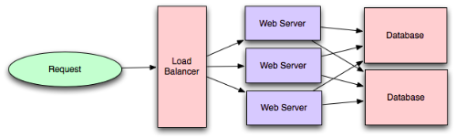
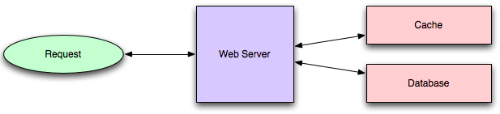
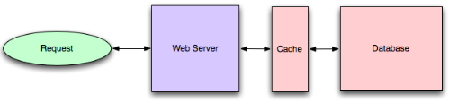
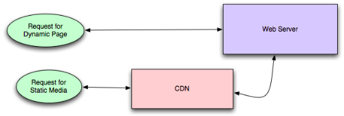
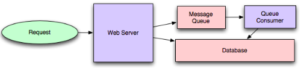
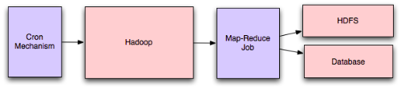
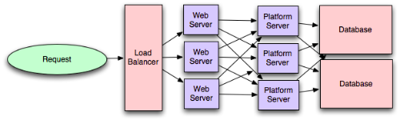
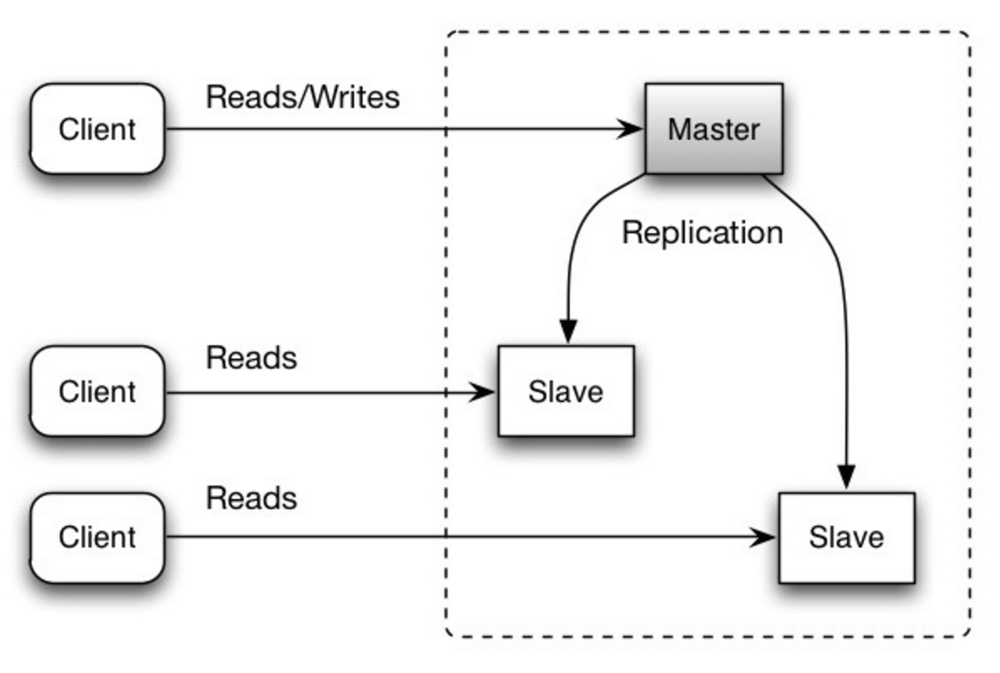
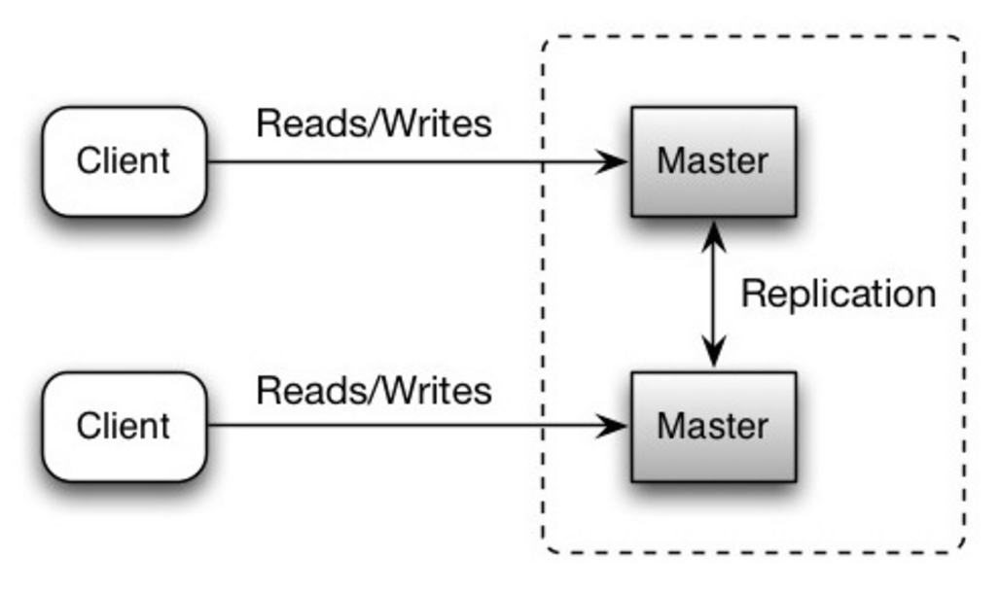
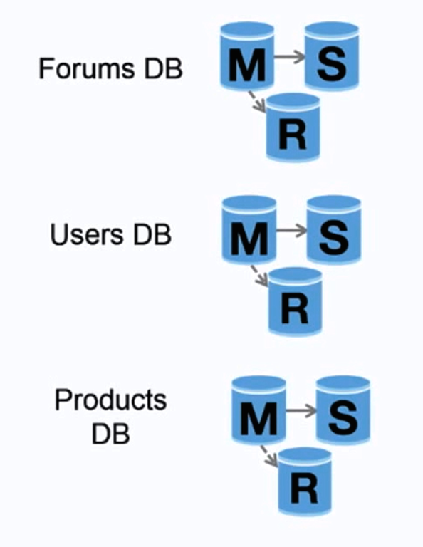

### Web scalability for Startup Engineers

- The key thing to observe here is that any data you put into the session should be stored outside of the web server itself to be available from any web server.
- There are three common ways to solve this problem:
  - Store session state in cookies
  - Delegate the session storage to an external data store
  - Use a load balancer that supports sticky sessions
- Using cookies for session data storage works very well as long as you can keep your data minimal. If all you need to keep in session scope is user ID or some security token, you will benefit from the simplicity and speed of this solution
- The second alternative approach is to store session data in a dedicated data store. In this case, your web application would take the session identifier from the web request and then load session data from an external data store. The only requirement here is to have very low latency on get-by-key and put-by-key operations
- Finally, you can handle session state by doing nothing in the application layer and pushing the responsibility onto the load balancer.
- If your startup grows much larger, you can also use **latency-based routing** of Route 53 to direct your clients to the “closest” data center. If you were hosting your servers in multiple Amazon regions (multiple data centers), your clients would actually benefit from establishing a connection to a region that is closer to their location. Route 53 allows you to do that easily using latency-based routing
- ELB needs some time to “warm up” and scale out. If you get sudden spikes in traffic that require doubling capacity in a matter of seconds or minutes, ELB may be too slow for you.
- HAProxy, on the other hand, is simpler in design than Nginx, as it is just a load balancer. It can be configured as either a layer 4 or layer 7 load balancer. When HAProxy is set up to be a layer 4 proxy, it does not inspect higher-level protocols and it depends solely on TCP/IP headers to distribute the traffic. This, in turn, allows HAProxy to be a load balancer for any protocol, not just HTTP/HTTPS. You can use HAProxy to distribute traffic for services like cache servers, message queues, or databases
- HAProxy can also be configured as a layer 7 proxy, in which case it supports sticky sessions and SSL termination, but needs more resources to be able to inspect and track HTTP-specific information
- The second alternative to distributed transactions is to provide a mechanism of compensating transaction. A compensating transaction can be used to revert the result of an operation that was issued as part of a larger logical transaction that has failed
- Cassandra, allow clients to fine-tune the guarantees and tradeoffs made by specifying the consistency level of each query independently. Rather than having a global tradeoff affecting all of your queries, you can choose which queries require more consistency and which ones can deal with stale data, gaining more availability and reducing latency of your responses.
- All you need to do to replace a broken server is add a new (blank) one and tell Cassandra which IP address this new node is replacing.
- As a result, some use cases that add and delete a lot of data can become inefficient because deletes increase the data size rather than reducing it (until the compaction process cleans them up).
- You can use different slaves for different types of queries. For example, you could use one slave for regular application queries and another slave for slow, long-running reports
- To prioritize what needs to be cached, use a simple metric of aggregated time spent generating a particular type of response. You can calculate the aggregated time spent in the following way: `aggregated time spent = time spent per request * number of requests`
- In the case of cache-aside caches, the application needs to be aware of the existence of the object cache, and it actively uses it to store and retrieve objects rather than the cache being transparently positioned between the application and its data sources.
- Always consider ways to reduce the number of possible cache keys. The fewer cache keys possible, the better for your cache efficency.
- The first header you need to become familiar with is **Cache-Control**. `Cache-Control : no-cache, no-store, max-age=0, must-revalidate`
- **private** option in Cache-Control indicates that the result is specific to the user who request it and the response cannot be served to any other user.
- Another important header is **Vary**. The purpose of that header is to tell caches that you may need to generate multiple variations of response based on some HTTP request header. `Vary: Accept-Encoding`
- There are four main types of HTTP Caches: browser cache, caching proxies, reverse proxies, and CDN.
- The availability of different routing methods may depend on which message broker you decide to use, but they usually support the following routing methods: direct worker queue, publish/subscribe, and custom routing rules
- This routing model is well suited for the distribution of time-consuming tasks across multiple worker machines. It is best if consumers are stateless and uniform; then replacement of failed nodes becomes as easy as adding a new worker node.”
- A good example of this routing model is to publish a message for every purchase. Your e-commerce application could publish a message to a topic each time a purchase is confirmed. Then you could create multiple consumers performing different actions whenever a purchase message is published
- Logging and alerting are good examples of custom routing based on pattern matching.
- Some of the common difficulties and pitfalls you may encounter when working with message queues and asynchronous processing include no message ordering, message requeuing, race conditions, and increased complexity.
- The first rule of thumb when creating indexes on a data set is that the higher the cardinality, the better the index performance.
- The second rule of thumb when creating indexes is the equal distribution leads to better index performance.
- data should be stored in a way that is optimized for specific access patterns and that indexes are the primary tool for making search scalable.
- When managing a project, you have three “levers” allowing you to balance the project: scope, cost, and time.
- Anytime you increase or decrease the scope, cost, or deadline, the remaining two variables need to be adjusted to reach a balance

### Performance vs Scalability

- A service is **scalable** if it results in increased **performance** in a manner proportional to resources added. Generally, increasing performance means serving more units of work, but it can also be to handle larger units of work, such as when datasets grow
- Another way to look at performance vs scalability
  - If you have a **performance** problem, your system is slow for a single user.
  - If you have a **scalability** problem, your system is fast for a single user but slow under heavy load.
- Is achieving good scalability possible? Absolutely, but only if we architect and engineer our systems to take scalability into account. For the systems we build we must carefully inspect along which axis we expect the system to grow, where redundancy is required, and how one should handle heterogeneity in this system, and make sure that architects are aware of which tools they can use for under which conditions, and what the common pitfalls are.
- **Latency** is the time to perform some action or to produce some result. Latency is measured in units of time -- hours, minutes, seconds, nanoseconds or clock periods.
- **Throughput** is the number of such actions or results per unit of time. This is measured in units of whatever is being produced (cars, motorcycles, I/O samples, memory words, iterations) per unit of time
- An assembly line is manufacturing cars. It takes eight hours to manufacture a car and that the factory produces one hundred and twenty cars per day.
- The latency is: 8 hours.
- The throughput is: 120 cars / day or 5 cars / hour
- Generally you should aim for **maximal throughput** with **acceptable latency**.

### CAP Theorem

- **Consistency** - Every read receives the most recent write or an error
- **Availability** - Every request receives a response, without guarantee that it contains the most recent version of the information
- **Partition Tolerance** - The system continues to operate despite arbitrary partitioning due to network failures
- CAP Theorem states that, in a distributed system (a collection of interconnected nodes that share data.), you can only have two out of the following three guarantees across a write/read pair: Consistency, Availability, and Partition Tolerance - one of them must be sacrificed
- **Consistency** - A read is guaranteed to return the most recent write for a given client.
- **Availability** - A non-failing node will return a reasonable response within a reasonable amount of time (no error or timeout)
- **Partition Tolerance** - The system will continue to function when network partitions occur.
- Given that networks aren’t completely reliable, you must tolerate partitions in a distributed system, period. According to the CAP theorem, this means we are left with two options: Consistency and Availability.
- **CP** - Wait for a response from the partitioned node which could result in a timeout error. The system can also choose to return an error, depending on the scenario you desire. Choose Consistency over Availability when your business requirements dictate atomic reads and writes.
- **AP** - Return the most recent version of the data you have, which could be stale. This system state will also accept writes that can be processed later when the partition is resolved. Choose Availability over Consistency when your business requirements allow for some flexibility around when the data in the system synchronizes. Availability is also a compelling option when the system needs to continue to function in spite of external errors (shopping carts, etc.)

### Remembrance Inc, analogy

- **Consistency**: Your customers, once they have updated information with you, will always get the most updated information when they call subsequently. No matter how quickly they call back
- **Availability**: Remembrance Inc will always be available for calls until any one of you(you or your wife) report to work.
- **Partition Tolerance**: Remembrance Inc will work even if there is a communication loss between you and your wife!
- You can have a run around clerk, who will update other’s notebook when one of your’s or your wife’s notebook is updated. This is how many NoSQL systems work, one node updates itself locally and a background process synchronizes all other nodes accordingly. The only problem is that you will lose consistency of some time. For eg., a customer’s call reaches your wife first and before the clerk has a chance to update your notebook, the customer calls back and it reaches you.

### What does CAP Theorem actually say?

- The CAP Theorem (henceforth 'CAP') says that it is impossible to build an implementation of read-write storage in an asynchronous network that satisfies all of the following three properties:
- **Availability** - will a request made to the data store always eventually complete?
- **Consistency** - will all executions of reads and writes seen by all nodes be _atomic_ or _linearizably_ consistent?
- **Partition tolerance** - the network is allowed to drop any messages.
- More informally, the CAP theorem tells us that we can't build a database that both responds to every request and returns the results that you would expect every time
- [cap-faq](https://github.com/henryr/cap-faq)
- [Microservices](https://www.nginx.com/blog/introduction-to-microservices/)

### Consistency Patterns

#### Weak consistency

- After a write, reads may or may not see it. A best effor approach is taken.
- This approach is seen in systems such as memcached. Weak consistency works well in real time use cases such as VoIP, video chat, realtime multiplayer games.

#### Eventual Consistency

- After a write, reads will eventually see it (typically within milliseconds). Data is replicated asynchronously.
- This approach is seen in systems such as DNS and email. Eventual consistency works well in highly available systems.

#### Strong consistency

- After a write, reads will see it. Data is replicated synchronously
- This approach is seen in file systems and RDBMSes. Strong consistency works well in systems that need transactions.

### Availability patterns

- There are two complementary patterns to support high availability : **fail-over** and **replication**

#### Fail-Over

- **Active-Passive**
  - With active-passive fail-over, heartbeats are sent between the active and the passive server on standby. If the heartbeat is interrupted, the passive server takes over the active's IP address and resumes service.
  - The length of downtime is determined by whether the passive server is already running in 'hot' standby or whether it needs to start up from 'cold' standby. Only the active server handles traffic.
- **Active-Active**
  - In active-active, both servers are managing traffic, spreading the load between them.
  - If the servers are public-facing, the DNS would need to know about the public IPs of both servers. If the servers are internal-facing, application logic would need to know about both servers.
- **Disadvantage(s) : failover**
  - Fail-over adds more hardware and additional complexity.
  - There is a potential for loss of data if the active system fails before any newly written data can be replicated to the passive.

#### Replication

- **Master-Slave** and **Master-Master**

- If a service consists of multiple components prone to failure, the service's overall availability depends on whether the components are in sequence or in parallel.
- In sequence : `Availability (Total) = Availability (Foo) * Availability (Bar)`
- In parallel : `Availability (Total) = 1 - (1 - Availability (Foo)) * (1 - Availability (Bar))`

### CDNs

- A content delivery network (CDN) is a globally distributed network of proxy servers, serving content from locations closer to the user.
- **Push CDNs**
  - Push CDNs receive new content whenever changes occur on your server. You take full responsibility for providing content, uploading directly to the CDN and rewriting URLs to point to the CDN. You can configure when content expires and when it is updated. Content is uploaded only when it is new or changed, minimizing traffic, but maximizing storage.
  - Sites with a small amount of traffic or sites with content that isn't often updated work well with push CDNs. Content is placed on the CDNs once, instead of being re-pulled at regular intervals.
- **Pull CDNs**
  - Pull CDNs grab new content from your server when the first user requests the content. You leave the content on your server and rewrite URLs to point to the CDN. This results in a slower request until the content is cached on the CDN.
  - A time-to-live (TTL) determines how long content is cached. Pull CDNs minimize storage space on the CDN, but can create redundant traffic if files expire and are pulled before they have actually changed.
  - Sites with heavy traffic work well with pull CDNs, as traffic is spread out more evenly with only recently-requested content remaining on the CDN

### Load Balancers

- Load balancers distribute incoming client requests to computing resources such as application servers and databases.
- Load balancers are effective at:
  - Preventing requests from going to unhealthy servers
  - Preventing overloading resources
  - Helping to eliminate a single point of failure
- Additional benefits include:
  - **SSL termination** : Decrypt incoming requests and encrypt server responses so backend servers do not have to perform these potentially expensive operations
  - **Session persistence** : Issue cookies and route a specific client's requests to same instance if the web apps do not keep track of sessions
- To protect against failures, it's common to set up multiple load balancers, either in active-passive or active-active mode.
- Load balancers can route traffic based on various metrics, including:
  - Random
  - Least loaded
  - Session/cookies
  - [Round robin or weighted round robin](https://www.g33kinfo.com/info/round-robin-vs-weighted-round-robin-lb)
  - Layer 4
  - Layer 7
- **Layer 4 load balancing** : Layer 4 load balancers look at info at the transport layer to decide how to distribute requests. Generally, this involves the source, destination IP addresses, and ports in the header, but not the contents of the packet. Layer 4 load balancers forward network packets to and from the upstream server, performing Network Address Translation (NAT).
- **Layer 7 load balancing** : Layer 7 load balancers look at the application layer to decide how to distribute requests. This can involve contents of the header, message, and cookies. Layer 7 load balancers terminate network traffic, reads the message, makes a load-balancing decision, then opens a connection to the selected server. For example, a layer 7 load balancer can direct video traffic to servers that host videos while directing more sensitive user billing traffic to security-hardened servers.

### Disadvantage(s) : Load balancer

- The load balancer can become a performance bottleneck if it does not have enough resources or if it is not configured properly.
- Introducing a load balancer to help eliminate a single point of failure results in increased complexity.
- A single load balancer is a single point of failure, configuring multiple load balancers further increases complexity.

### Disadvatage(s) : horizontal scaling

- Scaling horizontally introduces complexity and involves cloning servers
  - Servers should be stateless: they should not contain any user-related data like sessions or profile pictures
  - Sessions can be stored in a centralized data store such as a database (SQL, NoSQL) or a persistent cache (Redis, Memcached)
- Downstream servers such as caches and databases need to handle more simultaneous connections as upstream servers scale out

### Reverse proxy (Web server)

- A reverse proxy is a web server that centralizes internal services and provides unified interfaces to the public. Requests from clients are forwarded to a server that can fulfill it before the reverse proxy returns the server's response to the client.
- Additional benefits include :
  - **Increased security** : Hide information about backend servers, blacklist IPs, limit number of connections per client
  - **Increased scalability and flexibility** : Clients only see the reverse proxy's IP, allowing you to scale servers or change their configuration.
  - **SSL termination** : Decrypt incoming requests and encrypt server responses so backend servers do not have to perform these potentially expensive operations
  - **Compression** : Compress server responses
  - **Caching** : Return the response for cached requests
  - **Static content** : Server static content directly

## Introduction to Architecting Systems for Scale

- Conventions
  - _green_ is an external request from an external client (an HTTP request from a browser)
  - _blue_ is your code running in some container (a Django app running on [mod_wsgi](http://code.google.com/p/modwsgi/), a Python script listening to RabbitMQ)
  - _red_ is a piece of infrastructure (MySQL, [Redis](http://redis.io/), RabbitMQ, etc)
- Horizontal scalability and redundancy are usually achieved via load balancing
  
- Load balancing is the process of spreading requests across multiple resources according to some metric (random, round-robin, random with weighting for machine capacity, etc) and their current status (available for requests, not responding, elevated error rate, etc).
- Caching consists of: precalculating results (e.g. the number of visits from each referring domain for the previous day), pre-generating expensive indexes (e.g. suggested stories based on a user's click history), and storing copies of frequently accessed data in a faster backend (e.g. [Memcached](http://memcached.org/)
- There are two primary approaches to caching: **application** caching and **database** caching (most systems rely heavily on both)
  
- Application caching requires explicit integration in the application code itself
- The other side of the coin is database caching.
  
- **Least Recently used** LRU works by evicting less commonly used data in preference of more frequently used data, and is almost always an appropriate caching strategy.
  
- CDNs take the burden of serving static media off of your application servers.
- Message queues allow your web applications to quickly publish messages to the queue, and have other consumers processes perform the processing outside the scope and timeline of the client request.
  
  
- Adding a map-reduce layer makes it possible to perform data and/or processing intensive operations in a reasonable amount of time.
  
- cache invalidation and data replication/Consistency

### RDBMS

- ACID is a set of properties of relational database transactions.
  - **Atomicity** - Each transaction is all or nothing
  - **Consistency** - Any transaction will bring the database from one valid state to another
  - **Isolation** - Executing transactions concurrently has the same results as if the transactions were executed serially
  - **Durability** - Once a transaction has been committed, it will remain so
- There are many techniques to scale a relational database: master-slave replication, master-master replication, federation, sharding, denormalization, and SQL tuning.

#### Master-Slave replication

- The master serves reads and writes, replicating writes to one or more slaves, which serve only reads. Slaves can also replicate to additional slaves in a tree-like fashion. If the master goes offline, the system can continue to operate in read-only mode until a slave is promoted to a master or a new master is provisioned.
  
- **Disadvantage(s)** Additional logic is needed to promote a slave to master

#### Master-Master replication

- Both masters serve reads and writes and coordinate with each other on writes. If either master goes down, the system can continue to operate with both reads and writes.
  
- **Disadvantage(s)**
  - You will need a load balancer or you'll need to make changes to your application logic to determine where to write.
  - Most master-master systems are either loosely consistent (violating ACID) or have increased write latency due to synchronization.
  - Conflict resolution comes more into play as more write nodes are added and as latency increases.

#### Disadvantage(s) : replication

- There is a potential for loss of data if the master fails before any newly written data can be replicated to other nodes.
- Writes are replayed to the read replicas. If there are a lot of writes, the read replicas can get bogged down with replaying writes and can't do as many reads.
- The more read slaves, the more you have to replicate, which leads to greater replication lag.
- On some systems, writing to the master can spawn multiple threads to write in parallel, whereas read replicas only support writing sequentially with a single thread.
- Replication adds more hardware and additional complexity.

#### Federation

- Federation (or functional partitioning) splits up databases by function. For example, instead of a single, monolithic database, you could have three databases: forums, users, and products, resulting in less read and write traffic to each database and therefore less replication lag. Smaller databases result in more data that can fit in memory, which in turn results in more cache hits due to improved cache locality. With no single central master serializing writes you can write in parallel, increasing throughput.
- **Disadvantage(s)** :
  - Federation is not effective if your schema requires huge functions or tables.
  - You'll need to update your application logic to determine which database to read and write.
  - Joining data from two databases is more complex with a server link.
  - Federation adds more hardware and additional complexity.

#### Sharding

- Sharding distributes data across different databases such that each database can only manage a subset of the data. Taking a users database as an example, as the number of users increases, more shards are added to the cluster.
- Similar to the advantages of federation, sharding results in less read and write traffic, less replication, and more cache hits. Index size is also reduced, which generally improves performance with faster queries. If one shard goes down, the other shards are still operational, although you'll want to add some form of replication to avoid data loss. Like federation, there is no single central master serializing writes, allowing you to write in parallel with increased throughput.
- Common ways to shard a table of users is either through the user's last name initial or the user's geographic location.
- **Disadvantage(s)** :
  - You'll need to update your application logic to work with shards, which could result in complex SQL queries.
  - Data distribution can become lopsided in a shard. For example, a set of power users on a shard could result in increased load to that shard compared to others.
    - Rebalancing adds additional complexity. A sharding function based on consistent hashing can reduce the amount of transferred data.
  - Joining data from multiple shards is more complex.
  - Sharding adds more hardware and additional complexity.

### Sources and further reading

- [NGINX architecture](https://www.nginx.com/blog/inside-nginx-how-we-designed-for-performance-scale/)
- [HAProxy architecture guide](http://www.haproxy.org/download/1.2/doc/architecture.txt)
- [Layer 4 load balancing](https://www.nginx.com/resources/glossary/layer-4-load-balancing/)
- [Layer 7 load balancing](https://www.nginx.com/resources/glossary/layer-7-load-balancing/)
- [ELB listener config](http://docs.aws.amazon.com/elasticloadbalancing/latest/classic/elb-listener-config.html)
- [Reverse proxy vs load balancer](https://www.nginx.com/resources/glossary/reverse-proxy-vs-load-balancer/)
- [Intro to architecting systems for scale](https://lethain.com/introduction-to-architecting-systems-for-scale/)
- [Crack the system design interview](http://www.puncsky.com/blog/2016-02-13-crack-the-system-design-interview)
- [Introduction to Zookeeper](http://www.slideshare.net/sauravhaloi/introduction-to-apache-zookeeper)
- [Here's what you need to know about building microservices](https://cloudncode.wordpress.com/2016/07/22/msa-getting-started/)

### Types of databases

- **Document-oriented** : generally semi-structured & stored in a JSON-like format.
  - Use cases:
    - Working with semi-structured data
    - Need a flexible schema
    - Examples are real-time feeds, live sport apps, web-based multiplayer games
  - Real life implementations:
    - [Coinbase](https://www.mongodb.com/customers/coinbase)
- **Graph** : stored data in nodes/vertices and edges in the form of relationships
  - Use cases:
    - Maps
    - Social graphs
    - Recommendation engines
    - Storing genetic data
  - Real life implementations :
    - [Walmart](https://neo4j.com/case-studies/walmart/)
- **Key-value** : use a simple key-value method to store and quickly fetch the data
  - Use cases:
    - Caching
    - Implementing queue
    - Managing real-time data
  - Real life implementations:
    - [Google cloud](https://cloud.google.com/appengine/docs/standard/python/memcache/)
    - [Microsoft](https://redislabs.com/docs/microsoft-relies-redis-labs/)
- **Time series** : optimized for tracking & persisting time series data
  - Use cases :
    - Managing data in real-time & continually over a long period of time.
    - Managing data for running analytics and monitoring
  - Real life implementations:
    - [IBM](https://www.influxdata.com/customer/ibm/)
- **Wide column** : primarily used to handle massive amounts of data
  - Use cases : Managing big data
  - Real life implementations : [Netflix](https://netflixtechblog.com/tagged/cassandra)
