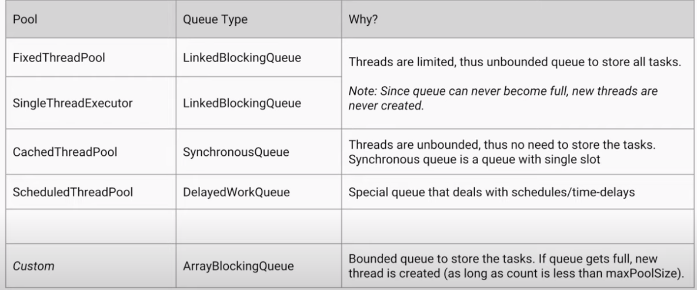
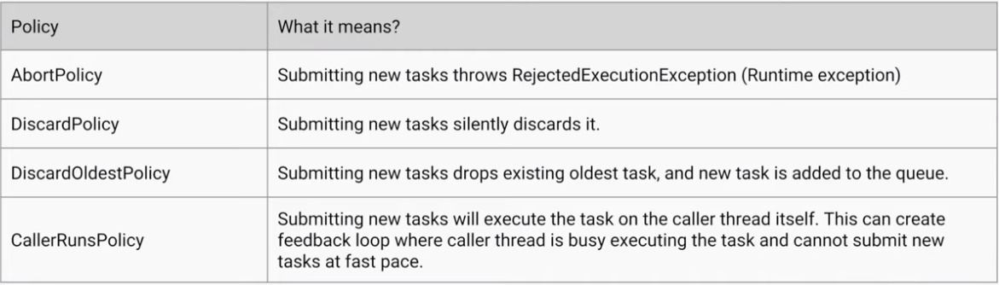

- In concurrent programming, there are two basic units of execution: _processes_ and _threads_.
- A process has a self-contained execution environment. A process generally has a complete, private set of basic run-time resources; in particular, each process has its own memory space.
- Threads are sometimes called _lightweight processes_. Both processes and threads provide an execution environment, but creating a new thread requires fewer resources than creating a new process. Threads exist within a process — every process has at least one
- A _process_ runs independently and isolated of other processes. It cannot directly access shared data in other processes. The resources of the process, e.g. memory and CPU time, are allocated to it via the operating system.
- A _thread_ is a so called lightweight process. It has its own call stack, but can access shared data of other threads in the same process. Every thread has its own memory cache. If a thread reads shared data, it stores this data in its own memory cache.
- In Java we can create processes with the help of `ProcessBuilder` class.
- Each process has its own registers, PC, stack memory, heap memory assigned by the OS.
- A given process can contain multiple threads. And each thread shares the resources of process.
- Every thread has its own stack memory but all threads share the heap memory (shared memory space)
- Every object in Java has a so-called intrinsic lock (Monitor)
- A thread that needs exclusive and consistent access to an object's fields has to acquire the object's intrinsic lock before accessing them, and then release the intrinsic lock when it's done with them.
- The Problem is that every object has a single monitor lock.
- If we have 2 independent **synchronized** methods then the threads have to wait for each other to release the lock.
- a thread **cannot acquire a lock owned by another thread**. But a given thread **can acquire a lock that it already owns**. Allowing a thread to acquire the same lock more than once is called _re-entrant synchronization_. And this is exactly what is happening with Java - the same thread may acquire the lock more than once.
- For e.g. : If a given thread calls a recursive and synchronized method several times then it is fine.
- Object level lock is mechanism when we want to synchronize a non-static method or non-static code block such that only one thread will be able to execute the code block on given instance of the class. This should always be done to make instance level data thread safe.
- Class level lock prevents multiple threads to enter in synchronized block in any of all available instances of the class on runtime. Class level locking should always be done to make static data thread safe.
- `wait` and `notify` must happen in a synchronized block on the monitor object whereas `sleep` does not.
- `wait` and `notify` can be interrupted where as `sleep` cannot
- Java doesn't notify the other thread immediately.
- `ReentrantLock`
  - It has the same behaviour as the "synchronized approach" with some extended features
  - `new ReentrantLock(boolean fairnessParameter)`
    - fairness parameter : if it is set to be true, then the longest waiting thread will get the lock. If it's set to false, then there is no access order !!!
- We can make a lock fair : **prevent thread starvation**. synchronized blocks are **unfair** by default.
- We can check whether the given lock is held or not with reentrant locks.
- We can get the **list of threads waiting** for the given lock with reentrant locks.
- synchronized blocks are nicer : we don't need the try-catch-finally block
- Every read of a `volatile` variable will be read from RAM not from cache.
- Deadlock occurs when two or more threads wait forever for a lock or resource held by another of the threads.
- Livelock threads are unable to make further progress. They are too busy responding to each other to resume work.
- How to handle deadlock and livelock
  - We should ensure that a thread doesn't block infinitely if it is unable to acquire a lock. This is why using `Lock` interface's `tryLock()` method is convenient
  - We should ensure that each thread acquires the locks in the same order to avoid any cyclic dependency in lock acquisition.
  - Livelock can be handled with the methods above and some randomness.
- Semaphore maintains a set of permits.
  - `acquire()` -> if a permit is available then takes it
  - `release()` -> adds a permit
  - Semaphore just keeps count of the number available. `new Semaphore(int permits, boolean fair)`
- Java provides its own multi-threading framework the so-called **Executor Framework**
- With the help of this framework we can manage worker threads more efficiently because of **thread pools**
- Thread pools can reuse threads by keeping the threads alive and reusing them (thread pools are usually **queues**)
- There are 4 types of executors
  - `SingleThreadExecutor` : This executor has a single thread so we can execute processes in a sequential manner. Every process is executed by a new thread.
  - `FixedThreadPool(n)` : This is how we can create a thread pool with **n** threads. Usually `n` is the number of cores in CPU. If there's more tasks than n then these tasks are stored with a **LinkedBlockingQueue**
  - `CachedThreadPool` : The number of threads is not bounded - if all threads are busy and a new task comes the pool will create and add a new thread to the executor. If a thread remains idle for **60** secs then it is removed. It is used for short parallel tasks.
  - `ScheduledExecutor` : We can execute a given operation at regular intervals or we can use this executor if we wish to delay a certain task
- `Runnable` and `Callable` both run on different threads than the calling thread but `Callable` can return a value and `Runnable` can not.
- RUNNABLE : a so-called _run-and-forget_ action. We execute a given operation in run() method without a return value
- CALLABLE<T> : We use Callable's call() method if we want to return a given value from the given thread
  - Callable interface will not return the value : this is why we need `Future<T>`
  - calling thread will be blocked till the `call()` method is executed and `Future<T>` returns the results.
- `executorService.submit()` can handle Runnable and Callable both.
- For parallel algorithms : we have to take the communication between threads into consideration.
- We have to make sure we split the work evenly amongst the processors.
- fork-join framework is the concrete implementation for parallel execution.
- A larger task -> it can be divided into smaller ones + the subsolutions can be combined.
- IMPORTANT subtasks have to be independent in order to be executed in parallel
- fork-join frameworks breaks the task into smaller subtasks until these subtasks are simple enough to solve without further breakups.
- `RecursiveTask<T>` it will return a `T` type. All the tasks we want to execute in parallel is a subclass of this class. Override the `computer` method that will return the solution of the subproblem
- `RecursiveAction` : it is a task, but w/o any return value
- `ForkJoinPool` : it is a thread pool for executing fork-join tasks.
- MapReduce is a programming model : a way of structuring the computation that allows it easily to be run on lots of nodes (servers)
- The algorithm has three steps:
  - _map_: splits the original dataset
  - _shuffle & sort_ : all the data is rearranged to be run in parallel. It makes sure that items with same keys will get to the same reducer
  - _reduce_ : combines the final results

### IBM Docs

- `CopyOnWriteArrayList` is a "thread-safe" variant of `ArrayList` in which all mutative operations (add, set, and so on) are implemented by making a fresh copy of the array.
- `CopyOnWriteArrayList` is ideal for read-often, write-rarely collections such as `Listeners` for a JavaBean event
- `BlockingQueue` neatly solves the problem of how to "hand off" items gathered by one thread to another thread for processing, without explicit concern for synchronization issues.
- `BlockingQueue` also supports methods that take a time parameter, indicating how long the thread should block before returning to signal failure to insert or retrieve the item in question.
- `SynchronousQueue` is a blocking queue in which each insert operation must wait for a corresponding remove operation by another thread, and vice versa. It gives us an extremely lightweight way to exchange single elements from one thread to another.
- `SynchronousQueue` will allow an insert into the queue only if there is a thread waiting to consume it.
- `CountDownLatch` class holds all threads at bay until a particular condition is met, at which point it releases them all at once.
- reading a volatile variable is synchronized and writing to a volatile variable is synchronized, but non-atomic operations are not. what this means is the following code is not thread-safe : `myVolatileVar++` _look deeper into it_
- The synchronized keyword is not considered to be part of a method's signature. So the synchronized modifier is not automatically inherited when subclasses override superclass methods, and methods in interfaces cannot be declared as synchronized .
- Also, constructors cannot be qualified as synchronized (although block synchronization can be used within constructors)

### Java Multithreading

- The theoretical possible performance gain can be calculated by _Amdahl's law_
- **Concurrency issues** : There are two basic problems, visibility and access problems.
- A _visibility_ problem occurs if thread A reads shared data which is later changed by thread B and thread A is unaware of this change.
- An _access_ problem can occur if several threads access and changes the same shared data at the same time.
- Visibility and access problem can lead to:
  - _Liveness failure_ : The program doesn't react anymore , e.g. deadlocks.
  - _Safety failure_ : The program creates incorrect data.
- If a variable is declared with _volatile_ keyword then it is guaranteed that any thread that reads the field will see the most recently written value.
- The _volatile_ keyword will not perform any mutual exclusive lock on the variable.
- An _atomic operation_ is an operation which is performed as a single unit of work without the possibility of interference from other operations.
- There are two basic strategies for using Thread objects to create a concurrent application.
  - To directly control thread creation and management, simply instantiate `Thread` each time the application needs to initiate an asynchronous task.
  - To abstract thread management from the rest of your application, pass the application's tasks to an _executor_
- An application that creates an instance of Thread must provide the code that will run in that thread. There are two ways to do this:
  - _Provide a `Runnable` object._ The `Runnable` interface defines a single method, `run`, meant to contain the code executed in the thread. The `Runnable` object is passed to the Thread constructor.
  - _Subclass `Thread`_ An application can subclass Thread, providing its own implementation of run.
- The idiom, which employs a `Runnable` object is more general because a `Runnable` object can subclass a class other than `Thread`.
- The `Runnable` is the task to perform and `Thread` is the worker doing this task.
- Thread pools manage a pool of worker threads. The thread pools contain a work queue which holds tasks waiting to be executed.
- A thread pool can be described as a collection of `Runnable` objects (work queue) and a connection of running threads.
- These threads are constantly running and are checking the work queue for new work. If there is new work to be done they execute this `Runnable`.
- The Executor framework provides example implementation of the `java.util.concurrent.Executor` interface, e.g. `Executors.newFixedThreadPool(int n)` which will create `n` worker threads.
- A compare-and-swap (CAS) operation checks if a variable has a certain value and if it has that value it will perform an operation.
- The fork-join framework allows you to distribute a certain task on several workers and then wait for the result.
- One can also define a thread by forming a subclass of the `Thread` class. Not recommended
- You should decouple the _task_ that is to be run in parallel from the _mechanism_ of running it
- Threads can be in one of six states:
  - New
  - Runnable
  - Blocked
  - Waiting
  - Timed Waiting
  - Terminated
- When a thread is created with the `new` operator - the thread is not yet running. It is in the _new_ state.
- Once `start` method is invoked the thread is in the _runnable_ state. A runnable thread may or may not actually be running at any given time.
- When a thread is blocked or waiting, it is temporarily inactive. It is upto the thread scheduler to reactivate it.
- When the thread tries to acquire an intrinsic object lock that is currently held by another thread, it becomes _blocked_.
- When the thread waits for another thread to notify the scheduler of a condition, it enters the _waiting_ state.
- Several methods have a timeout parameter. Calling them causes the thread to enter the _timed waiting_ state.
- A daemon is simply a thread that has no other role than to serve others. Examples are timer threads that send regular "timer ticks" or threads that clean up stale cache entries.
- To peek at the virtual machine bytecodes that execute each statement in our class. Run the command : `javap -c -v Bank` to decompile the Bank.class file.
- There are two mechanisms for protecting a code block from concurrent access. The Java language provides a `synchronized` keyword for this purpose and Java 5 introduced the `ReentrantLock` class.
- In general, you will want to protect blocks of code that update or inspect a shared object.
- A thread can only call `await`, `signalAll`, or `signal` on a condition if it owns the lock of the condition.
- A lock protects sections of code, allowing only one thread to execute the code at a time.
- A lock manages threads that are trying to enter a protected code segment.
- A lock can have one or more associated condition objects.
- Each condition object manages threads that have entered a protected code section but that cannot proceed.
- If a method is declared with the `synchronized` keyword, the object's lock protects the entire method.
- It is also legal to declare static methods as synchronized.
- A monitor has these properties:
  - A monitor is a class with only private fields.
  - Each object of that class has an associated lock.
  - All methods are locked by that lock. In other words, if a client calls `obj.method()`, then the lock for `obj` is automatically acquired at the beginning of the method call and relinquished when the method returns.
  - The lock can have any number of associated conditions
- `java.lang.Thread`

| Method                             | Use                                                                                                                        |
| ---------------------------------- | -------------------------------------------------------------------------------------------------------------------------- |
| `static void yield()`              | causes the currently executing thread to yield to another thread.                                                          |
| `void join()`                      | waits for the specified thread to terminate.                                                                               |
| `void join(long millis)`           | waits for the specified thread to die or for the specified number of milliseconds to pass                                  |
| `Thread.State getState()`          | gets the state of this thread.                                                                                             |
| `void interrupt()`                 | sends an interrupt request to a thread. The interrupted status of the thread is set to `true`                              |
| `static boolean interrupted()`     | tests whether the _current_ thread has been interrupted. It resets the interrupted status of the current thread to `false` |
| `boolean isInterrupted()`          | tests whether a thread has been interrupted. No side effects.                                                              |
| `static Thread currentThread()`    |                                                                                                                            |
| `void setDaemon(boolean isDaemon)` |                                                                                                                            |

- `java.util.concurrent.locks.Condition`
  - `void await()` puts this thread on the wait set for this condition
  - `void signalAll()` unblocks all threads in the wait set for this condition.
  - `void signal()` unblocks one randomly selected thread in the wait set for this condition.
- `java.util.concurrent.locks.Lock`
  - `Condition newCondition()` returns a condition object associated with this lock.
- `java.lang.Object`
  - `void notifyAll()` unblocks the threads that called `wait` on this object.
  - `void notify()` unblocks one randomly selected thread among the threads that called `wait` on this object.
  - `void wait()` causes a thread to wait until it is notified.
  - `void wait(long millis)`
  - `void wait(long millis, int nanos)`
- The above methods can only be called from within a _synchronized_ method or block.
- By extending the thread class, the derived class itself is a thread object and it gains full control over the thread life cycle.
- Implementing the Runnable interface does not give developers any control over the thread itself, as it simply defines the unit of work that will be executed in a thread.
- All the thread instances the developer created have the same priority, which the process will schedule fairly without worrying about the order.
- If one thread tries to read the data and another thread tries to update the same data, it is known as read/write problem, and it leads to inconsistent state for the shared data. This can be prevented by synchronizing access to the data via Java `synchronized` keyword.
- The producer-consumer problem (also known as the bounded-buffer problem ) is another classical example of a multithread synchronization problem.
- The problem describes two threads, the producer and the consumer, who share a common, fixed-size buffer. The producer’s job is to generate a piece of data and put it into the buffer. The consumer is consuming the data from the same buffer simultaneously. The problem is to make sure that the producer will not try to add data into the buffer if it is full and that the consumer will not try to remove data from an empty buffer.
- `Thread.sleep` causes the current thread to suspend execution for a specified period. One cannot assume that invoking sleep will suspend the thread for precisely the time period specified.
- An _interrupt_ is an indication to a thread that it should stop what it is doing and do something else.
- For the interrupt mechanism to work correctly, the interrupted thread must support its own interruption.
- How does a thread support its own interruption? This depends on what it's currently doing. If the thread is frequently invoking methods that throw `InterruptedException`, it simply returns from the `run` method after it catches that exception.
- If a thread goes a long time w/o invoking method that throws `InterruptedException`, then it must periodically invoke `Thread.interrupted` which returns true if an interrupt has been received. e.g.

```java
for (int i = 0; i < inputs.length; i++) {
  heavyCrunch(inputs[i]);
  if (Thread.interrupted()) {
    // We've been interrupted : no more crunching
    return;
  }
}
```

- In more complex applications it makes more sense to throw an `InterruptedException` when a thread is interrupted.
- The interrupt mechanism is implemented using an internal flag known as the _interrupt status_. Invoking `Thread.interrupt` sets this flag. When a thread checks for an interrupt by invoking the static method `Thread.interrupted`, interrupt status is cleared. The non-static `isInterrupted` method, which is used by one thread to query the interrupt status of another, does not change the interrupt status flag.
- By convention, any method that exits by throwing an `InterruptedException` clears interrupt status when it does so.
- The `join` method allows one thread to wait for the completion of another.
- If `t` is a `Thread` object whose thread is currently executing `t.join()` causes the current thread to pause execution until `t`'s thread terminates.
- Interference happens when two operations, running in different threads, but acting on the same data, _interleave_.
- _Memory consistency errors_ occur when different threads have inconsistent views of what should be the same data
- The key to avoiding memory consistency errors is understanding the _happens-before_ relationship
- A concurrent application's ability to execute in a timely manner is known as its _liveness_.
- _Starvation_ describes a situation where a thread is unable to gain regular access to shared resources and is unable to make progress. This happens when shared resources are made unavailable for long periods by "greedy" threads.
- A thread often acts in response to the action of another thread. If the other thread's action is also a response to the action of another thread, then _livelock_ may result
- The biggest advantage of `Lock` objects over implicit locks is their ability to back out of an attempt to acquire a lock
- The fork/join framework is distinct because it uses a _work-stealing_ algorithm. Worker threads that run out of things to do can steal tasks from other threads that are still busy.
- `int r = ThreadLocalRandom.current() .nextInt(4, 77);`
- **Futures** They're basically placeholders for a result of an operation that hasn't finished yet. Once the operation finishes, the `Future` will contain that result. For example, an operation can be a `Runnable` or `Callable` instance that is submitted to an `ExecutorService`. The submitter of the operation can use the `Future` object to check whether the operation `isDone()`, or wait for it to finish using the blocking `get()` method.
- **CompletableFuture** : They are in fact an evolution of regular Futures, inspired by Google's Listenable Futures, part of the Guava library. They are Futures that also allow you to string tasks together in a chain. You can use them to tell some worker thread to "go do some task X, and when you're done, go do this other thing using the result of X". Using CompletableFutures, you can do something with the result of the operation without actually blocking a thread to wait for the result.
- _CompletableFuture_ is at the same time a building block and a framework, with **about 50 different methods for composing, combining, and executing asynchronous computation steps and handling errors**.
- `CompletableFuture` supports asynchronous calls. It implements the `CompletionStage` interface.
- `CompletionStage` offers methods, that lets you attach call backs that will be executed on completion.
- `CompletableFuture.supplyAsync` runs the task asynchronously on the default thread pool of Java.
- The `thenApply` method can be used to define a callback which is executed once `supplyAsync` finishes.

| Task Type     | Ideal pool size | Considerations                                                                                                                          |
| ------------- | --------------- | --------------------------------------------------------------------------------------------------------------------------------------- |
| CPU intensive | CPU Core count  | How many other applications (or other executors/threads) are running on the same CPU                                                    |
| IO intensive  | High            | Exact number will depend on rate of task submissions and average task wait time. Too many threads will increase memory consumption too. |



