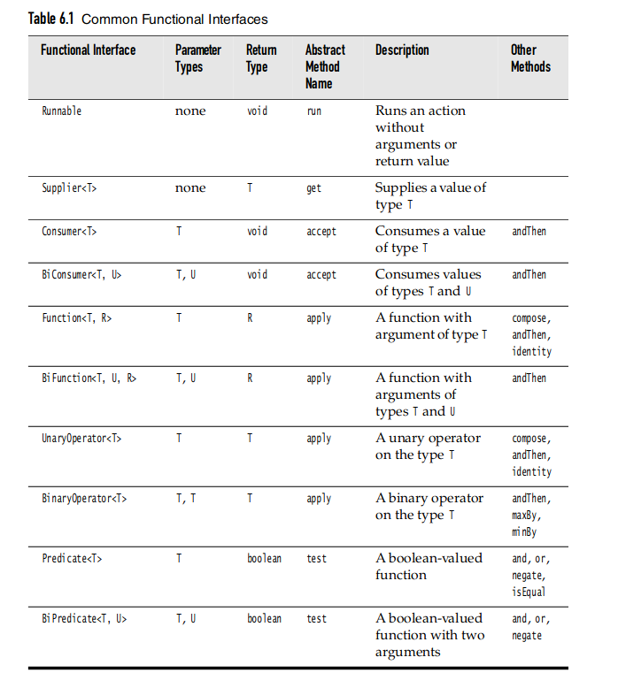
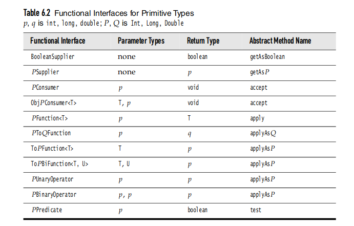
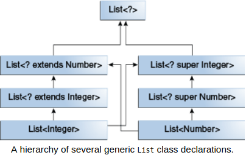

### Basics

- **static initialization block** is executed before the main() method.
- A class can have any number of static initialization blocks, and they can appear anywhere in the class body
- There is an alternative to static blocks — you can write a private static method: advantage is that they can be reused later if you need to reinitialize the class variable
- There are two alternatives to using a constructor to initialize instance variables: initializer blocks and final methods (This is especially useful if subclasses might want to reuse the initialization method).
- Initializer blocks for instance variables look just like static initializer blocks, but without the static keyword
- There are 4 access modifiers available in java:
  - `private` : can only be accessible from the class it is declared
  - `default` or no modifier or package private : can be accessible from any class of the same package
  - `protected`: can be accessed from any class of the package or subclass on the class
  - `public` : can be accessed from anywhere

### Strings

- A _code point_ is a code value that is associated with a character in an encoding scheme.
- In the Unicode standard, code points are written in hexadecimal and prefixed with U+, such as U+0041 for the code point of the Latin letter A
- Unicode has code points that are grouped into 17 _code planes_.
- The first code plane, called the _basic multilingual plane_, consists of the “classic” Unicode characters with code points U+0000 to U+FFFF.
- Sixteen additional planes, with code points U+10000 to U+10FFFF, hold the _supplementary characters_.
- The characters in the basic multilingual plane are represented as 16-bit values, called _code units_
- The supplementary characters are encoded as consecutive pairs of code units.
- In Java, the `char` type describes a code unit in the UTF-16 encoding.
- `static char[] readPassword(String prompt, Object... args)`, `static String readLine(String prompt, Object... args)` : displays the prompt and reads the user input until the end of the input line. The args parameters can be used to supply formatting arguments.
- You can use the `s` conversion to format arbitrary objects. If an arbitrary object implements the `Formattable` interface, the object’s `formatTo` method is invoked. Otherwise, the `toString` method is invoked to turn the object into a string
- `Scanner in = new Scanner(Path.of('my-file.txt'), StandardCharsets.UTF_8 )` to read from a file
- To write to a file, construct a `PrintWriter` object. In the constructor, supply the file name and the character encoding: `PrintWriter out = new PrintWriter('my-file.txt', StandardCharsets.UTF_8);`
- `String dir = System.getProperty('user.dir');` to get the current working directory.

### Manifests

| Option | Description                            |
| ------ | -------------------------------------- |
| e      | Creates an entry point in the manifest |
| i      | creats an index file                   |
| m      | Adds a _manifest_ to the JAR file      |

- A manifest is a description of the archive contents and origin.
- JAR files can contain class files, images, and other resources.
- The manifest file is called `MANIFEST.MF` and is located in a special META-INF subdirectory of the JAR file.

```
Manifest-Version: 1.0
lines describing this archive

Name: Woozle.class
lines describing this file
Name: com/mycompany/mypkg
lines describing this package
```

- to make a new JAR file with a manifest, run, `jar cfm MyArchive.jar manifest.mf com/mycompany/mypkg/*.class`
- To update the manifest of an existing JAR file, place the additions into a text file and use a command such as - `jar ufm MyArchive.jar manifest-additions.mf`
- to specify the entry point of a program
  - `jar cvfe MyProgram.jar com.my-company.mypkg.MainAppClass files_to_add`
  - specify the main class of the program in the manifest of the form - `Main-Class: com.my-company.mypkg.MainAppClass`
- _multi-release JARs_ can contain class files for different Java releases.
- For backwards compatibility, the additional class files are placed in the `META-INF/versions` directory.

### Class Design Hints

- Always keep data private
- Always initialize data.
- Don't use too many basic types in a class.
- Not all fields need individual field accessors and mutators
- Break up classes that have too many responsibilities.
- Make the names of classes and methods reflect their responsibilities.
- Prefer immutable classes.

### Method Calls

- Let's say we call `x.f(args)` and `x` is declared to be an object of class `C`. Here is what happens
  1. The compiler enumerates all methods called `f` in the class `C` and all accessible methods called `f` in the superclasses of `C`.
  2. If among all the methods called `f` there is a unique method whose parameter types are a best match for the supplied arguments, that method is chosen to be called. This process is called _overloading resolution_.
  3. If the method is `private`, `static`, `final` or constructor, then the compiler knows exactly which method to call. This is called _static binding_ Otherwise, the method to be called depends on the actual type of the implicit parameter, and dynamic binding must be used at runtime.
  4. The VM must call the version of the method that is appropriate for the _actual_ type of the object to which `x` refers. Let's say the actual type is `D`, a subclass of `C`. If the class `D` defines method `f(String)`, that method is called. If not, `D`'s superclass is searched for a method f(String), and so on.
- The VM precomputes for each class a _method table_ that lists all method signatures and the actual methods to be called. When a method is called the VM simply makes a table lookup.
- Only one good reason to make a method or class `final`: to make sure its semantics cannot be changed in a subclass.
- One can cast only within an inheritance hierarchy
- Use `instanceof` to check before casting from a superclass to a subclass.
- TIP: In general, it is best to minimize the use of casts and the `instanceof` operator.
- For restricting a method to subclasses only or, less commonly, to allow subclass methods to access a superclass field - declare a class feature as `protected`

### equals method

- TIP: `Objects.equals(a,b)` : returns true if both arguments are null, false if only one is null, and calls a.equals(b) OW.
- Recipe for writing equals method:
  1. Name the explicit parameter `otherObject`
  2. Test whether `this` happens to be identical to `otherObject`
  3. Test whether `otherObject` is null and return false if it is.
  4. Compare the classes of `this` and `otherObject`. If the semantics of `equals` can change in subclasses, use the `getClass` test. `if (getClass() != otherObject.getClass()) return false;` If the same semantics holds for _all_ subclasses, use an `instanceof` test
  5. Cast `otherObject` to a variable of your class type
  6. Now compare the fields as required. If you redefine `equals` in a subclass, include a call to `super.equals(other)`

### Enums

- The constructor of an enumeration is always private.
- `java.lang.Enum<E>`
  - `static Enum valueOf(Class enumClass, String name)` returns the enumerated constant of the given class with given name.
  - `int ordinal()` return the zero-base position of this enumerated constant in the enum declaration
  - `int compareTo(E other)`

### Reflection

- _Reflection_ is the ability to find out more about classes and their properties in a running program.
- Using reflection, Java can support user interface builders, ORMs, and many other development tools that dynamically inquire about the capabilities of classes.
- A program that can analyze the capabilities of classes is called _reflective_.
- When the program is running the Java runtime system always maintains what it calls _runtime type identification_ on all objects.
- `java.lang.Class`
  - `static Class forName(String className)` : returns the Class object representing the class with name `className`
  - `Constructor getConstructor(Class... parameterTypes)` : yields an object describing the constructor with the given parameter types.
  - finds the resource in the same place as the class and then returns a URL or input stream that can be used for loading the resource.
    - `URL getResource(String name)`
    - `InputStream getResourceAsStream(String name)`
  - `Field[] getFields()` returns an array containing `Field` objects for the public fields of this class or its superclasses; `Field[] getDeclaredFields()` returns an array of `Field` objects for all fields of this class.
  - `Method[] getMethods()` returns public methods and includes inherited method; `Method[] getDeclaredMethods()` return all methods of this class or interface but doesn't include inherited methods.
  - `Constructor[] getConstructors` and `Constructor[] getDeclaredConstructors`
  - `String getPackageName()`
- `java.lang.reflect.Constructor`
  - `Object newInstance(Object... params)` constructs a new instance of the constructor's declaring class, passing `params` to the constructor.
- `java.lang.reflect.Field` , `java.lang.reflect.Method`
  - `Class getDeclaringClass`
  - `Class[] getExceptionTypes()`
  - `int getModifiers()`
  - `String getName()`
  - `Class[] getParameterTypes()`
  - `Class getReturnType()`
- `java.lang.reflect.Modifier`
  - `static String toString(int modifiers)`
  - `static boolean isAbstract...`

### Abstract classes and Interfaces

- An _interface_ is a reference type, similar to a class, that can contain only constants, method signatures, default methods, static methods, and nested types. Method bodies exist only for default methods and static methods
- All constant values defined in an interface are implicitly public, static, and final
- When you extend an interface that contains a default method, you can do the following:
  - Not mention the default method at all, which lets your extended interface inherit the default method.
  - Redeclare the default method which makes it `abstract`
  - Redefine the default method, which overrides it.
- _Multiple inheritance of state_ : the ability to inherit fields from multiple classes
- _Multiple inheritance of implementation_ is the ability to inherit method definitions from multiple classes.
- _Multiple inheritance of type_ : is the ability of a class to implement more than one interface.
- The distinction between hiding a static method and overriding an instance method has important implications:
  - The version of the overridden instance method that gets invoked is the one in the subclass.
  - The version of the hidden static method that gets invoked depends on whether it is invoked from the superclass or the subclass
- An overriding method can also return a subtype of the type returned by the overridden method. This subtype is called a covariant return type.

```java
public Employee getBuddy() { ... }
public Manager getBuddy() { ... } // OK to change return type
```

- The two `getBuddy` methods have _covariant_ return types.
- When the supertypes of a class or interface provide multiple default methods with the same signature, the Java compiler follows inheritance rules to resolve the name conflict. These rules are driven by the following two principles:
  - Instance methods are preferred over interface default methods.
  - Methods that are already overridden by other candidates are ignored. This circumstance can arise when supertypes share a common ancestor.
- If two or more independently defined default methods conflict, or a default method conflicts with an abstract method, then the Java compiler produces a compiler error. You must explicitly override the supertype methods.
- Inherited instance methods from classes can override abstract interface methods.
- Static methods in interfaces are never inherited.
- You will get a compile-time error if you attempt to change an instance method in the superclass to a static method in the subclass, and vice versa.
- In a subclass, you can overload the methods inherited from the superclass. Such overloaded methods neither hide nor override the superclass instance methods
- The JVM calls the appropriate method for the object that is referred to in each variable. It does not call the method that is defined by the variable's type. This behavior is referred to as _virtual method invocation_
- Methods and constructors can throw exceptions. So far, there are two kinds of exceptions which can be thrown. There are the ones which have to be handled, and the ones which don't have to be dealt with. When we have to handle the exceptions, we do it either in a try-catch chunk, or throwing them from a method.
- It is also possible to avoid handling the exceptions in a method, and delegate the responsibility to the method caller. We delegate the responsibility of a method by using the statement throws Exception.
- Interfaces can also define the exceptions thrown
- If we want to define superclass variables or methods whose accessibility should be restricted to only its subclasses, we can use the _protected_ field accessability.
- The `super` call must always be in the first line!
- The method which can be called is defined through the variable type. For instance, if a `Student` object reference is saved into a `Person` variable, the object can use only the methods defined in the `Person` class
- The execution method is always chosen based on the object real type, regardless of the variable type which is used
- we can think that if an object owns or is composed of the other objects, inheritance is wrong.
- Inheritance does not exclude using interfaces, and vice-versa. Interfaces are like an agreement on the class implementation, and they allow for the abstraction of the concrete implementation.
- Abstract classes combine interfaces and inheritance. They do not produce instances, but you can create instances of their subclasses.
- The difference between interfaces and abstract classes is that abstract classes provide the program with more structure.
- Because it is possible to define the functionality of abstract classes, we can use them to define the default implementation
- In Java, arrays are covariant. This means that if a type S is a subtype of another type T, then an array of S is considered to be a subtype of array of T.
- The value returned by `hashCode()` is the object's hash code, which is the object's memory address in hexadecimal
- By definition, if two objects are equal, their hash code _must also_ be equal. That's why you should override hashCode() method when you override equals() as the hashCode() implementation by Object class will not be valid anymore.
- Methods called from constructors should generally be declared `final`. If a constructor calls a non-final method, a subclass may redefine that method with surprising or undesirable results.
- with abstract classes, you can declare fields that are not static and final, and define public, protected, and private concrete methods. With interfaces, all fields are automatically public, static, and final, and all methods that you declare or define (as default methods) are public.
- Which should you use, abstract classes or interfaces?
  - Consider using abstract classes if any of these statements apply to your situation:
    - You want to share code among several closely related classes.
    - You expect that classes that extend your abstract class have many common methods or fields, or require access modifiers other than public (such as protected and private).
    - You want to declare non-static or non-final fields. This enables you to define methods that can access and modify the state of the object to which they belong.
  - Consider using interfaces if any of these statements apply to your situation:
    - You expect that unrelated classes would implement your interface. For example, the interfaces Comparable and Cloneable are implemented by many unrelated classes.
    - You want to specify the behavior of a particular data type, but not concerned about who implements its behavior
    - You want to take advantage of multiple inheritance of type.

* You can supply a default implementation for any interface method. You must tag such a method with the default modifier.
* A default method can call other methods.
* An important use for default methods is _interface evolution_
* Rules for resolving default method conflicts:
  1. Superclasses win. If a superclass provides a concrete method, default methods with the same name and parameter are simply ignored.
  2. Interfaces clash. If an interface provides a default method, and another interface contains a method with the same name and parameter types (default or not), then you must resolve the conflict by overriding that method.
* The `Cloneable` interface is one of a handful of _tagging interfaces_ that Java provides. Some programmers call them _marker interfaces_. A tagging interface has no methods; its only purpose is to allow the use of `instanceOf` in a type inquiry. Recommended not to use in our programs

### Lambdas

- You can supply a lambda expression whenever an object of an interface with a single abstract method is expected. Such an interface is called _functional interface_
- A functional interface is any interface that contains only one abstract method
- A functional interface may contain one or more default methods or static methods.
- default methods can be overridden whereas static methods cannot.
- A Supplier has no arguments and yields a value of type T when it is called. Suppliers are used for _lazy evaluation_
- `Person[] people = Stream.toArray(Person[] :: new)`
- A lambda expression has three ingredients
  1. A block of code.
  2. Parameters
  3. Values for the _free_ variables - that is, the variables that are not parameters and not defined inside the code.
- In a lambda-expression, one can only reference variables whose value doesn't change.
- It is also illegal to refer, in a lambda expression, to a variable that is mutated outside.
- The rule is that any captured variable in a lambda expression must be _effectively final_
- 
- 
- The static `comparing` method takes a "key extractor" function that maps a type T to a comparable type (such as `String`). `Arrays.sort(people, Comparator.comparing(Person :: getName));`
- We can chain comparators with the `thenComparing` method for breaking ties.

### Nested classes

- An inner class method gets to access both its own data fields _and_ those of the outer object creating it.
- An object of inner class always gets an implicit reference to the object that created it.
- Only inner classes can be private. Regular classes always have either package or public access.
- Any static fields declared in an inner class must be final and initialized with a compile-time constant.
- An inner class cannot have `static` methods.
- You refer to an inner class as _outerclass.innerClass_ when it occurrs outside the scope of the outer class.
- If an inner class accesses a private data field, then it is possible to access that data field through other classes added to the package or the outer class.
- We can define a class _locally in a single method_ if the class name is used only once. Local classes are never declared with an access modifier.
- Use a static inner class whenever the inner class does not need to access an outer class object.
- A simple rule of thumb is that if you don't use any instance members of the outer class, make the nested class static
- Unlike regular inner classes, static inner classes can have static fields and methods.
- Inner classes that are declared inside an interface are automatically `static` and `public`
- Proxies can be used to create at runtime, new classes that implement a given set of interfaces. Proxies are only necessary when you don't yet know at compile time which interfaces you need to implement.
- Nested classes are divided into two categories: **static** and **non-static**.
- Nested classes that are declared static are called _static nested classes_.
- Non-static nested classes are called _inner classes_
- inner classes have access to other members of the enclosing class, even if they are declared private.
- Static nested classes do not have access to other members of the enclosing class
- There are two special kinds of inner classes:
  - _local classes_ (an inner class within the body of a method )
  - _anonymous classes_ (an inner class within the body of a method without naming the class).
- Local classes are similar to inner classes because they cannot define or declare any static members
- Local classes in static methods can only refer to static members of the enclosing class.
- Local classes are non-static because they have access to instance members of the enclosing block.
- You cannot declare an interface inside a block; interfaces are inherently static.
- You cannot declare static initializers or member interfaces in a local class.
- A local class can have static members provided that they are constant variables.
- A local class can only access local variables that are declared final or are _effectively_ final.
- Like local classes, anonymous classes can capture variables; they have the same access to local variables of the enclosing scope.
- **Local classes** Use it if you need to create more than one instance of a class, access its constructor, or introduce a new, named type (because, for example, you need to invoke additional methods later)
- **Anonymous class** : Use it if you need to declare fields or additional methods.
- **Lambda expression**
  - Use it if you are encapsulating a single unit of behaviour that you want to pass to other code.
  - Use it if you need a simple instance of a functional interface and none of the preceding criteria apply.
- **Nested class**
  - Use it if requirements are similar to local class, you want to make the type more widely available, and you don't require access to local variables or method parameters.
  - Use a non-static nested class (or inner class) if you require access to an enclosing instance's non-public fields and methods. Use a static nested class if you don't require this access.

### Inheritance

- Interface inheritance (what): Simply tells what the subclasses should be able to do.
  - e.g. all lists should be able to print themselves, how they do it is up to them.
- Implementation inheritance (how): Tells the subclasses how they should behave.
  - Lists should print themselves exactly this way: by getting each element in order and then printing them.
- By using the extends keyword, subclasses inherit all members of the parent class. "Members" include:
  - All instance and static variables,
  - All methods
  - All nested classes

* Note that constructors are not inherited, and private members cannot be directly accessed by subclasses.
* if the implementation details of a module are kept internally hidden and the only way to interact with it is through a documented interface, then that module is said to be encapsulated.
* Implementation inheritance breaks encapsulation
* Method calls have compile-time type equal to their declared type.
* Compile-time type is also called _static_ type.
* Invocation of overridden methods follows two simple rules:
  - Compiler plays it safe and only allows us to do things according to the static type.
  - For overridden methods (not overloaded methods), the actual method invoked is based on the dynamic type of the invoking expression
  - Can use casting to overrule compiler type checking
* interfaces in Java provide us with the ability to make callbacks. Sometimes, a function needs the help of another function that might not have been written yet (e.g. max needs compareTo). A callback function is the helping function (in the scenario, compareTo). In some languages, this is accomplished using explicit function passing; in Java, we wrap the needed function in an interface.
* A Comparable says, "I want to compare myself to another object". It is embedded within the object itself, and it defines the natural ordering of a type.
* A Comparator, on the other hand, is more like a third party machine that compares two objects to each other. Since there's only room for one compareTo method, if we want multiple ways to compare, we must turn to Comparator
* Type upper bounds in generic methods (e.g. `K extends Comparable<K>`)
* `am.new KeyIterator();` This construction allows us to instantiate a non-static nested class, meaning a class that needs to be associated with a particular instance of the enclosing class
* **Iterable**, the interface that makes a class able to be iterated on, and requires the method `iterator()`, which returns an Iterator object. And we've seen **Iterator**, the interface that defines the object with methods to actually do that iteration. You can think of an Iterator as a machine that you put onto an iterable that facilitates the iteration. Any iterable is the object on which the iterator is performing

### Exceptions

- With _checked_ exceptions, the compiler checks that the programmer is aware of the exception and prepared to deal with the consequences.
- Common exceptions, such as bounds errors or accessing a null reference, are _unchecked_. The compiler does not expect that you provide a handler.
- You only need to supply a `throws` clause for checked exceptions.
- In Java, an exception object is always an instance of a class derived from `Throwable`.
- Throwable has two direct descendents : `Error` and `Exception`
- When a dynamic linking failure or other hard failure in JVM occurs, the VM throws an Error
- `Exception` is divided into two branches : `IOException` and `Runtime Exception`
- The first kind of exception is the _checked exception_. These are exceptional conditions that a well-written application should anticipate and recover from.
- Checked exceptions are _subject to_ the Catch or Specify Requirement
- All exceptions are checked exceptions, except for those indicated by `Error`, `RuntimeException`, and their subclasses.
- The second kind of exception is the _error_. These are exceptional conditions that are external to the application, and that the application usually cannot anticipate or recover from
- Errors are not subject to the Catch or Specify Requirement. Errors are those exceptions indicated by Error and its subclasses.
- The third kind of exception is the _runtime exception_. These are exceptional conditions that are internal to the application, and that the application usually cannot anticipate or recover from. Usually logic error or improper use of an API.
- The compiler checks that we provide exception handlers for all checked exceptions
- A method must declare all the _checked_ exceptions that it might throw.
- Catching multiple exceptions doesn't just make your code look simpler but also more efficient.
- You can use the `finally` clause without a `catch` clause.
- The body of `finally` clause is intended for cleaning up resources. Don't put statements that change the control flow (return, throw, break, continue) inside a finally clause.
- A _stack trace_ is a listing of all pending method calls at a particular point in the execution of a program.
- If the JVM exits while the `try` or `catch` code is being executed, then the `finally` block may not execute. If the thread executing the try or catch code is interrupted or killed, the finally blcok may not execute.
- We can open multiple resources in try-with-resources statement separated by a semicolon.
- When multiple resources are opened in try-with-resources, it closes them in the reverse order to avoid any dependency issue.
- If an exception is thrown in both try block and finally block, the method returns the exception thrown in finally block.
- For try-with-resources, if exception is thrown in try block and in try-with-resources statement, then method returns the exception thrown in try block.
- You can retrieve suppressed exceptions by calling the `Throwable.getSuppressed` method from the exception thrown by the try block
- Chained exceptions help the programmer to know when one exception causes another.
- If a client can reasonably be expected to recover from an exception, make it a checked exception. If a client cannot do anything to recover from the exception, make it an unchecked exception.
- checked exceptions must be explicitly caught in a method or declared in the method's throws clause. Unchecked exceptions are caused by problems that can not be solved, such as dividing by zero, null pointer, etc. Checked exceptions are especially important because you expect other developers who use your API to know how to handle the exceptions.
- If an exception can be properly handled then it should be caught, otherwise, it should be thrown.
- Can we catch multiple exceptions in the same catch clause?
  - The answer is YES. As long as those exception classes can trace back to the same super class in the class inheritance hierarchy, you can use that super class only.
- Constructors can throw exceptions
- javac -g file.java : the. -g flag will generate debugging information, including information about local variables
- **Advantages of Exceptions**
  - Separate Error-Handling Code from "Regular" Code.
  - Propagating Errors up the call stack
  - Grouping and Differentiating Error types.
- `java.lang.Throwable`
  - `Throwable(Throwable cause)`
  - `Throwable(String message, Throwable cause)`
  - `Throwable initCause(Throwable cause)` : sets the cause for this object or throws an exception if this object already has a cause. Returns this.
  - `Throwable getCause()`
- Use exceptions for exceptional circumstances only because it takes far longer to catch an exception than to perform a simple test
- Don't just throw a `RuntimeException`. Find an appropriate subclass or create your own.
- `NoClassDefFoundError` occurs when the source was successfully compiled, but at runtime, the required `class` files were not found. It is an error and arises from the JVM having problems finding a class it expected to find. For instance, we created A.class and B.class at compile time and removed A.class on which B.class depended. So, when running B it will give this error
- `ClassNotFoundException` may stem from trying to make reflective calls to classes at runtime, but the classes the program is trying to call don't exist.
- ClassCast Exception is thrown when we try to cast an object of the parent class to the child class object.
- The Java language has a keyword `assert`. There are two forms: `assert condition;` and `assert condition: expression;`

### Annotations

- _Annotations_ are a form of metadata, provide data about a program that is not part of the program itself. Annotations have no direct effect on the operation of the code they annotate.
- Annotations have a number of uses, among them:
  - **Information for the compiler**
  - **Compile-time and deployment-time processing**
  - **Runtime processing**
- Annotations can be applied to declarations: declarations of classes, fields, methods, and other program elements.
- As of the Java SE 8 release, annotations can also be applied to the use of types. This form of annotation is called a _type annotation_. A few examples

```java
new @Interned MyObject(); // Class instance creation expression

myString = (@NonNull String) str;   // Type cast

class UnmodifiableList<T> implements @ReadOnly List<@ReadOnly T> { ... }  // implements clause

void monitorTemperature() throws @Critical TemperatureException { ... }   // Thrown exception declaration
```

- `@Retention` this describes up to which step in the compilation process the annotation will be available. RetentionPolicy.{SOURCE, CLASS, RUNTIME}
- `@Target` annotation marks another annotation to restrict what kind of Java elements the annotation can be applied to. This defines where the annotation can be set
- Type Annotations were created to support improved analysis of Java programs by way of ensuring stronger type checking. For example: to ensure that a particular variable in a program is never assigned to null; to avoid triggering a NullPointerException. One can write a custom plug-in to check for this. You would then modify your code to annotate that particular variable, indicating that it is never assigned to null. The variable declaration might look like this: `@NonNull String str;`
- There are some situations where you want to apply the same annotation to a declaration or type use. As of the Java SE 8 release, repeating annotations enable you to do this
- For instance you want a cleanup method to be called in month end and every friday at 11 p.m. So same `@Schedule` annotation can be used on the method with differnt values
- This repeating annotations are stored in _container annotation_

### Generics

- generics enable _types_ (classes and interfaces) to be parameters when defining classes, interfaces and methods. type parameters provide a way to re-use the same code with different inputs
- using generics, programmers can implement generic algorithms that work on collections of different types, can be customized, and are type safe
- A _generic type_ is a generic class or interface that is parameterized over types.
- A type variable can be any non-primitive type you specify: any class type, any interface type, any array type, or even another type variable.
- The most commonly used type parameter names are:
  - E - Element, K - Key, N - Number, T - Type, V - Value, S,U,V etc. - 2nd, 3rd, 4th types
- perform a _generic type invocation_, which replaces T with some concrete value
- A _raw type_ is the name of a generic class or interface without any type arguments
- Static and non-static generic methods are allowed, as well as generic class constructors.
- The syntax for a generic method includes a list of type parameters, inside angle brackets, which appears before the method's return type.
- For static generic methods, the type parameter section must appear before the method's return type.
- to restrict the types that can be used as type arguments in a parameterized type _bounded type parameters_ are used.
- To declare a bounded type parameter, list the type parameter's name, followed by the extends keyword, followed by its upper bound
- In addition to limiting the types you can use to instantiate a generic type, bounded type parameters allow you to invoke methods defined in the bounds:
- A type parameter can have _multiple bounds_: `<T extends B1 & B2 & B3>`
- A type variable with multiple bounds is a subtype of all the types listed in the bound. If one of the bounds is a class, it must be specified first.
- Given two concrete types A and B (for example, Number and Integer), `MyClass<A>` has no relationship to `MyClass<B>`, regardless of whether or not A and B are related. The common parent of `MyClass<A>` and `MyClass<B>` is Object.
- In generic code, `?`called the wildcard, represents an unknown type.
- upper bounded wildcard restricts the unknown type to be a specific type or a subtype of that type and is represented using the _extends_ keyword.
- The unbounded wildcard type is specified using the wildcard character (?), for example, List<?>. This is called _a list of unknown type_. There are two scenarios where an unbounded wildcard is a useful approach:
  - When writing a method that can be implemented using functionality provided in the Object class.
  - When the code is using methods in the generic class that don't depend on the type parameter
- It's important to note that List<Object> and List<?> are not the same. You can insert an Object, or any subtype of Object, into a List<Object>. But you can only insert null into a List<?>
- a _lower bounded_ wildcard restricts the unknown type to be a specific type or a _super type_ of that type
- A lower bounded wildcard is expressed using the wildcard character ('?'), following by the _super_ keyword, followed by its lower bound: `<? super A>`.
- 
- a list may be defined as `List<?>` but, when evaluating an expression, the compiler infers a particular type from the code. This scenario is known as _wildcard capture_
- `copy(src, dest)` : src is the "in" variable, dest is the "out" variable.
- use the "in" and "out" principle when deciding whether to use a wildcard and what type of wildcard is appropriate. The following list provides the guidelines to follow:
  - An "in" variable is defined with an upper bounded wildcard, using the `extends` keyword.
  - An "out" variable is defined with a lower bounded wildcard, using the super keyword.
  - In the case where the "in" variable can be accessed using methods defined in the Object class, use an unbounded wildcard.
  - In the case where the code needs to access the variable as both an "in" and an "out" variable, do not use a wildcard.
- These guidelines do not apply to a method's return type. Using a wildcard as a return type should be avoided because it forces programmers using the code to deal with wildcards.
- A _reifiable_ type is a type whose type information is fully available at runtime. This includes primitives, non-generic types, raw types, and invocations of unbound wildcards.
- _Non-reifiable types_ are types where information has been removed at compile-time by type erasure
- _Heap pollution_ occurs when a variable of a parameterized type refers to an object that is not of that parameterized type.
- Restrictions on Generics:
  - Cannot instantiate generic types with primitive types.
  - Cannot create instances of type parameters : `E elem = new E()` compile time error. As a workaround, can create an object of a type parameter through reflection. `E elem = cls.newInstance()` where `Class<E> cls`
  - Cannot declare static fields whose types are type parameters
  - Cannot use casts or `instanceOf` with parameterized types.
  - Cannot create arrays of parameterized types.
  - Cannot create, catch, or throw objects of parameterized types.
  - Cannot overload a method where the formal parameter types of each overload erase to the same raw type.

### I/O

- An _I/O Stream_ represents an input source or an output destination.
- Programs use byte streams to perform input and output of 8-bit bytes. All byte stream classes are descended from `InputStream` and `OutputStream`.
- Byte streams should only be used for the most primitive I/O.
- There are many byte stream classes - `FileInputStream` and `FileOutputStream`
- All character stream classes are descended from `Reader` and `Writer`. As with byte streams, there are character stream classes that specialize in file I/O: `FileReader` and `FileWriter`
- _Unbuffered I/O_ means each read or write request is handled directly by the underlying OS which often triggers disk access, network activity.
- _Buffered I/O_ solves the above problem. Buffered input streams read data from a memory area known as a _buffer_ and calls native API only when buffer is empty. Buffered o/p streams write data to a buffer, and the native o/p API is called only when the buffer is full.
- `BufferedInputStream` and `BufferedOutputStream` create buffered byte streams, while `BufferedReader` and `BufferedWriter` create buffered character streams.
- When you need to create a formatted output stream, instantiate PrintWriter, not PrintStream.
- All data streams implement either the DataInput interface or the DataOutput interface. Data streams support binary I/O of primitive data type values as well as String values
- object streams support I/O of objects.
- The object stream classes are ObjectInputStream and ObjectOutputStream. These classes implement ObjectInput and ObjectOutput,
- A stream can only contain one copy of an object, though it can contain any number of references to it.
- `toAbsolutePath` method converts a path to an absolute path.
- `toRealPath` method returns the _real_ path of an existing file.
- to construct a path from one location in the file system to another location use the `relativize` method
- A relative path cannot be constructed if only one of the paths includes a root element
- The `Files` methods work on instances of `Path` objects
- An _atomic file operation_ is an operation that cannot be interrupted or "partially" performed. Either the entire operation is performed or the operation fails.
- `Files` class is "link" aware. Every `Files` method either detects what to do with a sym link or provides an option to configure.
- You can copy a file or directory by using the copy(Path, Path, CopyOption...) method. The copy fails if the target file exists, unless the REPLACE_EXISTING option is specified.
- You can move a file or directory by using the move(Path, Path, CopyOption...) method. The move fails if the target file exists, unless the REPLACE_EXISTING option is specified.
- You can use the `FileStore` class to learn information about a file store, such as how much space is available.

### Collections

- HashSet stores its elements in a hashtable, is the best performing.
- TreeSet stores its elements in a Red-Black Tree, orders its elements based on their values and is substantially slower than HashSet
- LinkedHashSet is implemented as a hash table with a linked list running through it, orders its elements based on insertion-order.
- `s1.containsAll(s2)` : returns true if s2 is a **subset** of s1.
- `s1.addAll(s2)` : transforms s1 into the **union** of s1 and s2.
- `s1.retainAll(s2)` : transforms s1 into the intersection of s1 and s2
- `s1.removeAll(s2)` : transforms s1 into the (asymmetric) set difference of s1 and s2.
- Predefined classes like `ArrayDeque` and `LinkedList` implement the Deque interface
- The reduce operation always returns a new value. However, the accumulator function also returns a new value every time it processes an element of a stream.
- Unlike the reduce method, which always creates a new value when it processes an element, the collect method modifies, or mutates, an existing value.
- The `collect` operation takes three arguments :
  - supplier : for the collect operation, it creates instances of the result container
  - accumulator
  - combiner : takes two result containers and merges their contents.
- Avoid using _stateful lambda expressions_ as parameters in stream operations. A stateful lambda expression is one whose result depends on any state that might change during the execution of a pipeline.

| Interfaces | Hash table impl | Resizable array impl | Tree impl | Linked list impl | Hash table + Linked list impl |
| ---------- | --------------- | -------------------- | --------- | ---------------- | ----------------------------- |
| Set        | Hashet          |                      | TreeSet   |                  | LinkedHashSet                 |
| List       |                 | ArrayList            |           | LinkedList       |                               |
| Queue      |                 |                      |           |                  |                               |
| Deque      |                 | ArrayDeque           |           | LinkedList       |                               |
| Map        | HashMap         |                      | TreeMap   |                  | LinkedHashMap                 |

- SortedSet and SortedMap interfaces have one impl. TreeSet and TreeMap respectively.
- There are two general purpose Queue impl. LinkedList and PriorityQueue
- If you accept the default load factor but want to specify an initial capacity, pick a number that's about twice the size to which you expect the set to grow.
- There are three special-purpose Map implementations - EnumMap, WeakHashMap and IdentityHashMap

## 6.031

### Reading 1 : Static Typing

- **Static checking** can catch:
  - syntax errors, like extra punctuation or spurious words
  - wrong names
  - wrong number of arguments
  - wrong argument types
  - wrong return types
- **Dynamic checking** can catch:
  - illegal argument values.
  - illegal conversions : e.g `Integer.valueOf("hello")` is a dynamic error.
  - unrepresentable return values : e.g. `Integer.valueOf("8000000000")`
  - out of range indices
  - calling a method on a null object reference
- It’s good practice to use `final` for declaring the parameters of a method and as many local variables as possible.
- goal should be to produce software that is
  - **Safe from bugs** : Correctness and defensiveness are required in any software we build.
  - **Easy to understand** : code has to communicate to future programmers
  - **Ready for change** : designs should make it easy to make changes

### Reading 2 : Basic Java

- The keys of Java `Map` must be **hashable**
- The objects of Java `Set` must be **hashable**
- When the set of values is small and finite, it makes sense to define all the values as named constants, which Java calls an **enumeration**.
- [java.io.File](http://docs.oracle.com/javase/8/docs/api/?java/io/File.html) represents a file on disk. We can test whether the file is readable, delete the file, see when it was last modified…
- [java.io.FileReader](http://docs.oracle.com/en/java/javase/13/docs/api/java.base/java/io/FileReader.html) lets us read text files.
- [java.io.BufferedReader](http://docs.oracle.com/javase/8/docs/api/?java/io/BufferedReader.html) lets us read in text efficiently, and it also provides a very useful feature: reading an entire line at a time.

### Reading 3 : Testing

- A **module** is a part of a software that can be designed, implemented, tested, and reasoned about separately from the rest of the system.
- A **specification** describes the behavior of a module. The **specification** describes the input and output behavior of the function. For a function it gives the types of the parameters and any additional constraints on them. It also gives the type of the return value and how the return value relates to the inputs.
- A module has an _implementation_ that provides its behavior, and _clients_ that use the module.
- A _test case_ is a particular choice of inputs, along with expected o/p behavior required by the spec.
- A _test suite_ is a set of test cases for a module.
- Systematic testing is the goal of designing a test suite with three desirable properties:
  - **Correct** : A correct test is a legal client of the specification.
  - **Thorough** : A thorough test suite finds actual bugs in the implementation.
  - **Small** : A small test suite, with few test cases, is faster to write in the first place.
- We divide the input space into **subdomains**, each consisting of a set of inputs.
- The idea behind subdomains is to divide the input space into sets of similar inputs on which the program has similar behaviour. Then we use one representative of each set.

* A test case must obey the requirements of the function’s specification.
* All the assertions in Java follow this order : expected first, actual second

- **Blackbox testing** means choosing test cases only from the specification, not the implementation of the function.
- **Glass box testing** means choosing test cases with knowledge of how the function is actually implemented.
- A test that tests an individual module (where a module is a method or a class), in isolation if possible, is called a **unit test**.
- The opposite of a unit test is an **integration test** , which tests a combination of modules, or even the entire program.
- **Automated testing** means running the tests and checking their results automatically.
- It’s very important to rerun your tests when you modify your code. This prevents your program from regressing — introducing other bugs when you fix new bugs or add new features. Running all your tests after every change is called **regression testing**.
- So **automated regression testing** is a best-practice of modern software engineering.
- Always set your programming editor to insert space characters when you press the Tab key.
- In general, change global variables into parameters and return values, or put them inside objects that you’re calling methods on

### Reading 4: Code Review

- SFB - Safe from Bugs
- ETU - Easy to Understand
- RFC - Ready for change
- General principles of good code
  - DRY
  - Comments where needed
  - Fail fast
  - Avoid magic numbers
  - One purpose for each variable
  - Use good names
  - No global variables
  - Return results, don't print them
  - Use whitespace for readability

### Reading 5: Version Control

- All of the operations we do with Git — clone, add, commit, push, log, merge, … — are operations on a graph data structure that stores all of the versions of files in our project, and all the log entries describing those changes.
- The **Git object graph** is stored in the .git directory of your local repository.
- The history of a Git project is **DAG**
- Each node in the history graph is a `commit`.
- Except for the initial commit, each commit has a pointer to a **parent** commit
- Some commits have the same parent: they are versions that diverged from a common previous version. And some commits have two parents: they are versions that tie divergent histories back together.
- `git log --name-status` `A` means a file was added, `M` means modified. `D` is deleted.
- `git log -p hello.txt` will show the history of hello.txt including diffs,
- Each commit is a snapshot of our entire project, which Git represents with a **tree** node
- the Git object graph stores each version of an individual file once, and allows multiple commits to _share_ that one copy
- `git show <commit hash>:` show what was in the repo at a particular commit (i.e files)

### Reading 6 : Specifications

- A specification of a method consists of several clauses:
  - a _precondition_ indicated by the keyword _requires_
  - a _postcondition_ indicated by the keyword _effects_
- primitives cannot be `null`
- **Avoid null**
- Instead of returning a special variable such as -1 or null when some condition is not satisfied we can throw exceptions.
- _checked exceptions_ are called that because they are checked by the compiler:
  - If a method might throw a checked exception, the possibility must be declared in its signature.
  - If a method calls another method that may throw a checked exception, it must either handle it, or declare the exception itself.
- _Unchecked exceptions_ are used to signal bugs. These exceptions are not expected to be handled by the code except perhaps at the top level.
- `Throwable` is the class of objects that can be thrown or caught.
- `RuntimeException`, `Error`, and their subclasses are **unchecked** exceptions.
- All other throwables — `Throwable`, `Exception`, and all of their subclasses except for those of the `RuntimeException` and `Error` lineage — are **checked** exceptions
- When you define your own exceptions, you should either subclass `RuntimeException` (to make it an unchecked exception) or `Exception` (to make it checked)
- You should use an **unchecked** exception only to signal an unexpected failure (i.e. a bug), or if you expect that clients will usually write code that ensures that exception will not happen, because there is a convenient and inexpensive way to avoid the exception; Otherwise you should use a **checked** exception.
- Exceptions that are used to signal unexpected failures – bugs in either the client or the implementation – are not part of the postcondition of a method, so they should not appear in either `@throws` or `throws`.
- Exceptions that signal a special result are always documented with a Javadoc `@throws` clause, specifying the conditions under which that special result occurs

### Reading 7: Designing Specifications

- **deterministic** does the spec define only a single possible output for a given input, or allow the implementor to choose from a set of legal outputs?
- **declarative** does the spec just characterize _what_ the output should be, or does it explicitly say _how_ to compute the output?
- **strong** does the spec have a small set of legal implementations, or a large set?
- Roughly speaking, there are two kinds of specifications.
  - _Operational_ specifications give a series of steps that the method performs.
  - _Declarative_ specifications don’t give details of intermediate steps. Instead, they just give properties of the final outcome, and how it’s related to the initial state. (Almost always preferable)
- A specification S2 is stronger than or equal to a specification S1 if
  - S2's precondition is weaker than or equal to S1's
  - S2's postcondition is stronger than or equal to S1's, for the states that satisfy S1's precondition
- If the above is the case, then an implementation that satisfies S2 can be used to satisfy S1 as well, and it’s safe to replace S1 with S2 in your program.

#### Designing good specifications

- The specification should be coherent. A method should do only one thing
- The results of a call should be informative
- the specification should be strong enough
- The specification should also be weak enough
- The specification should use _abstract types_ when possible

### Reading 8: Mutability & Immutability

- You should never use `Date` Use one of the classes from package `java.time` : `LocalDateTime` or `Instant` since they are immutable
- `BigInteger` and `BigDecimal` are immutable
- An object is immutable if its state cannot change after construction. The object's fields are initialized only once inside the constructor and never change.
- Steps for creating an immutable class:
  - Make it final.
  - Make all fields private.
  - Don't expose setter methods.
  - Make all mutable fields final so that it's value can be assigned only once.
  - Initialize all the fields via a constructor performing deep copy.
  - Perform cloning of objects in the getter methods to return a copy rather than acutal object reference.
- Immutable classes are normally used for caching purposes and they are by definition thread-safe.
- We can also use Builder Pattern to easily create immutable classes.

### Reading 9: Avoiding Debugging

- A Java assert statement may also include a description expression. he description follows the asserted expression, separated by a colon. For example: `assert x >= 0 : "x is " + x;`
- What to Assert?
  - Method argument requirements
  - Method return value requirements
- If an assertion is obvious from its local context, leave it out.
- Never use assertions to test conditions that are external to your program, such as the existence of files, the availability of network, or the correctness of input typed by a human user.
- Asserted expressions should not have _side-effects_

### Reading 11: Abstraction Functions and Rep Invariants

- Most important property of a good ADT is that it **preserves its own invariants**.
- defensive copying: making a copy of a mutable object to avoid leaking out references to the rep
- If any of the types are mutable, make sure your implementation doesn’t return direct references to its representation
- so using unmodifiable lists, maps, and sets can be a very good way to reduce the risk of bugs.
