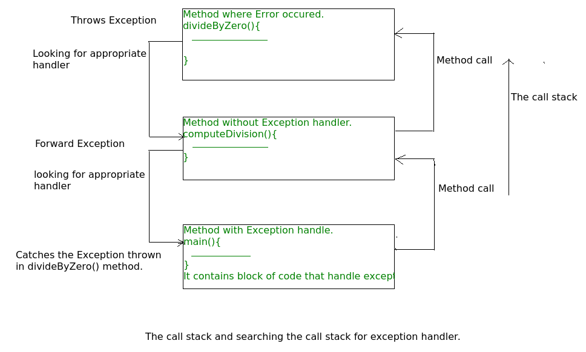
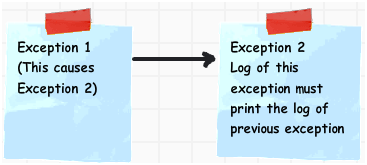

- With _checked_ exceptions, the compiler checks that the programmer is aware of the exception and prepared to deal with the consequences.
- Common exceptions, such as bound errors or accessing a null reference, are _unchecked_. The compiler does not expect that you provide a handler.
- You only need to supply a `throws` clause for checked exceptions.
- In Java, an exception object is always an instance of a class derived from `Throwable`.
- Throwable has two direct descendents : `Error` and `Exception`
- `Exception` is divided into two branches : `IOException` and `Runtime Exception`
- The first kind of exception is the _checked exception_. These are exceptional conditions that a well-written application should anticipate and recover from.
- Checked exceptions are _subject to_ the Catch or Specify Requirement
- All exceptions are checked exceptions, except for those indicated by `Error`, `RuntimeException`, and their subclasses.
- The second kind of exception is _error_. These are exceptional conditions that are external to the application, and that the application usually cannot anticipate or recover from
- Errors are not subject to the Catch or Specify Requirement. Errors are those exceptions indicated by Error and its subclasses.
- The third kind of exception is the _runtime exception_. These are exceptional conditions that are internal to the application, and that the application usually cannot anticipate or recover from. Usually logic error or improper use of an API.
- The compiler checks that we provide exception handlers for all checked exceptions
- A method must declare all the _checked_ exceptions that it might throw.
- Catching multiple exceptions doesn't just make your code look simpler but also more efficient.
- You can use the `finally` clause without a `catch` clause.
- The body of `finally` clause is intended for cleaning up resources. Don't put statements that change the control flow (return, throw, break, continue) inside a finally clause.
- A _stack trace_ is a listing of all pending method calls at a particular point in the execution of a program.
- If the JVM exits while the `try` or `catch` code is being executed, then the `finally` block may not execute. If the thread executing the try or catch code is interrupted or killed, `finally` block may not execute.
- We can open multiple resources in try-with-resources statement separated by a semicolon.
- When multiple resources are opened in try-with-resources, it closes them in the reverse order to avoid any dependency issue.
- If an exception is thrown in both `try` block and finally block, the method returns the exception thrown in `finally` block.
- For try-with-resources, if exception is thrown in try block and in try-with-resources statement, then method returns the exception thrown in try block.
- You can retrieve suppressed exceptions by calling the `Throwable.getSuppressed` method from the exception thrown by the try block
- Chained exceptions help the programmer to know when one exception causes another.
- If a client can reasonably be expected to recover from an exception, make it a checked exception. If a client cannot do anything to recover from the exception, make it an unchecked exception.
- checked exceptions must be explicitly caught in a method or declared in the method's throws clause. Unchecked exceptions are caused by problems that can not be solved, such as dividing by zero, null pointer, etc. **Checked exceptions are especially important because you expect other developers who use your API to know how to handle the exceptions.**
- If an exception can be properly handled then it should be caught, otherwise, it should be thrown.
- Can we catch multiple exceptions in the same catch clause?
  - The answer is YES. As long as those exception classes can trace back to the same super class in the class inheritance hierarchy, you can use that super class only.
- Constructors can throw exceptions
- `javac -g file.Java` : the. -g flag will generate debugging information, including information about local variables
- **Advantages of Exceptions**
  - Separate Error-Handling Code from "Regular" Code.
  - Propagating Errors up the call stack
  - Grouping and Differentiating Error types.
- `java.lang.Throwable`
  - `Throwable(Throwable cause)`
  - `Throwable(String message, Throwable cause)`
  - `Throwable initCause(Throwable cause)` : sets the cause for this object or throws an exception if this object already has a cause. Returns this.
  - `Throwable getCause()`
- Don't just throw a `RuntimeException`. Find an appropriate subclass or create your own.
- `NoClassDefFoundError` occurs when the source was successfully compiled, but at runtime, the required `class` files were not found. It is an error and arises from the JVM having problems finding a class it expected to find. For instance, we created A.class and B.class at compile time and removed A.class on which B.class depended. So, when running B it will give this error
- `ClassNotFoundException` may stem from trying to make reflective calls to classes at runtime, but the classes the program is trying to call don't exist.
- ClassCast Exception is thrown when we try to cast an object of the parent class to the child class object.
- The Java language has a keyword `assert`. There are two forms: `assert condition;` and `assert condition: expression;`
- **throw**: Sometimes we explicitly want to create exception object and then throw it to halt the normal processing of the program. `throw` keyword is used to throw exception to the runtime to handle it.
- **throws**: When we are throwing any checked exception in a method and not handling it, then we need to use throws keyword in method signature to let caller program know the exceptions that might be thrown by the method. The caller method might handle these exceptions or propagate it to its caller method using throws keyword. We can provide multiple exceptions in the throws clause and it can be used with main() method also.
- **try-catch**: We use try-catch block for exception handling in our code. try is the start of the block and catch is at the end of try block to handle the exceptions. We can have multiple catch blocks with a try and try-catch block can be nested also. catch block requires a parameter that should be of type Exception.
- **finally**: finally block is optional and can be used only with try-catch block. Since exception halts the process of execution, we might have some resources open that will not get closed, so we can use finally block. finally block gets executed always, whether exception occurs or not.



### Can an exception be rethrown?

- We all know that exceptions occurred in the try block are caught in catch block. Thus caught exceptions can be re-thrown using throw keyword. Re-thrown exception must be handled some where in the program, otherwise program will terminate abruptly.
  There are the following reasons to "re-throw" exceptions:
  1. If you have something to do before.
  2. If you catch exception of one type and throw exception of other type:
     ```java
     try {
       // do something
     } catch (IOException ioe) {
       throw new IllegalStateException(ioe);
     }
     ```
- Rethrowing _can_ be useful if the method that catches and then re-throws the exception needs to take some additional action upon seeing the Exception, and also desires that the Exception is propagated to the caller, so that the caller can see the Exception and also take some action.
- Also throwing a new exception that wraps the caught exception is good for abstraction. e.g., your library uses a third-party library that throws an exception that the clients of your library shouldn't know about. In that case, you wrap it into an exception type more native to your library, and throw that instead.
- Sometimes you want to hide the implementation details of a method or improve the level of abstraction of a problem so that it’s more meaningful to the caller of a method.
- One way would be to log the error first in the catch, and then throw it up to the UI to generate a friendly error message with the option to see a more "advanced/detailed" view of the error, which contains the original error. To do this, you can intercept the original exception and substitute a custom exception that’s better suited for explaining the problem.
- Another approach is a "retry" approach, e.g., an error count is kept, and after a certain amount of retries that's the only time the error is sent up the stack (this is sometimes done for database access for database calls that timeout, or in accessing web services over slow networks).

### What is Exception Chaining?

- Chained Exceptions allows to relate one exception with another exception, i.e one exception describes cause of another exception. For example, consider a situation in which a method throws an ArithmeticException because of an attempt to divide by zero but the actual cause of exception was an I/O error which caused the divisor to be zero. The method will throw only ArithmeticException to the caller. So the caller would not come to know about the actual cause of exception. Chained Exception is used in such type of situations.

- **Constructors** Of Throwable class Which support chained exceptions:

  1. `Throwable(Throwable cause)` :- Where cause is the exception that causes the current exception.
  2. `Throwable(String msg, Throwable cause)` :- Where msg is the exception message and cause is the exception that causes the current exception.

- **Methods** Of Throwable class Which support chained exceptions in Java :

  1. `getCause()` :- This method returns actual cause of an exception.
  2. `initCause(Throwable cause)` :- This method sets the cause for the calling exception.

  

### Why Chained Exceptions?

- The main purpose of exception chaining is to preserve the original exception when it propagates across multiple logical layers in a program. This is very helpful for the debugging process when an exception is thrown, as the programmer can analyze the full stack trace of the exceptions.
- We need to chain the exceptions to make logs readable. Let’s write two examples. First without chaining the exceptions and second, with chained exceptions. Later, we will compare how logs behave in both of the cases.
- **Without chaining**

```java
public class ExceptionTest {
  static int arr[] = { 11, 22, 33 };

  public static void main(String[] args) {
    try {
      System.out.println(arr[4]);
    } catch (ArrayIndexOutOfBoundsException ae) {
        try {
          MyCustomException e = new MyCustomException("Exception Occured");
          throw e;
        } catch (MyCustomException e) {
          	e.printStackTrace();
			  }
		}
  }
}

class MyCustomException extends Exception {

	public MyCustomException(String msg) {
		super(msg);
	}
}

// Output :
com.G2.Exception.MyCustomException: Exception Occured
at com.G2.Exception.ExceptionTest.main(ExceptionTest.Java:13)
```

You can see the poor programming practice from the above Java code.
Actual reason of the exception is **ArrayIndexOutOfBoundsException** but it is printing the logs of the last exception.
A cause can be associated with a throwable in two ways: via a constructor that takes the cause as an argument, or via the `initCause(Throwable)` method.

- **With chaining**

```java
public class ExceptionTest {
  static int arr[] = { 11, 22, 33 };
  public static void main(String[] args) {
    try {
      System.out.println(arr[4]);
    } catch (ArrayIndexOutOfBoundsException ae) {
        try {
          // initcause() Method of class Throwable to retain the cause of the exception.
          MyCustomException e = new MyCustomException("Exception Occured");
          e.initCause(ae);

          // OR In the constructor of the MyCustomException, pass the object of the Throwable.
          MyCustomException e = new MyCustomException("Exception Occured", ae);
			    throw e;
			  } catch (MyCustomException e) {
				      e.printStackTrace();
			  }
    }
  }
}

class MyCustomException extends Exception {

	public MyCustomException(String msg) {
		super(msg);
	}
}

// OUTPUT
com.G2.Exception.MyCustomException: Exception Occured
at com.G2.Exception.ExceptionTest.main(ExceptionTest.Java:13)
Caused by: Java.lang.ArrayIndexOutOfBoundsException: 4
at com.G2.Exception.ExceptionTest.main(ExceptionTest.Java:10)
```

### Can you throw any exception inside a lambda expression’s body?

- When using a standard functional interface already provided by Java, you can only throw unchecked exceptions because standard functional interfaces do not have a “throws” clause in method signatures:

```java
List<Integer> integers = Arrays.asList(3, 9, 7, 0, 10, 20);
integers.forEach(i -> {
    if (i == 0) {
        throw new IllegalArgumentException("Zero not allowed");
    }
    System.out.println(Math.PI / i);
});
```

- However, if you are using a custom functional interface, throwing checked exceptions is possible if your method declares throws.

### Is there any way of throwing a checked exception from a method that does not have a throws clause?

- Yes. We can take advantage of the type erasure performed by the compiler and make it think we are throwing an unchecked exception, when, in fact; we’re throwing a checked exception:

```java
void doSomething() {
    // ...
    throw new RuntimeException(new Exception("Chained Exception"));
}
```

- When chaining exceptions, the compiler only cares about the first one in the chain and, because it detects an unchecked exception, we don’t need to add a throws clause.

### Will the following program snippet compile?

```java
catch (IOException | JAXBException e) {
  e = new Exception("");
  e.printStackTrace();
}
```

- The above program won’t compile because exception object in multi-catch block is final and we can’t change it’s value. You will get compile time error as “The parameter e of a multi-catch block cannot be assigned”.
  We have to remove the assignment of “e” to new exception object to solve this error.

```java
private static void test() {
    try {
    } catch (IOException e) {
    }
}
```

- This exception is never thrown from the try statement body. It is not allowed to catch a **Checked Exception** which is not thrown from try block except for class Exception and Throwable which has RuntimeException as subclass for which decision is taken at run time and not compile time.

### What are the types of Exceptions? Explain the hierarchy of Java Exception classes?

- Exception is an error event that can happen during the execution of a program and disrupts its normal flow.
- **Types of Java Exceptions**  
  **1. Checked Exception**: The classes which directly inherit `Throwable class` except RuntimeException and Error are known as checked exceptions e.g. IOException, SQLException etc. Checked exceptions are checked at compile-time.  
  **2. Unchecked Exception**: The classes which inherit `RuntimeException` are known as unchecked exceptions e.g. ArithmeticException, NullPointerException, ArrayIndexOutOfBoundsException etc. Unchecked exceptions are not checked at compile-time, but they are checked at runtime.  
  **3. Error**: Error is irrecoverable e.g. OutOfMemoryError, VirtualMachineError, AssertionError etc.
- **Hierarchy of Java Exception classes**  
  The java.lang.Throwable class is the root class of Java Exception hierarchy which is inherited by two subclasses: Exception and Error.


### What is difference between Error and Exception?

| BASIS        | ERROR                                                            | EXCEPTION                                                                                                 |
| ------------ | ---------------------------------------------------------------- | --------------------------------------------------------------------------------------------------------- |
| Basic        | An error is caused due to lack of system resources.              | An exception is caused because of the code.                                                               |
| Recovery     | An error is irrecoverable.                                       | An exception is recoverable.                                                                              |
| Keywords     | There is no means to handle an error by the program code.        | Exceptions are handled using three keywords "try", "catch", and "throw".                                  |
| Consequences | As the error is detected the program will terminated abnormally. | As an exception is detected, it is thrown and caught by the "throw" and "catch" keywords correspondingly. |
| Types        | Errors are classified as unchecked type.                         | Exceptions are classified as checked or unchecked type.                                                   |
| Package      | In Java, errors are defined "java.lang.Error" package.           | In Java, an exceptions are defined in"java.lang.Exception".                                               |
| Example      | OutOfMemory, StackOverFlow.                                      | Checked Exceptions: NoSuchMethod, ClassNotFound.Unchecked Exceptions: NullPointer, IndexOutOfBounds.      |

### Explain about Exception Propagation?

- An exception is first thrown from the top of the stack and if it is not caught, it drops down the call stack to the previous method, If not caught there, the exception again drops down to the previous method, and so on until they are caught or until they reach the very bottom of the call stack. This is called exception propagation.

### Exception Propagation in Unchecked Exceptions

- When an exception happens, Propagation is a process in which the exception is being dropped from to the top to the bottom of the stack. If not caught once, the exception again drops down to the previous method and so on until it gets caught or until it reach the very bottom of the call stack. This is called exception propagation and this happens in case of Unchecked Exceptions.
- In the below example exception occurs in m() method where it is not handled,so it is propagated to previous n() method where it is not handled, again it is propagated to p() method where exception is handled.
- Exception can be handled in any method in call stack either in main() method, p() method, n() method or m() method.

```java
class TestExceptionPropagation {

    void m() {
      int data = 50/0;
    }

    void n() {
      m();
    }

    void p() {
        try {
           n();
        } catch(Exception e) {
           System.out.println("exception handled");
        }
    }

    public static void main(String args[]) {
        TestExceptionPropagation obj = new TestExceptionPropagation();
        obj.p();
        System.out.println("Normal Flow...");
    }
}
```

### Exception Propagation in Checked Exceptions

- Unlike Unchecked Exceptions, the propagation of exception **does not happen** in case of Checked Exception and its mandatory to use throw keyword here. Only unchecked exceptions are propagated. **Checked exceptions throw compilation error**.
  In example below, If we omit the throws keyword from the m() and n() functions, the compiler will generate compile time error. Because unlike in the case of unchecked exceptions, the checked exceptions cannot propagate without using throws keyword.
  **Note** : By default, Checked Exceptions are **not** forwarded in calling chain (propagated).

```java
class Simple {
	// exception propagated to n()
	void m() throws IOException{
		// checked exception occurred
		throw new IOException("device error");
	}

	// exception propagated to p()
	void n() throws IOException{
		m();
	}

	void p() {
		try {
			// exception handled
			n();
		}
		catch (Exception e) {
			System.out.println("exception handled");
		}
    }

	public static void main(String args[]){
		Simple obj = new Simple();
		obj.p();
		System.out.println("normal flow...");
	}
}
```

### What are different scenarios causing "Exception in thread main"?

- **Exception in thread main java.lang.UnsupportedClassVersionError**: This exception comes when your java class is compiled from another JDK version and you are trying to run it from another java version.
- **Exception in thread main java.lang.NoClassDefFoundError**: There are two variants of this exception. The first one is where you provide the class full name with .class extension. The second scenario is when Class is not found.
- **Exception in thread main java.lang.NoSuchMethodError: main**: This exception comes when you are trying to run a class that doesn’t have main method.
- **Exception in thread "main" java.lang.ArithmeticException**: Whenever any exception is thrown from main method, it prints the exception is console. The first part explains that exception is thrown from main method, second part prints the exception class name and then after a colon, it prints the exception message.

### What is checked, unchecked exception and errors?

**1. Checked Exception**:

- These are the classes that extend **Throwable** except **RuntimeException** and **Error**.
- They are also known as compile time exceptions because they are checked at **compile time**, meaning the compiler forces us to either handle them with try/catch or indicate in the function signature that it **throws** them and forcing us to deal with them in the caller.
- They are programmatically recoverable problems which are caused by unexpected conditions outside the control of the code (e.g. database down, file I/O error, wrong input, etc).
- Example: **IOException, SQLException** etc.

```java
import java.io.*;

class Main {
    public static void main(String[] args) {
        FileReader file = new FileReader("C:\\assets\\file.txt");
        BufferedReader fileInput = new BufferedReader(file);

        for (int counter = 0; counter < 3; counter++)
            System.out.println(fileInput.readLine());

        fileInput.close();
    }
}
```

output:

```
Exception in thread "main" java.lang.RuntimeException: Uncompilable source code -
unreported exception java.io.FileNotFoundException; must be caught or declared to be
thrown
    at Main.main(Main.java:5)
```

After adding IOException

```java
import java.io.*;

class Main {
    public static void main(String[] args) throws IOException {
        FileReader file = new FileReader("C:\\assets\\file.txt");
        BufferedReader fileInput = new BufferedReader(file);

        for (int counter = 0; counter < 3; counter++)
            System.out.println(fileInput.readLine());

        fileInput.close();
    }
}
```

output:

```java
Output: First three lines of file “C:\assets\file.txt”
```

**2. Unchecked Exception**:

- The classes that extend **RuntimeException** are known as unchecked exceptions.
- Unchecked exceptions are not checked at compile-time, but rather at **runtime**, hence the name.
- They are also programmatically recoverable problems but unlike checked exception they are caused by faults in code flow or configuration.
- Example: **ArithmeticException, NullPointerException, ArrayIndexOutOfBoundsException** etc.

```java
class Main {
   public static void main(String args[]) {
      int x = 0;
      int y = 10;
      int z = y/x;
  }
}
```

Output:

```java
Exception in thread "main" java.lang.ArithmeticException: / by zero
    at Main.main(Main.java:5)
Java Result: 1
```

**3. Error**:

**Error** refers to an irrecoverable situation that is not being handled by a **try/catch**.  
Example: **OutOfMemoryError, VirtualMachineError, AssertionError** etc.

### What is difference between ClassNotFoundException and NoClassDefFoundError?

- `ClassNotFoundException` and `NoClassDefFoundError` occur when a particular class is not found at runtime. However, they occur at different scenarios.
- `ClassNotFoundException` is an exception that occurs when you try to load a class at run time using `Class.forName()` or `loadClass()` methods and mentioned classes are not found in the classpath.
- `NoClassDefFoundError` is an error that occurs when a particular class is present at compile time, but was missing at run time.

### What are important methods of Java Exception Class?

| Method                            | Description                                                                                                                                                                                                                         |
| --------------------------------- | ----------------------------------------------------------------------------------------------------------------------------------------------------------------------------------------------------------------------------------- |
| String getMessage()               | This method returns the message String of Throwable and the message can be provided while creating the exception through it’s constructor.                                                                                          |
| String getLocalizedMessage()      | This method is provided so that subclasses can override it to provide locale specific message to the calling program. Throwable class implementation of this method simply use getMessage() method to return the exception message. |
| synchronized Throwable getCause() | This method returns the cause of the exception or null if the cause is unknown.                                                                                                                                                     |
| String toString()                 | This method returns the information about Throwable in String format, the returned String contains the name of Throwable class and localized message.                                                                               |
| void printStackTrace()            | This method prints the stack trace information to the standard error stream, this method is overloaded and we can pass PrintStream or PrintWriter as argument to write the stack trace information to the file or stream.           |

### Explain Java finally block behaviour when return statement is encountered.

- If there is a return statement in try block as well as in catch block, **finally** block will execute. The only case where it will not execute is when it encounters **System.exit()**.
- In below code first finally will execute and then the value will be returned.

```java
try {
    return 0;
} finally {
    System.out.println("Inside Finally block");
}
```

- Also **finally block overrides the values returned by try-catch block**. e.g. in below code output will be 19

```java
try {
    ...
    return 5;
} finally {
    ...
    return 19;
}
```

- If a method returns a value and also has try, catch and finally blocks in it, then following two rules need to follow.
  - If finally block returns a value then try and catch blocks may or may not return a value.
  - If finally block does not return a value then both try and catch blocks must return a value.
- If try-catch-finally blocks are returning a value according to above rules, then you should not keep any statements after finally block. Because they become unreachable and in Java, Unreachable code gives compile time error.
- finally block will be always executed even though try and catch blocks are returning the control.finally block overrides any return values from try and catch blocks.

### What is difference between `throw` and `throws` keyword in Java?

- **throws** keyword is used with method signature to declare the exceptions that the method might throw whereas throw keyword is used to disrupt the flow of program and handing over the exception object to runtime to handle it.
- **throw** keyword in Java is used to explicitly throw an exception from a method or any block of code. We can throw either checked or unchecked exception. The throw keyword is mainly used to throw custom exceptions.
- Important points to remember about throws keyword:
  - throws keyword is required only for checked exception and usage of throws keyword for unchecked exception is meaningless.
  - throws keyword is required only to convince compiler and usage of throws keyword does not prevent abnormal termination of program.
  - By the help of throws keyword we can provide information to the caller of the method about the exception.

### What is difference between `final`, `finally` and `finalize` in Java?

- `final` and `finally` are keywords in Java whereas finalize is a method.
- **final** keyword can be used with class variables so that they can’t be reassigned, with class to avoid extending by classes and with methods to avoid overriding by subclasses
- **finally** keyword is used with try-catch block to provide statements that will always gets executed even if some exception arises, usually finally is used to close resources.
- **finalize**() method is executed by GC before the object is destroyed, it’s great way to make sure all the global resources are closed.

### Explain Exception handling in Method overriding.

- **Rule**: An overriding method (the method of child class) can throw any unchecked exceptions, regardless of whether the overridden method (method of base class) throws exceptions or not. However the overriding method should not throw checked exceptions that are new or broader than the ones declared by the overridden method. The overriding method can throw those checked exceptions, which have less scope than the exception(s) declared in the overridden method.
- **Code will work fine**
  - If base class doesn’t throw any exception but child class throws an unchecked exception.
  - When base class and child class both throws a checked exception and child class method is throwing subclass or no exception compared to the same method of base class
- Code will give compilation error
  - If base class doesn’t throw any exception but child class throws an checked exception
  - When child class method is throwing border checked exception compared to the same method of base class

### Explain few checked and unchecked exceptions?

#### Popular checked exceptions

| Name                   | Description                                                                                                                   |
| ---------------------- | ----------------------------------------------------------------------------------------------------------------------------- |
| IOException            | While using file input/output stream related exception                                                                        |
| SQLException.          | While executing queries on database related to SQL syntax                                                                     |
| DataAccessException    | Exception related to accessing data/database                                                                                  |
| ClassNotFoundException | Thrown when the JVM can’t find a class it needs, because of a command-line error, a classpath issue, or a missing .class file |
| InstantiationException | Attempt to create an object of an abstract class or interface.                                                                |

#### Popular Unchecked Exceptions

| Name                     | Description                                                                                                                    |
| ------------------------ | ------------------------------------------------------------------------------------------------------------------------------ |
| NullPointerException     | Thrown when attempting to access an object with a reference variable whose current value is null                               |
| ArrayIndexOutOfBound     | Thrown when attempting to access an array with an invalid index value (either negative or beyond the length of the array)      |
| IllegalArgumentException | Thrown when a method receives an argument formatted differently than the method expects.                                       |
| IllegalStateException    | Thrown when the state of the environment doesn’t match the operation being attempted,e.g., using a Scanner that’s been closed. |
| NumberFormatException    | Thrown when a method that converts a String to a number receives a String that it cannot convert.                              |
| ArithmaticException      | Arithmetic error, such as divide-by-zero.                                                                                      |

#### Popular Errors

| Name                         | Description                                                                                                                                                                                          |
| ---------------------------- | ---------------------------------------------------------------------------------------------------------------------------------------------------------------------------------------------------- |
| StackOverflowError           | thrown when the amount of call stack memory is allocated by JVM is exceeded.                                                                                                                         |
| OutOfMemoryError.            | Usually, thrown when there is insufficient space to allocate an object in the Java heap.                                                                                                             |
| InternalError                | thrown to indicate some unexpected internal error has occurred in the Java Virtual Machine.                                                                                                          |
| NoSuchMethodError            | thrown if an application tries to call a specified method of a class (either static or instance), and that class no longer has a definition of that method.                                          |
| VirtualMachineError          | thrown to indicate that the Java Virtual Machine is broken or has run out of resources necessary for it to continue operating.                                                                       |
| UnsupportedClassVersionError | This occurs when the JVM attempts to read a class file and determines that the version in the file is not supported, normally because the file was generated with a newer version of Java            |
| NoClassDefFoundError         | thrown when JVM tries to load the definition of a class, and that class definition is no longer available. The required class definition was present at compile time, but it was missing at runtime. |

