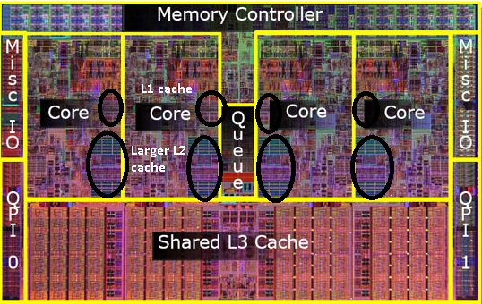
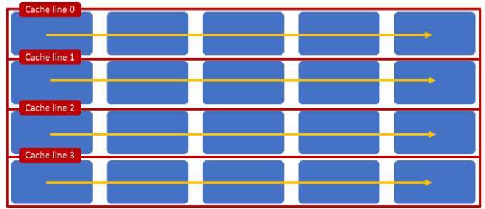
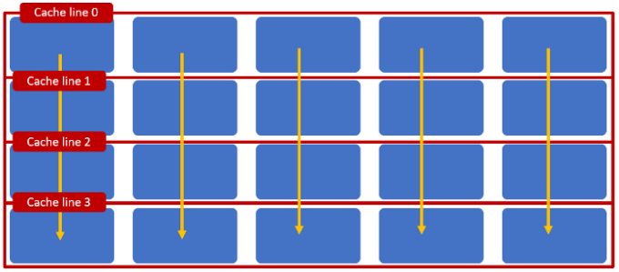
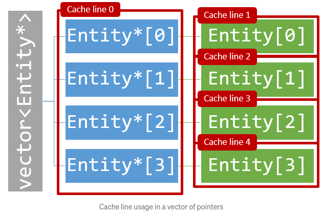
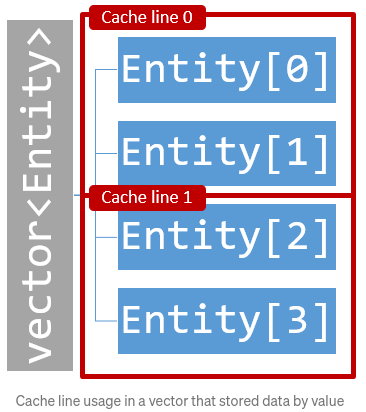
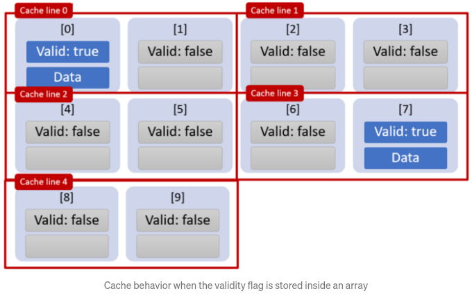
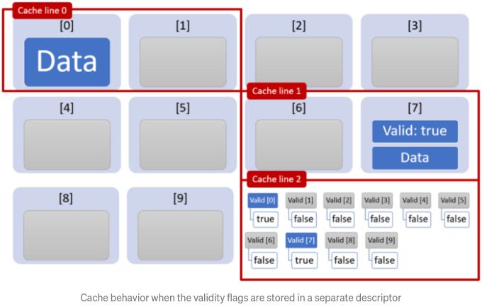
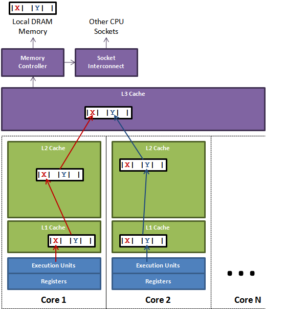
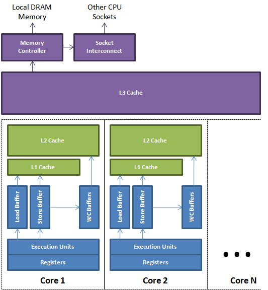

### CPU Caches

- Each processor core sports two level of cache:
  - 2 to 64 KB Level 1 (L1) cache very high speed cache.
  - ~256 KB Level 2 (L2) cache medium speed cache
- All cores share a Level 3 (L3) cache. The L3 cache tends to be around 8 MB.



- L1 access latency : 4 cycles
- L2 access latency : 11 cycles
- L3 access latency : 39 cycles
- Main memory access latency : 107 cycles
- Here accessing data or code from L1 caches is 27 times faster than accessing the data from the main memory. Due to this lopsided nature of memory access, an O(N) algorithm may perform better than an O(1) algorithm if the latter causes more cache misses.
- A **cache line** is the unit of data transfer between the cache and main memory. Typically the cache line is 64 bytes.
- The processor will read or write an entire cache line when any location in the 64 byte region is read or written.




- The processors also attempt to prefetch cache lines by analyzing the memory access pattern or a thread.
- Prefer arrays and vectors stored by value




- Keep array entry validity flags in separate descriptor array.




- Avoid cache line sharing between threads (false sharing)
- Consider the array shown below that has been optimized so that two cores (blue and green) are operating on alternate entries in the array.



- Since the green and blue processor share a cache line, this triggers _cache coherency procedures_ between green and blue cores. This approach is referred to as _false sharing_
- Code with tight `for` loops is likely to fit into the L1 or L2 cache.

### Let the caller choose

```java
String str = "Some string that I may want to split";
String[] values = str.split(" ");
```

- To make the above idiom work CPU has to do a lot of work. Instead we should use the following :

```java
String str = "Some string that I may want to split";
Collection<String> values = new ArrayList<String>();
str.split(values, " ");
```

- In Java world this idiom becomes critical to performance when large arrays are involved. An array may be too large to be allocated in the young generation and therefore needs to be allocated in the old gen. Besides being less efficient and contended for large object allocation, the large array may cause a compaction of the old gen. resulting in a mult-second stop-the-world pause.

### Processor affinity

- **Processor affinity** or **CPU pinning** or _cache affinity_, enables the binding and unbinding of a process or thread to a CPU or a range of CPUs, so that the process or thread will execute only on the designated CPU or CPUs rather than any CPU.

### Memory fence/barrier

- A memory fence/barrier is a class of instructions that mean memory read/writes occur in the order you expect. For example a _full fence_ means all read/writes before the fence are committed before those after the fence.
- Memory fences are a hardware concept.



- The techniques for making memory visible from a processor core are known as memory barriers or fences.
- A **store barrier**, `sfence` instruction on x86, waits for all store instructions prior to the barrier to be written from the store buffer to the L1 cache for the CPU on which it is issued.
- A **load barrier**, `lfence` instruction on x86, ensures all load instructions after the barrier to happen after the barrier and then wait on the load buffer to drain for the issuing CPU.
- A **full barrier**, `mfence` instruction on x86, is a composite of both load and store barriers happening on a CPU

### False sharing

- False sharing is a term which applies when threads unwittingly impace the performance of each other while modifying independent variables sharing the same cache line.
- Write contention on cache lines is the single most limiting factor on achieving scalability for parallel threads of execution in an SMP system.


### Inter Thread Latency

- Message rates between threads are fundamentally determined by the latency of memory exchange between CPU cores. The minimum unit of transfer will be a cache line exchanged via shared caches or socket interconnects. Memory Barriers are the instructions that cause a CPU to make memory visible to other cores in an ordered and timely manner.
- In this article I’ll directly compare C++ and Java to measure the cost of signalling a change between threads.
- For the test we'll use two counters each updated by their own thread. A simple ping-pong algorithm will be used to signal from one to the other and back again. The exchange will be repeated millions of times to measure the average latency between cores. This measurement will give us the latency of exchanging a cache line between cores in a serial manner.
