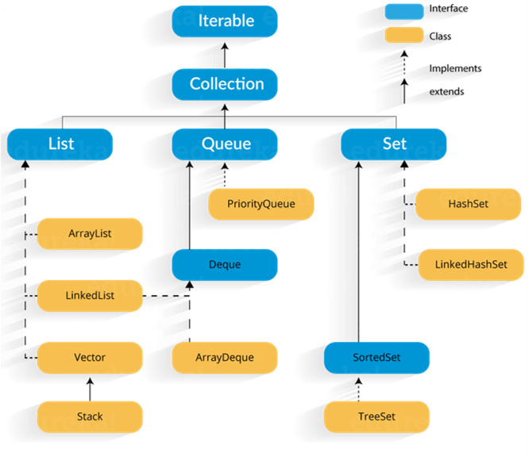
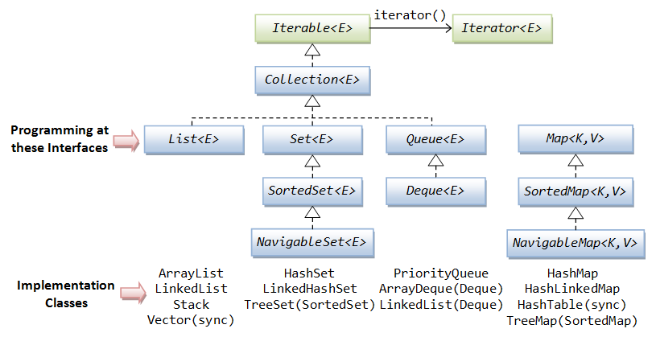
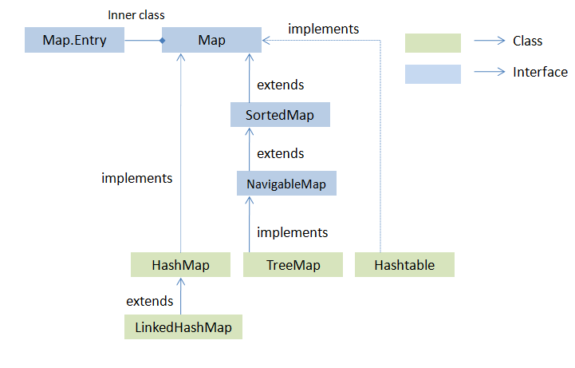

### What is Java Collections Framework? List out some benefits of Collections framework?

- It is a framework that provides a mechanism to store and manipulate group of objects.
- Java Collections can achieve all the operations that we perform on data such as searching, sorting, insertion, manipulation, and deletion.
- Java Collection means a single unit of objects.
- Java Collection framework provides many interfaces (Set, List, Queue, Deque) and classes (ArrayList, Vector, LinkedList, PriorityQueue, HashSet, LinkedHashSet, TreeSet).
- **Collection Interface**
  - Collection interface is at the root of the hierarchy. Collection interface provides all general purpose methods which all collections classes must support (or throw `UnsupportedOperationException`).
  - It extends **Iterable** interface which adds support for iterating over collection elements using the “for-each loop” statement.
- **List**
  - Lists represent an **ordered collection** of elements. Using lists we can access elements by their integer index, and search for elements in the list.
  - Some useful classes which implement List interface are – **ArrayList**, **CopyOnWriteArrayList**, **LinkedList**, **Stack** and **Vector**.
- **Set**
  - Sets represent a collection of **sorted** elements. Sets do not allow duplicate elements.
  - Set interface does not provide guarantee to return the elements in any predictable order; though some Set implementations store elements in their natural ordering and guarantee this order.
  - Some useful classes which implement Set interface are – **ConcurrentSkipListSet**, **CopyOnWriteArraySet**, **EnumSet**, **HashSet**, **LinkedHashSet** and **TreeSet**.
- **Map**
  - The Map interface enables us to store data in key-value pairs (keys should be immutable). A map cannot contain duplicate keys; each key can map to at most one value.
  - The Map interface provides three collection views, which allow a map’s contents to be viewed as a set of keys, collection of values, or set of key-value mappings. Some map implementations, like the TreeMap class, make specific guarantees as to their order; others, like the HashMap class, do not.
  - Some useful classes which implement Map interface are – **ConcurrentHashMap**, **ConcurrentSkipListMap**, **EnumMap**, **HashMap**, **Hashtable**, **IdentityHashMap**, **LinkedHashMap**, **Properties**, **TreeMap** and **WeakHashMap**.
- **Stack**
  - The Java Stack interface represents a classic stack data structure, where elements can be pushed to last-in-first-out (LIFO) stack of objects. In Stack we push an element to the top of the stack, and pop off from the top of the stack again later.
- **Queue**
  - A queue data structure is intended to hold the elements (put by producer threads) prior to processing by consumer thread(s). Besides basic Collection operations, queues provide additional insertion, extraction, and inspection operations.
  - Some useful classes which implement Map interface are – **ArrayBlockingQueue, ArrayDeque, ConcurrentLinkedDeque, ConcurrentLinkedQueue, DelayQueue, LinkedBlockingDeque, LinkedBlockingQueue, LinkedList, LinkedTransferQueue, PriorityBlockingQueue, PriorityQueue and SynchronousQueue**.
- **Deque**
  - A double ended queue (pronounced “deck“) that supports element insertion and removal at both ends. When a deque is used as a queue, FIFO (First-In-First-Out) behavior results. When a deque is used as a stack, LIFO (Last-In-First-Out) behavior results.
  - Some common known classes implementing this interface are **ArrayDeque ConcurrentLinkedDeque, LinkedBlockingDeque** and **LinkedList**.

    |             | List | Set         | Queue                                        | Map                                   |
    | ----------- | ---- | ----------- | -------------------------------------------- | ------------------------------------- |
    | Order       | Yes  | No          | Yes                                          | No                                    |
    | Duplicates  | Yes  | No          | Yes                                          | No (Allow duplicate values not keys)  |
    | Null Values | Yes  | Single Null | Yes (LinkedList Queue). No (Priority Queue). | Single null key and many null valuess |

- **The Java Collections Framework provides the following benefits:**
  - Reduces programming effort
  - Increases program speed and quality
  - Allows interoperability among unrelated APIs
  - Reduces effort to learn and to use new APIs
  - Reduces effort to design new APIs
  - Fosters software reuse

**Collections Framework Implementation Classes Summary**

### What will be the problem if you do not override hashcode() method?

- Some collections, like HashSet, HashMap or HashTable use the hashcode value of an object to find out how the object would be stored in the collection. Hashing retrieval involves:
  - First, find out the right bucket using hashCode().
  - Secondly, search the bucket for the right element using equals()
- If hashcode() in not overridden then the default implementation in Object class will be used by collections. This implementation gives different values for different objects, even if they are equal according to the equals() method.

### Why Collection doesn’t extend Cloneable and Serializable interfaces ?

- Collection is an interface that specifies a group of objects known as elements. The details of how the group of elements is maintained is left up to the concrete implementations of Collection. For example, some Collection implementations like List allow duplicate elements whereas other implementations like Set don't. A lot of the Collection implementations have a public clone method. However, it does't really make sense to include it in all implementations of Collection. This is because Collection is an abstract representation. What matters is the implementation. The semantics and the implications of either cloning or serializing come into play when dealing with the actual implementation; that is, the concrete implementation should decide how it should be cloned or serialized, or even if it can be cloned or serialized. In some cases, depending on what the actual backing-implementation is, cloning and serialization may not make much sense. So mandating cloning and serialization in all implementations is actually less flexible and more restrictive. The specific implementation should make the decision as to whether it can be cloned or serialized.

### What is difference between Array and ArrayList?

| Factor          | Array                                                                                                                                                | ArrayList                                                                         |
| --------------- | ---------------------------------------------------------------------------------------------------------------------------------------------------- | --------------------------------------------------------------------------------- |
| Size            | Array in Java is fixed in size                                                                                                                       | ArrayList is dynamic in size                                                      |
| Primitives      | Array can contain both primitive data types as well as objects                                                                                       | ArrayList can not contain primitive data types. It contains only objects.         |
| Iterator        | We use for loop for iterating elements in an array.                                                                                                  | In an ArrayList we use an Iterator object to traverse the elements                |
| Multi-dimension | An Array can be multi-dimensional.                                                                                                                   | An ArrayList is always of single dimension                                        |
| Type Safety     | An Array can contain objects of same type of classe. If we try to store a different data type object in an Array then it throws ArrayStoreException. | Java helps in ensuring Type Safety of elements in an ArrayList by using Generics. |

### What is difference between ArrayList and LinkedList?

| ArrayList                                                                                                                                              | LinkedList                                                                                                                            |
| ------------------------------------------------------------------------------------------------------------------------------------------------------ | ------------------------------------------------------------------------------------------------------------------------------------- |
| ArrayList internally uses a dynamic array to store the elements.                                                                                       | LinkedList internally uses a doubly linked list to store the elements.                                                                |
| Manipulation with ArrayList is slow because it internally uses an array. If any element is removed from the array, all the bits are shifted in memory. | Manipulation with LinkedList is faster than ArrayList because it uses a doubly linked list, so no bit shifting is required in memory. |
| An ArrayList class can act as a list only because it implements only List interface.                                                                   | LinkedList class can act as a list and queue both, because it implements List and Deque interfaces.                                   |
| ArrayList is better for storing and accessing data.                                                                                                    | LinkedList is better for manipulating data.                                                                                           |

### What is difference between Comparable and Comparator interface?

- Comparable and Comparator both are interfaces and can be used to sort collection elements.
- **Comparable**: A comparable object is capable of comparing itself with another object. The class itself must implements the `java.lang.Comparable` interface in order to be able to compare its instances.
- **Comparator**: A comparator object is capable of comparing two different objects. The class is not comparing its instances, but some other class’s instances. This comparator class must implement the `java.util.Comparator` interface.

| Comparable                                                                                                                                              | Comparator                                                                                                                                                    |
| ------------------------------------------------------------------------------------------------------------------------------------------------------- | ------------------------------------------------------------------------------------------------------------------------------------------------------------- |
| Comparable provides a single sorting sequence. In other words, we can sort the collection on the basis of a single element such as id, name, and price. | Comparator provides multiple sorting sequences. In other words, we can sort the collection on the basis of multiple elements such as id, name, and price etc. |
| Comparable affects the original class, i.e., the actual class is modified.                                                                              | Comparator doesn't affect the original class, i.e., the actual class is not modified.                                                                         |
| Comparable provides compareTo() method to sort elements.                                                                                                | Comparator provides compare() method to sort elements.                                                                                                        |
| We can sort the list elements of Comparable type by Collections.sort(List) method.                                                                      | We can sort the list elements of Comparator type by Collections.sort(List, Comparator) method.                                                                |

### What is `PriorityQueue`?

- A priority queue in Java is a special type of queue wherein all the elements are ordered as per their natural ordering or based on a custom `Comparator` supplied at the time of creation.
- **features**
  - PriorityQueue is an unbounded queue and grows dynamically.
  - It does not allow NULL objects.
  - Objects added to PriorityQueue MUST be comparable.
  - The objects of the priority queue are ordered **by default in natural order**.
  - A Comparator can be used for custom ordering of objects in the queue.
  - The **head** of the priority queue is the **least** element based on the natural ordering or comparator based ordering. When we poll the queue, it returns the head object from the queue.
  - If multiple objects are present of same priority then it can poll any one of them randomly.
  - PriorityQueue is **not thread safe**. Use `PriorityBlockingQueue` in concurrent environment.
  - It provides **O(log(n))** time for add and poll methods.

### What are different Collection views provided by Map interface?

- In the inheritance tree of the Map interface, there are several implementations but only 3 major, common, and general purpose implementations - they are HashMap, LinkedHashMap and TreeMap.

**1. HashMap**

- This implementation uses a hash table as the underlying data structure. It implements all of the Map operations and allows null values and one null key. This class is roughly equivalent to Hashtable - a legacy data structure before Java Collections Framework, but it is not synchronized and permits nulls. HashMap does not guarantee the order of its key-value elements. Therefore, consider to use a HashMap when order does not matter and nulls are acceptable.

**2. LinkedHashMap**

- This implementation uses a hash table and a linked list as the underlying data structures, thus the order of a LinkedHashMap is predictable, with insertion-order as the default order. This implementation also allows nulls like HashMap. So consider using a LinkedHashMap when you want a Map with its key-value pairs are sorted by their insertion order.

**3. TreeMap**

- This implementation uses a red-black tree as the underlying data structure. A TreeMap is sorted according to the natural ordering of its keys, or by a Comparator provided at creation time. This implementation does not allow nulls. So consider using a TreeMap when you want a Map sorts its key-value pairs by the natural order of the keys (e.g. alphabetic order or numeric order), or by a custom order you specify.

### What is `LinkedHashMap`?

- LinkedHashMap is just like HashMap with an additional feature of maintaining an order of elements inserted into it. Java LinkedHashMap class is Hashtable and Linked list implementation of the Map interface, with predictable iteration order. It inherits HashMap class and implements the Map interface.
- **Features**
  - It contains values based on the key.
  - It contains unique elements.
  - It may have one null key and multiple null values.
  - It is not synchronized.
  - It maintains insertion order.
  - The initial default capacity of Java HashMap class is 16 with a load factor of 0.75.

### What is `EnumMap`?

- EnumMap is specialized implementation of Map interface for enumeration types. It extends AbstractMap and implements Map Interface in Java.
- **Features**
  - All keys used in EnumMap must be from same Enum type which is specified while creating EnumMap in Java
  - EnumMap is ordered collection and they are maintained in the natural order of their keys( natural order of keys means the order on which enum constant are declared inside enum type )
  - It’s a high performance map implementation, much faster than HashMap.
  - EnumMap doesn’t allow null key and throw NullPointerException, at same time null values are permitted.
- **Constructors of EnumMap**
  - `EnumMap(Class<K> keyType)` : It is used to create an empty enum map with the specified key type.
  - `EnumMap(EnumMap<K,? extends V> m)` : It is used to create an enum map with the same key type as the specified enum map.
  - `EnumMap(Map<K,? extends V> m)` : It is used to create an enum map initialized from the specified map.

### What is difference between HashMap and Hashtable?

| HashMap                                                                                                      | Hashtable                                                         |
| ------------------------------------------------------------------------------------------------------------ | ----------------------------------------------------------------- |
| HashMap allows one null key and multiple null values.                                                        | Hashtable doesn't allow any null key or value.                    |
| HashMap is a new class introduced in JDK 1.2.                                                                | Hashtable is a legacy class.                                      |
| HashMap is fast.                                                                                             | Hashtable is slow.                                                |
| HashMap is traversed by Iterator.                                                                            | Hashtable is traversed by Enumerator and Iterator.                |
| Iterator in HashMap is fail-fast.                                                                            | Enumerator in Hashtable is not fail-fast.                         |
| HashMap inherits AbstractMap class.                                                                          | Hashtable inherits Dictionary class.                              |
| HashMap is **not synchronized**                                                                              | Hashtable is **synchronized**.                                    |
| We can make the HashMap as synchronized by calling this code `Map m = Collections.synchronizedMap(hashMap);` | Hashtable is internally synchronized and can't be unsynchronized. |

### What is the difference between fail-fast and fail-safe iterator?

**fail-fast Iterator**

- Iterators in Java are used to iterate over the Collection objects. Fail-Fast iterators immediately throw `ConcurrentModificationException` if there is **structural modification** of the collection. Structural modification means adding, removing or updating any element from collection while a thread is iterating over that collection. Iterator on ArrayList, HashMap classes are some examples of fail-fast Iterator.
- According to Oracle docs, **the fail-fast behavior of an iterator cannot be guaranteed** as it is, generally speaking, impossible to make any hard guarantees in the presence of unsynchronized concurrent modification. Fail-fast iterators throw ConcurrentModificationException on a best-effort basis. Therefore, it would be wrong to write a program that depended on this exception for its correctness: **the fail-fast behavior of iterators should be used only to detect bugs**.

**fail-safe Iterator**

- Fail-Safe iterators don’t throw any exceptions if a collection is structurally modified while iterating over it. This is because, they operate on the clone of the collection, not on the original collection and that’s why they are called fail-safe iterators. Iterators on CopyOnWriteArrayList, ConcurrentHashMap classes are examples of fail-safe Iterator.
- According to Oracle docs, fail safe iterator is ordinarily too costly, but may be more efficient than alternatives when traversal operations vastly outnumber mutations, and is useful when you cannot or don’t want to synchronize traversals, yet need to preclude interference among concurrent threads. The "snapshot" style iterator method uses a reference to the state of the array at the point that the iterator was created. This array never changes during the lifetime of the iterator, so interference is impossible and the iterator is guaranteed not to throw ConcurrentModificationException. The iterator will not reflect additions, removals, or changes to the list since the iterator was created. Element-changing operations on iterators themselves (remove(), set(), and add()) are not supported. These methods throw UnsupportedOperationException.

### How Fail Fast Iterator come to know that the internal structure is modified ?

- Iterator read internal data structure (object array) directly. The internal data structure (i.e. object array) should not be modified while iterating through the collection. To ensure this it maintains an internal flag "mods". Iterator checks the "mods" flag whenever it gets the next value (using hasNext() method and next() method). Value of mods flag changes whenever there is structural modification. Thus indicating iterator to throw ConcurrentModificationException.

### What is `UnsupportedOperationException`?

- This exception is thrown to indicate that the requested operation is not supported. Example of UnsupportedOperationException. If you call add() or remove() method on the readOnly collection. We know readOnly collection can not be modified. Hence, UnsupportedOperationException will be thrown.

### What are concurrent collection classes?

- The concurrent collection APIs of Java provide a range of classes that are specifically designed to deal with concurrent operations. These classes are alternatives to the Java Collection Framework and provide similar functionality except with the additional support of concurrency.
- **Java Concurrent Collection Classes**
  - `BlockingQueue`, `ArrayBlockingQueue`, `SynchronousQueue`, `PriorityBlockingQueue`, `LinkedBlockingQueue`, `DelayQueue`, `BlockingDeque`, `LinkedBlockingDeque`, `TransferQueue`, `LinkedTransferQueue`, `ConcurrentMap`, `ConcurrentHashMap`, `ConcurrentNavigableMap`, `ConcurrentSkipListMap`

### What is `BlockingQueue`? How to implement producer-consumer problem by using `BlockingQueue`?

- **BlockingQueue**: When a thread tries to dequeue from an empty queue, it is blocked until some other thread inserts an item into the queue. Also, when a thread tries to enqueue an item in a full queue, it is blocked until some other thread makes space in the queue, either by dequeuing one or more items or clearing the queue completely.

### What is difference between Enumeration and Iterator interface?

| Enumeration                                                                                                                | Iterator                                                                                                             |
| -------------------------------------------------------------------------------------------------------------------------- | -------------------------------------------------------------------------------------------------------------------- |
| Enumeration was introduced in JDK 1.0                                                                                      | Iterator was introduced in JDK 1.2                                                                                   |
| Methods : hasMoreElements() and nextElement()                                                                              | Methods : hasNext(), next() and remove()                                                                             |
| Enumeration is fail-safe in nature.                                                                                        | Iterator is fail-fast in nature.                                                                                     |
| Enumeration is not safe and secured due to it’s fail-safe nature.                                                          | Iterator is safer and secured than Enumeration.                                                                      |
| is used to traverse legacy classes - Vector, Stack and HashTable.                                                          | Is used to iterate most of the classes in the collection framework like ArrayList, HashSet, HashMap, LinkedList etc. |
| Using Enumeration, you can only traverse the collection. You can’t do any modifications to collection while traversing it. | Using Iterator, you can remove an element of the collection while traversing it.                                     |

### What is difference between `Iterator` and `ListIterator`?

- `ListIterator` is the child interface of `Iterator` interface. The major difference between `Iterator` and `ListIterator` is that `Iterator` can traverse the elements in the collection only in **forward direction** whereas, the `ListIterator` can traverse the elements in a collection in both the **forward as well as the backwards direction**.

### How can we create a synchronized collection from given collection?

- In Java, normally collections aren't synchronized, which leads to fast performance. However, in multi-threaded situations, it can be very useful for collections to be synchronized. The Java Collections class has several static methods on it that provide synchronized collections. These methods are:
  - Collections.synchronizedCollection(Collection<T> c)
  - Collections.synchronizedList(List<T> list)
  - Collections.synchronizedMap(Map<K,V> m)
  - Collections.synchronizedSet(Set<T> s)
  - Collections.synchronizedSortedMap(SortedMap<K,V> m)
  - Collections.synchronizedSortedSet(SortedSet<T> s)

### What is a default capacity of Collection?

| Collections  | Capacity | Load Factor | Empty Size | 10K Entry Overhead | Expansion Algorithm |
| ------------ | -------- | ----------- | ---------- | ------------------ | ------------------- |
| ArrayList    | 10       |             | 88         | 40K                | size + 50%          |
| Vector       | 10       |             |
| HashSet      | 16       | 0.75        | 144        | 360K               | double size         |
| HashMap      | 16       | 0.75        | 128        | 360K               | double size         |
| HashTable    | 11       | 0.75        | 104        | 360K               | double size + 1     |
| LinkedList   | 1        |             | 48         | 240K               | single entries      |
| StringBuffer | 16       |             | 72         | 24                 | double size         |

### What is the difference between Collection and Collections?

- **Collection Interface** : It is the root level interface of the Java Collection Framework. Most of the classes in Java Collection Framework inherit from this interface. **List, Set and Queue** are main sub interfaces of this interface. JDK provides direct implementations of it’s sub interfaces. **ArrayList, Vector, HashSet, LinkedHashSet, PriorityQueue** are some indirect implementations of Collection interface.
- **Collections Class** : Collections is an utility class in java.util package. It consists of only static methods which are used to operate on objects of type Collection.

| Collections Methods                  | Description                                                           |
| ------------------------------------ | --------------------------------------------------------------------- |
| Collections.max()                    | returns maximum element in the specified collection.                  |
| Collections.min()                    | returns minimum element in the given collection.                      |
| Collections.sort()                   | sorts the specified collection.                                       |
| Collections.shuffle()                | randomly shuffles the elements in the specified collection.           |
| Collections.synchronizedCollection() | returns synchronized collection backed by the specified collection.   |
| Collections.binarySearch()           | searches given collection for the given object using binary search    |
| Collections.disjoint()               | returns true if two specified collections have no elements in common. |
| Collections.copy()                   | copies all elements from one collection to another collection.        |
| Collections.reverse()                | reverses the order of elements in the specified collection.           |

### What is `TreeSet` in Java

- Java TreeSet class implements the Set interface that uses a tree for storage. It inherits AbstractSet class and implements NavigableSet interface. The objects of TreeSet class are stored in ascending order.
- TreeSet implements the SortedSet interface so duplicate values are not allowed.
- Objects in a TreeSet are stored in a sorted and ascending order. TreeSet does not preserve the insertion order of elements.
- TreeSet does not allow to insert Heterogeneous objects. It will throw classCastException at Runtime if trying to add hetrogeneous objects.
- TreeSet serves as an excellent choice for storing large amounts of sorted information which are supposed to be accessed quickly because of its faster access and retrieval time.
- TreeSet is basically implementation of a self-balancing binary search tree like Red-Black Tree. **Therefore operations like add, remove and search take O(Log n) time**. And operations like printing n elements in sorted order takes O(n) time.
- insertion of null into a TreeSet throws NullPointerException because while insertion of null, it gets compared to the existing elements and null cannot be compared to any value.
- If insertion of an object that cannot be compared with the elements existing in the set a ClassCastException is thrown.

### What is the difference between `HashSet` and `TreeSet`?

- HashSet gives better performance (faster) than TreeSet for the operations like add, remove, contains, size etc.
- HashSet offers constant time cost while TreeSet offers log(n) time cost for such operations.
- HashSet does not maintain any order of elements while TreeSet elements are sorted in ascending order by default.

### What is the difference between `Set` and `Map`?

- **Sets**
  1. Set does not allow duplicates. Set and all of the classes which implements Set interface should have unique elements.
  2. Set allows single null value at most.
  3. Set does not maintain any order; still few of its classes sort the elements in an order such as LinkedHashSet maintains the elements in insertion order.
  4. Classes used in sets are Set: HashSet, Linked HashSet, TreeSet, SortedSet etc.
- **Maps**
  1. Map stored the elements as key & value pair. Map doesn’t allow duplicate keys while it allows duplicate values.
  2. Map can have single null key at most and any number of null values.
  3. Set Map also doesn’t stores the elements in an order, however few of its classes does the same.
  4. Classes in Maps: HashMap, TreeMap, WeakHashMap, LinkedHashMap, IdentityHashMap etc.

### How HashMap works in Java?

- HashMap in Java works on **hashing** principle. It is a data structure which allows to store object and retrieve it in constant time O(1).
- When we call put method, **hashcode()** method of the key object is called so that hash function of the map can find a bucket location to store value object, which is actually an index of the internal array, known as the table. HashMap internally stores mapping in the form of **Map.Entry** object which contains both key and value object. This time again key object generate same hash code (it's mandatory for it to do so to retrieve the object and that's why HashMap keys are immutable e.g. String) and we end up at same bucket location. If there is only one object then it is returned and that's your value object which you have stored earlier. Things get little tricky when collisions occur
- Since the internal array of HashMap is of fixed size, and if you keep storing objects, at some point of time hash function will return same bucket location for two different keys, this is called **collision** in HashMap. In this case, a linked list is formed at that bucket location and a new entry is stored as next node.
- If we try to retrieve an object from this linked list, we need an extra check to search correct value, this is done by **equals()** method. Since each node contains an entry, HashMap keeps comparing entry's key object with the passed key using equals() and when it return true, Map returns the corresponding value.
- Since searching in linked list is O(n) operation, in worst case hash collision reduce a map to linked list. This issue is recently addressed in Java 8 by replacing linked list with tree to search in O(logN) time.

### What will happen if two different objects have the same hashcode?

- Two unequal objects in Java can have same hashcode.
- Since hashcode is same, bucket location would be same and collision will occur in HashMap Since HashMap uses LinkedList to store object, this entry (object of Map.Entry comprise key and value ) will be stored in LinkedList.

### How will you retrieve Value object if two Keys will have the same hashcode?

- we will call get() method and then HashMap uses Key Object's hashcode to find out bucket location
- After finding bucket location, we will call keys.equals() method to identify a correct node in LinkedList and return associated value object for that key in Java HashMap.

### What happens On HashMap in Java if the size of the HashMap exceeds a given threshold defined by load factor ?".

- If the size of the Map exceeds a given threshold defined by load-factor e.g. if the load factor is .75 it will act to re-size the map once it filled 75%. Similar to other collection classes like ArrayList, Java HashMap re-sizes itself by creating a new bucket array of size twice of the previous size of HashMap and then start putting every old element into that new bucket array. This process is called rehashing because it also applies the hash function to find new bucket location

### How does HashMap handle collisions in java?

- Prior to Java 8, HashMap and all other hash table based Map implementation classes in Java handle collision by chaining, i.e. they use linked list to store map entries which ended in the same bucket due to a collision. If a key end up in same bucket location where an entry is already stored then this entry is just added at the head of the linked list there. In the worst case this degrades the performance of the `get()` method of HashMap to `O(n)` from `O(1)`. In order to address this issue in the case of frequent HashMap collisions, Java 8 has started using a **balanced tree** instead of linked list for storing collided entries. This also means that in the worst case you will get a performance boost from `O(n)` to `O(log n)`.
- The threshold of switching to the balanced tree is defined as **TREEIFY_THRESHOLD** constant in java.util.HashMap JDK 8 code. Currently, it's value is 8, which means if there are more than 8 elements in the same bucket than HashMap will use a tree instead of linked list to hold them in the same bucket.

### What is the difference between `HashSet` and `HashMap`?

- **HashSet**
  1. HashSet class implements the Set interface
  2. In HashSet, we store objects(elements or values) e.g. If we have a HashSet of string elements then it could depict a set of HashSet elements: {“Hello”, “Hi”, “Bye”, “Run”}
  3. HashSet does not allow duplicate elements that mean you can not store duplicate values in HashSet.
  4. HashSet permits to have a single null value.
  5. HashSet is not synchronized which means they are not suitable for thread-safe operations until unless synchronized explicitly.
- **HashMap**
  1. HashMap class implements the Map interface
  2. HashMap is used for storing key & value pairs. In short, it maintains the mapping of key & value
  3. HashMap does not allow duplicate keys however it allows having duplicate values.
  4. HashMap permits single null key and any number of null values.
  5. HashMap is not synchronized which means they are not suitable for thread-safe operations until unless synchronized explicitly.

### What is the difference between `HashMap` and `TreeMap`?

| HashMap                                                                                                                              | TreeMap                                                                                                                                                |
| ------------------------------------------------------------------------------------------------------------------------------------ | ------------------------------------------------------------------------------------------------------------------------------------------------------ |
| is a hashtable based implementation of Map interface.                                                                                | is a Tree structure-based implementation of Map interface.                                                                                             |
| implements Map, Cloneable, and Serializable interface.                                                                               | TreeMap implements NavigableMap, Cloneable, and Serializable interface.                                                                                |
| allows a **single** null key and multiple null values.                                                                               | TreeMap does not allow **null** keys but can have multiple null values.                                                                                |
| The HashMap class uses the **hash table**.                                                                                           | TreeMap internally uses a **Red-Black** tree, which is a self-balancing Binary Search Tree.                                                            |
| Order of elements HashMap does not maintain any order.                                                                               | The elements are sorted in natural order (ascending).                                                                                                  |
| allows heterogeneous elements because it does not perform sorting on keys.                                                           | TreeMap allows homogeneous values as a key because of sorting.                                                                                         |
| is **faster** than TreeMap because it provides constant-time performance that is O(1) for the basic operations like get() and put(). | TreeMap is **slow** in comparison to HashMap because it provides the performance of O(log(n)) for most operations like add(), remove() and contains(). |
| It uses **equals()** method of the Object class to compare keys. The equals() method of Map class overrides it.                      | It uses the **compareTo()** method to compare keys.                                                                                                    |
| It contains only basic functions like get(), put(), KeySet(), etc.                                                                   | It is rich in functionality as it contains functions like: tailMap(), firstKey(), lastKey(), pollFirstEntry(), pollLastEntry().                        |
| should be used when we do not require key-value pair in sorted order.                                                                | The TreeMap should be used when we require key-value pair in sorted (ascending) order.                                                                 |

### What is the `Dictionary` class?

- **util.Dictionary** is an abstract class, representing a key-value relation and works similiar to a map. Both keys and values can be objects of any type but not null. An attempt to insert either a null key or a null value to a dictionary causes a NullPointerException exception.

### Why `ConcurrentHashMap` is faster than `Hashtable` in Java?

- ConcurrentHashMap uses multiple buckets to store data. This avoids read locks and greatly improves performance over a HashTable. Both are thread safe, but there are obvious performance wins with ConcurrentHashMap.
- When we read from a ConcurrentHashMap using get(), there are no locks, contrary to the HashTable for which all operations are simply synchronized. HashTable was released in old versions of Java whereas ConcurrentHashMap is added in java 1.5 version.

### What is the difference between peek(), poll() and remove() method of the Queue interface?

- **peek()** : This method returns the object at the top of the current queue, without removing it. If the queue is empty this method returns null.
- **poll()** : The peek() method of the Queue interface returns the object at the top of the current queue and removes it. Returns null if queue is empty
- If Queue is empty then `poll()` method will return **null**. While in similar case, `remove()` method will throw **NoSuchElementException**.

### How Set/HashSet implement unique values?

- When we create a HashSet, it internally creates a HashMap and if we insert an element into this HashSet using add() method, it actually call put() method on internally created HashMap object with element you have specified as it’s key and constant Object called **PRESENT** as it’s value. So we can say that a Set achieves uniqueness internally through HashMap.

### Difference between containsKey(), keySet() and values() in HashMap.

- **containsKey()** : It returns true if this map maps one or more keys to the specified value.
- **keySet()** : This method returns a Set view of all the keys in the map. The set is backed by the map, so changes to the map are reflected in the set, and vice-versa.
- **values()** : It returns a Collection view of the values contained in this map. The collection is backed by the map, so changes to the map are reflected in the collection, and vice-versa.

### What is `LinkedHashSet`?

- A LinkedHashSet is an ordered version of HashSet that maintains a doubly-linked List across all elements. When the iteration order is needed to be maintained this class is used. When iterating through a HashSet  the order is unpredictable, while a LinkedHashSet lets us iterate through the elements in the order in which they were inserted. Also elements will be returned in the order in which they were inserted.
- Contains unique elements only like HashSet. It extends HashSet class and implements Set interface.
- Maintains insertion order
- Provides all optional set operations, and permits null elements

### What is `EnumSet`?

- EnumSet is one of the specialized implementation of Set interface for an enumeration type. It extends AbstractSet and implements Set Interface in Java.
- `public abstract class EnumSet<E extends Enum<E>>` Here, E specifies the elements. E must extend Enum, which enforces the requirement that the elements must be of specified enum type.
- EnumSet is a special Set implementation, only applicable for Enums in Java, but you can only store instances of thesingle enum type. Adding an instance of different enum will result in compile time error, as EnumSet provide type-safety.
- Iterator returned by EnumSet traverse the elements in their natural order, i.e. the order on which enum constants aredeclared, or the order returned by ordinal() method.
- EnumSet is also not synchronized in Java. Though if you need, you can make EnumSet synchronized similar to othercollection by using utility methods from Collections class.
- EnumSet is an abstract class, which means you cannot create its instance using new() operator. This is actually carefully thought to provide special implementation, and that's why EnumSet provides several static factory methods for creating instance e.g. noneOf() returns an empty EnumSet with specified enum type, EnumSet.of(....) returns Set of specified enum constants and allOf()method creates an enum set containing all elements of specified enum.

  | Method                                                               | Description                                                                      |
  | -------------------------------------------------------------------- | -------------------------------------------------------------------------------- |
  | `static <E extends Enum<E>> EnumSet<E> allOf(Class<E> elementType`   | create an enum set containing all of the elements in the specified element type. |
  | `static <E extends Enum<E>> EnumSet<E> copyOf(Collection<E> c)`      | create an enum set initialized from the specified collection.                    |
  | `static <E extends Enum<E>> EnumSet<E> noneOf(Class<E> elementType)` | create an empty enum set with the specified element type.                        |
  | `static <E extends Enum<E>> EnumSet<E> of(E e)`                      | create an enum set initially containing the specified element.                   |
  | `static <E extends Enum<E>> EnumSet<E> range(E from, E to)`          | create an enum set initially containing the specified elements.                  |
  | `EnumSet<E> clone()`                                                 | return a copy of this set.                                                       |

### What is difference between `HashSet` and `LinkedHashSet`?

- A HashSet is unordered and unsorted Set. LinkedHashSet is the ordered version of HashSet. The only difference between HashSet and LinkedHashSet is that LinkedHashSet maintains the **insertion order**. When we iterate through a HashSet, the order is unpredictable while it is predictable in case of LinkedHashSet. The reason why LinkedHashSet maintains insertion order is because the underlying data structure is a doubly-linked list.

### What are the differences between ArrayList and Vector?

| ArrayList                                                                                               | Vector                                                                                                                                                                                                   |
| ------------------------------------------------------------------------------------------------------- | -------------------------------------------------------------------------------------------------------------------------------------------------------------------------------------------------------- |
| ArrayList is **not synchronized**                                                                       | Vector is **synchronized**.                                                                                                                                                                              |
| ArrayList **increments 50%** of current array size if the number of elements exceeds from its capacity. | Vector **increments 100%** means doubles the array size if the total number of elements exceeds than its capacity.                                                                                       |
| ArrayList is not a legacy class. It is introduced in JDK 1.2.                                           | Vector is a legacy class.                                                                                                                                                                                |
| ArrayList is **fast** because it is non-synchronized.                                                   | Vector is **slow** because it is synchronized, i.e., in a multithreading environment, it holds the other threads in runnable or non-runnable state until current thread releases the lock of the object. |
| ArrayList uses the **Iterator** interface to traverse the elements.                                     | A Vector can use the **Iterator** interface or **Enumeration** interface to traverse the elements.                                                                                                       |

### What is initial capacity and load factor?

- The initial capacity means the number of buckets when hashtable (HashSet internally uses HashMap data structure) is created. Number of buckets will be automatically increased if the current size gets full.
- The load factor is a measure of how full the HashSet is allowed to get before its capacity is automatically increased. When the number of entries in the hash map exceeds the product of the load factor and the current capacity, the hash map is rehashed (that is, internal data structures are rebuilt) so that the hash map has approximately twice the number of buckets. `loadfactor = Number of store elements in the table / size of the hash table`
- If internal capacity is 16 and load factor is 0.75 then, number of buckets will automatically get increased when table has 12 elements in it.

### How ArrayList grow its size dynamically?

- Java checks to ensure that there is enough capacity in the existing array to hold the new object. If not, a new array of a greater size is created, the old array is copied to new **array** using `Arrays.copyOf` and the new array is assigned to the existing array.
- Internally new array is created with new capacity and then elements from existing array are copied to the new array with bigger capacity. **elementData = Arrays.copyOf(elementData, newCapacity);**
- New capacity is calculated with below expression: **int newCapacity = (oldCapacity \* 3)/2 + 1;**

### What is CopyOnWriteArrayList in java?

- CopyOnWriteArrayList is a thread safe variant of ArrayList in which all mutative operations like add or set are implemented by creating a fresh copy of the underlying array.
- It guaranteed not to throw ConcurrentModificationException.
- It permits all elements including null

### What is ConcurrentModificationException. When it is thrown?

- java.util.ConcurrentModificationException is a very common exception when working with java collection classes. Java Collection classes are fail-fast, which means if the Collection will be changed while some thread is traversing over it using iterator, the iterator.next() will throw ConcurrentModificationException. Concurrent modification exception can come in case of multithreaded as well as single threaded java programming environment.
- To Avoid ConcurrentModificationException in multi-threaded environment:
  1. You can convert the list to an array and then iterate on the array. This approach works well for small or medium size list but if the list is large then it will affect the performance a lot.
  2. You can lock the list while iterating by putting it in a synchronized block. This approach is not recommended because it will cease the benefits of multithreading.
  3. If you are using JDK1.5 or higher then you can use ConcurrentHashMap and CopyOnWriteArrayList classes. It is the recommended approach.
- While using iterator if we call the next() method and we try to change the structure of the collection by removing or adding, then we will get the ConcurrentModificationException. If we will not call the next method and only change the structure then exception will not be thrown.

### What is the benefit of Generics in Collections Framework?

- Generics allow us to provide the type of Object that a collection can contain, so if we try to add any element of other type it throws compile time error. This avoids `ClassCastException` at Runtime because we will get the error at compilation. Also Generics make code clean since we don’t need to use casting and instanceof operator.
