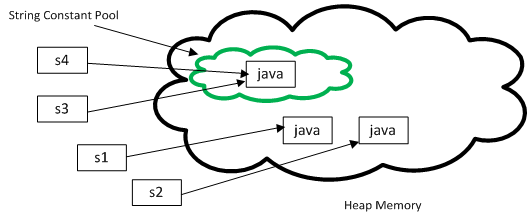
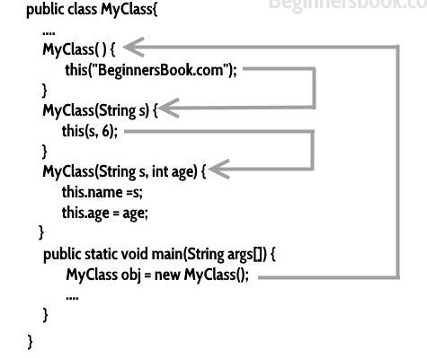

### Explain JVM, JRE and JDK?

- **JVM (Java Virtual Machine)** : It is an abstract machine. It is a specification that provides run-time environment in which java bytecode can be executed. It follows three notations:
  - **Specification**: It is a document that describes the implementation of the Java virtual machine. It is provided by Sun and other companies.
  - **Implementation**: It is a program that meets the requirements of JVM specification.
  - **Runtime Instance**: An instance of JVM is created whenever you write a java command on the command prompt and run the class.
- **JRE (Java Runtime Environment)** : JRE refers to runtime environment in which java bytecode can be executed. It implements the JVM (Java Virtual Machine) and provides all the class libraries and other support files that JVM uses at runtime. So JRE is a software package that contains what is required to run a Java program. Basically, it’s an implementation of the JVM which physically exists.
- **JDK(Java Development Kit)** : It is the tool necessary to compile, document and package Java programs. The JDK completely includes JRE which contains tools for Java programmers. The Java Development Kit is provided free of charge. Along with JRE, it includes an interpreter/loader, a compiler (javac), an archiver (jar), a documentation generator (javadoc) and other tools needed in Java development. In short, it contains JRE + development tools.

### Can we assign List of String into a List of Object variable? e.g. `List<Object> var = new ArrayList<String>;`

- No, because list of `Object` can hold any type of `Object`. But actual list object is restricted to hold only `String` type. So it will give compile time error.

### What is difference between the Inner Class and Sub Class?

- Nested Inner class can access any private instance variable of outer class. Like any other instance variable, we can have access modifier private, protected, public and default modifier.

### When to throw an exception?

- If the function's assumptions about its inputs are violated, it should throw an exception instead of returning normally.
- The other side of this equation is: if you find your functions throwing exceptions frequently, then you probably need to refine their assumptions.

### Difference between >> and >>>?

- `>>` is arithmetic shift right, `>>>` is logical shift right / unsigned shift.
- In an arithmetic shift, the sign bit is extended to preserve the signedness of the number.

### When to call System.exit

- System.exit() can be used to run [shutdown hooks](http://docs.oracle.com/javase/1.5.0/docs/guide/lang/hook-design.html) before the program quits. This is a convenient way to handle shutdown in bigger programs, where all parts of the program can't (and shouldn't) be aware of each other. Then, if someone wants to quit, he can simply call System.exit(), and the shutdown hooks (if properly set up) take care of doing all necessary shutdown ceremonies such as closing files, releasing resources etc.
- in the standard [Runtime](http://download.oracle.com/javase/6/docs/api/java/lang/Runtime.html)

### Explain the SOLID principles?

- **Single responsibility** principle : a class should have only a single responsibility (i.e. only one potential change in the software's specification should be able to affect the specification of the class)
- **Open/Closed** principle : software entities should be open for extension, but closed for modification
- **Liskov substitution** principle : objects in a program should be replaceable with instances of their subtypes without altering the correctness of that program. Child can be substituted in place for parent.
- **Interface segregation** principle : many client-specific interfaces are better than one general-purpose interface
- **Dependency inversion** principle : one should "Depend upon Abstractions. Do not depend upon concretions". Dependency should be inverted to user instead of code.

### What is the purpose of using `BufferedInputStream` and `BufferedOutputStream` classes?

- `BufferedInputStream` and `BufferedOutputStream` class is used for buffering an input and output stream while reading and writing, respectively. It internally uses buffer to store data. It adds more efficiency than to write data directly into a stream. So, it makes the performance fast.

### What are the restrictions that are applied to the Java `static` methods?

- If a method is declared as `static`, it is a member of a class rather than belonging to the object of the class. It can be called without creating an object of the class. A static method also has the power to access static data members of the class.

* There are a few restrictions imposed on a static method
  - The static method cannot use non-static data member or invoke non-static method directly.
  - The `this` and `super` cannot be used in static context.
  - The static method can access only static type data (static type instance variable).
  - There is no need to create an object of the class to invoke the static method.
  - A static method cannot be overridden in a subclass

```java
class Parent {
   static void display() {
      System.out.println("Super class");
   }
}
public class Example extends Parent {
   void display()  // trying to override display() {
      System.out.println("Sub class");
   }
   public static void main(String[] args) {
      Parent obj = new Example();
      obj.display();
   }
}
```

This generates a compile time error. The output is as follows −

```
Example.java:10: error: display() in Example cannot override display() in Parent
void display()  // trying to override display()
     ^
overridden method is static
1 error
```

### Name some classes present in java.util.regex package?

- **Java Regex**: The Java Regex or Regular Expression is an API to define a pattern for searching or manipulating strings.
- **java.util.regex package**
  - MatchResult interface
  - Matcher class
  - Pattern class
  - PatternSyntaxException class

```java
import java.util.regex.*;
public class RegexExample {
   public static void main(String args[]) {
      //1st way
      Pattern p = Pattern.compile(".s"); // represents single character
      Matcher m = p.matcher("as");
      boolean b = m.matches();

      //2nd way
      boolean b2 = Pattern.compile(".s").matcher("as").matches();

      //3rd way
      boolean b3 = Pattern.matches(".s", "as");

      System.out.println(b + " " + b2 + " " + b3);
   }
}
```

### In Java, How many ways can you take input from the console?

- In Java, there are three different ways for reading input from the user in the command line environment(console).
  1. **Using Buffered Reader Class**: This method is used by wrapping the `System.in` (standard input stream) in an `InputStreamReader` which is wrapped in a `BufferedReader`, we can read input from the user in the command line.
  2. **Using Scanner Class**: The main purpose of the `Scanner` class is to parse primitive types and strings using regular expressions, however it also can be used to read input from the user in the command line.
  3. **Using Console Class**: It has become a preferred way for reading user’s input from the command line. In addition, it can be used for reading password-like input without echoing the characters entered by the user; the format string syntax can also be used (like System.out.printf()).

```java
public class Sample
{
   public static void main(String[] args) {
      // Using Console to input data from user
      String name = System.console().readLine();
      System.out.println(name);
   }
}
```

### What is the difference between Serializable and Externalizable interface?

| SERIALIZABLE                                                                                    | EXTERNALIZABLE                                                                                                         |
| ----------------------------------------------------------------------------------------------- | ---------------------------------------------------------------------------------------------------------------------- |
| It is a marker interface i.e. does not contain any method.                                      | it contains two methods writeExternal() and readExternal() which implementing classes MUST override.                   |
| It passes the responsibility of serialization to JVM and it’s default algorithm.                | Externalizable provides control of serialization logic to programmer – to write custom logic.                          |
| Mostly, default serialization is easy to implement, but has higher performance cost.            | Serialization done using Externalizable, add more responsibility to programmer but often result in better performance. |
| It’s hard to analyze and modify class structure because any change may break the serialization. | It’s more easy to analyze and modify class structure because of complete control over serialization logic.             |
| Default serialization does not call any class constructor.                                      | A public no-arg constructor is required while using Externalizable interface.                                          |

### What is the purpose of using javap?

- `javap` command displays information about the fields, constructors and methods present in a class file. The `javap` command (also known as the Java Disassembler) disassembles one or more class files. `javap Simple.class`

### What is the difference between creating String as new() and literal?

- When you create String object using `new()` operator, it always creates a new object in heap memory. On the other hand, if you create object using String literal syntax e.g. "Java", it may return an existing object from String pool, if it already exists. Otherwise it will create a new string object and put in string pool for future re-use.

```java
String a = "abc";
String b = "abc";
System.out.println(a == b);  // true

String c = new String("abc");
String d = new String("abc");
System.out.println(c == d);  // false
```

### What is a Memory Leak? How can a memory leak appear in garbage collected language?

- The standard definition of a memory leak is a scenario that occurs when **objects are no longer being used by the application, but the Garbage Collector is unable to remove them from working memory** – because they’re still being referenced. - As a result, the application consumes more and more resources – which eventually leads to a fatal OutOfMemoryError.

```java
// Java Program to illustrate memory leaks
import java.util.Vector;
public class MemoryLeaksDemo
{
   public static void main(String[] args) {
      Vector v = new Vector(214444);
      Vector v1 = new Vector(214744444);
      Vector v2 = new Vector(214444);
      System.out.println("Memory Leaks Example");
   }
}
```

Output

```
Exception in thread "main" java.lang.OutOfMemoryError: Java heap space exceed
```

### What are different types of Memory Leaks in Java?

- Memory Leak through static Fields
- Unclosed Resources/connections
- Adding Objects With no `hashCode()` and `equals()` Into a HashSet
- Inner Classes that Reference Outer Classes
- Through `finalize()` Methods
- Calling `String.intern()` on Long String

### How are strings represented in memory?

- A `String` instance in Java is an object with two fields: a `char[]` _value_ field and an `int` _hash_ field. The _value_ field is an array of chars representing the string itself, and the _hash_ field contains the _hashCode_ of a string which is initialized with zero, calculated during the first `hashCode()` call and cached ever since. As a curious edge case, if a `hashcode` of a string has a zero value, it has to be recalculated each time the `hashCode()` is called.
- Important thing is that a `String` instance is immutable: you can't get or modify the underlying `char[]` array. Another feature of strings is that the static constant strings are loaded and cached in a string pool. If you have multiple identical `String` objects in your source code, they are all represented by a single instance at runtime.

### What is string constant pool?

- Since String is one of the most used type in any application, Java designer took a step further to optimize uses of this class. They know that Strings will not going to be cheap, and that's why they come up with an idea to cache all String instances created inside double quotes e.g. "Java". These double quoted literal is known as String literal and the cache which stored these String instances are known as as String pool. In earlier version of Java, I think up-to Java 1.6 String pool is located in permgen area of heap, but in Java 1.7 updates its moved to main heap area. Earlier since it was in PermGen space, it was always a risk to create too many String object, because its a very limited space, default size 64 MB and used to store class metadata e.g. .class files. Creating too many String literals can cause java.lang.OutOfMemory: permgen space. Now because String pool is moved to a much larger memory space, it's much more safe.
- Whenever you create a string object using string literal, JVM first checks the content of the object to be created. If there exist an object in the string constant pool with the same content, then it returns the reference of that object. It doesn’t create a new object. If the content is different from the existing objects then only it creates new object.
  - String is a final class in java.lang package which is used to represent the set of characters in java.
  - String is a derived type and not primitive type.
  - There are two ways to create string objects in java. One is using new operator and another one is using string literals.
  ```java
  String s1 = new String("abc");  //Creating string object using new operator
  String s2 = "abc";             //Creating string object using string literal
  ```
- One special thing about string objects is that you can create string objects without using new operator i.e using string literals. This is not possible with other derived types (except wrapper classes). One more special thing about strings is that you can concatenate two string objects using ‘+’. This is the relaxation java gives to string objects as they will be used most of the time while coding. And also java provides string constant pool to store the string objects.

### What is a `StringBuilder` and what are its use cases? What is the difference between appending a string to a `StringBuilder` and concatenating two strings with a + operator? How does `StringBuilder` differ from `StringBuffer`?

- `StringBuilder` allows manipulating character sequences by appending, deleting and inserting characters and strings. This is a mutable data structure, as opposed to the String class which is immutable.
- When concatenating two String instances, a new object is created, and strings are copied. This could bring a huge garbage collector overhead if we need to create or modify a string in a loop. `StringBuilder` allows handling string manipulations much more efficiently.
- `StringBuffer` is different from `StringBuilder` in that it is thread-safe. If you need to manipulate a string in a single thread, use `StringBuilder` instead.

### What is a compile time constant in Java? What is the risk of using it?

- If a primitive type or a string is defined as a constant and the value is known at compile time, the compiler replaces the constant name everywhere in the code with its value. This is called a compile-time constant.
- **Compile time constant must be:**
  - declared final
  - primitive or String
  - initialized within declaration
  - initialized with constant expression
- They are replaced with actual values at compile time because compiler know their value up-front and also knows that it cannot be changed during run-time. `private final int x = 10;`

### Do you know Generics? How did you use it in your coding?

- Generics allow types (Integer, String, … etc and user defined types) to be a parameter to methods, classes and interfaces. For example, classes like HashSet, ArrayList, HashMap, etc use generics very well.
- **Advantages**
  - **Code reuse** : We can write a method/class/interface once and use for any type we want.
  - **Type-safety**: We can hold only a single type of objects in generics. It doesn't allow to store other objects. Generics make errors to appear compile time than at run time.
  - **Type Casting**: There is no need to typecast the object.
  - **Compile-Time Checking**: It is checked at compile time so problem will not occur at runtime.

### What are Generics and why are they used? How can you restrict types on a generic class/method?

- Generics refers to a technique of writing the code for a class, without specifying the data type that the class works with.
- Benefits:
  - This allows a generic class to be specialized for many different data types without having to rewrite the class.
  - As the type T is defined when using generics, instead of using an object type, the type does not need to be boxed/unboxed.
- Sometimes we don’t want whole class to be parameterized, in that case we can create Java generics method. Since constructor is a special kind of method, we can use generics type in constructors too.
- Following are the rules to define Generic Methods −
  - All generic method declarations have a type parameter section delimited by angle brackets (< and >) that precedes the method's return type .
  - Each type parameter section contains one or more type parameters separated by commas. A type parameter, also known as a type variable, is an identifier that specifies a generic type name.
  - The type parameters can be used to declare the return type and act as placeholders for the types of the arguments passed to the generic method, which are known as actual type arguments.
  - A generic method's body is declared like that of any other method. Note that type parameters can represent only reference types, not primitive types (like int, double and char).
- **Java Generics supports multiple bounds also**, i.e `<T extends A & B & C>.` In this case A can be an interface or class. If A is class then B and C should be interfaces. **We can’t have more than one class in multiple bounds**.
- Question mark (?) is the wildcard in generics and represent an unknown type. The wildcard can be used as the type of a parameter, field, or local variable and sometimes as a return type. **We can’t use wildcards while invoking a generic method or instantiating a generic class**.

### What are Java Generics Upper Bounded Wildcard

- Upper bounded wildcards are used to relax the restriction on the type of variable in a method. Suppose we want to write a method that will return the sum of numbers in the list, so our implementation will be something like this.

```java
public static double sum(List<Number> list) {
   double sum = 0;
   for (Number n : list) {
      sum += n.doubleValue();
   }
   return sum;
}
```

- Now the problem with above implementation is that it won’t work with List of Integers or Doubles because we know that `List<Integer>` and `List<Double>` are not related, this is when upper bounded wildcard is helpful. We use generics wildcard with **extends** keyword and the **upper bound** class or interface that will allow us to pass argument of upper bound or it’s subclasses types.
- The above implementation can be modified like below program. `public static double sum(List<? extends Number> list)`
- In above method we can use all the methods of upper bound class Number.

### What are Generics unbounded Wildcard

- Sometimes we have a situation where we want our generic method to be working with all types, in this case unbounded wildcard can be used. Its same as using `<? extends Object>`. e.g. `public static void printData(List<?> list)`

### What do you mean by Generics Type Erasure

- Generics in Java was added to provide type-checking at compile time and it has no use at run time, so java compiler uses **type erasure** feature to remove all the generics type checking code in byte code and insert type-casting if necessary. Type erasure ensures that no new classes are created for parameterized types; consequently, generics incur no runtime overhead.

### What are Generics Lower Bounded WildCard

- Suppose we want to add Integers to a list of integers in a method, we can keep the argument type as `List<Integer>` but it will be tied up with `Integer` where as `List<Number>` and `List<Object>` can also hold integers, so we can use lower bound wildcard to achieve this. We use generics wildcard (?) with **super** keyword and lower bound class to achieve this.
- We can pass lower bound or any super type of lower bound as an argument in this case, Java compiler allows to add lower bound object types to the list.

```java
public static void addIntegers(List<? super Integer> list) {
   list.add(new Integer(50));
}
```

### Runtime order of static init, init, constructor, inner class init

- Class/static initializer are executed in the order they are defined when the class is loaded. (Actually when it is resolved)
- Instance initializer are executed in the order defined when the class is instantiated, immediately before the constructor code is executed, immediately after the invocation of the super constructor.

### Serialization/Deserialization

- Process of serialization
  - write serialization stream magic data STREAM_MAGIC, STREAM_VERSION etc.
  - walk up inheritance tree and write class metadata till you reached java.lang.Object class then walk down the inheritance tree and write data for class instance property.
- Why serialversionUID : for class versioning. If not provided while doing deserialization `InvalidClassException` will come.
- deserialization : a hidden constructor which never uses class constructor to build object state.
- custom serialization :
  - `public void readObject(ObjectInputStream ois)`
  - `public void writeObject(ObjectOutputStream oos)`
- Static fields are not serialized because we are serializing an object and static fields belong to class not object
- When a class implements the _Serializable_ interface, all its sub-classes are serializable as well.
- Parent class without serializable interface : while doing serialization, properties of parent class would not be serialized.
- composite class not serializable : then while doing serialization of container class, JVM will throw `NotSerializableException`
- Externalizable extends Serializable interface. methods `public void readExternal(ObhectInput inp)` and `public void writeExternal(ObjectOutput o)`
- Serialization with singleton : use `private Object readResolve()` method, return same static instance.
- If don't want to provide serialization : override readObject and writeObject method, throw `SerializationNotSupportedException`
- Serializable vs Externalizable : During deserialization, Serializable interface doesn't call default constructor to create object. It uses value assignment using reflection. Whereas Externalizable calls default constructor.
- readResolve and writeReplace : hook method so JVM will call those method. We need to provide implmentation for those methods.
- On the contrary, when an object has a reference to another object, these objects must implement the Serializable interface separately.
- The JVM associates a version (long) number with each serializable class. It is used to verify that the saved and loaded objects have the same attributes and thus are compatible on serialization.

### Why we give Serial Version UID?

- The serialization runtime associates with each serializable class a version number, called a `serialVersionUID`, which is used during deserialization to verify that the sender and receiver of a serialized object have loaded classes for that object that are compatible with respect to serialization. If the receiver has loaded a class for the object that has a different `serialVersionUID` than that of the corresponding sender's class, then deserialization will result in an InvalidClassException. A serializable class can declare its own `serialVersionUID` explicitly by declaring a field named `serialVersionUID` that must be static, final, and of type `long`

### What will be output of below code snippet?

```java
String s1 = "abc";
StringBuffer s2 = new StringBuffer(s1);
System.out.println(s1.equals(s2));
```

- It will print false because s2 is not of type String. If you will look at the equals method implementation in the String class, you will find a check using instanceof operator to check if the type of passed object is String? If not, then return false.

```java
String s1 = "abc";
String s2 = new String("abc");
s2.intern();
System.out.println(s1 ==s2);
```

- It’s a tricky question and output will be false. We know that intern() method will return the String object reference from the string pool, but since we didn’t assigned it back to s2, there is no change in s2 and hence both s1 and s2 are having different reference. If we change the code in line 3 to `s2 = s2.intern();` then output will be true.

### What is String interning using intern() method

- Java by default doesn't put all String object into String pool, instead they gives you flexibility to explicitly store any arbitrary object in String pool. You can put any object to String pool by calling intern() method of java.lang.String class
- Though, when you create String using literal notation of Java, it automatically calls intern() method to put that object into String pool, provided it was not present in the pool already. This is another difference between string literal and new string, because in case of new, interning doesn't happen automatically, until you call intern() method on that object.
- Look at the below example. Object ‘s1’ will be created in heap memory as we are using new operator to create it. When we call intern() method on s1, it creates a new string object in the string constant pool with “JAVA” as it’s content and assigns it’s reference to s2. So, **s1 == s2** will return false because they are two different objects in the memory and s1.equals(s2) will return true because they have same content.

```java
public class StringExamples {
   public static void main(String[] args) {
        String s1 = new String("JAVA");
        String s2 = s1.intern();            // Creating String Intern
        System.out.println(s1 == s2);       // Output : false
        System.out.println(s1.equals(s2));  // Output : true
    }
}
```

- Look at this example. Object s1 will be created in string constant pool as we are using string literal to create it and object s2 will be created in heap memory as we are using new operator to create it. When you call intern() method on s2, it returns reference of object to which s1 is pointing as it’s content is same as s2. It does not create a new object in the pool. So, **s1 == s3** will return true as both are pointing to same object in the pool.

```java
public class StringExamples {
    public static void main(String[] args) {
        String s1 = "JAVA";
        String s2 = new String("JAVA");
        String s3 = s2.intern();       		// Creating String Intern
        System.out.println(s1 == s3);      	// Output : true
    }
}
```

- String Literals Are Automatically Interned : When you call intern() on the string object created using string literals it returns reference of itself. Because, you can’t have two string objects in the pool with same content. That means string literals are automatically interned in java.

```java
public class StringExamples {
    public static void main(String[] args) {
        String s1 = "JAVA";
        String s2 = s1.intern();      // Creating String Intern
        System.out.println(s1 == s2); // Output : true
    }
}
```

### What is the use of interning the string?

- **To Save The memory Space :** Using interned string, you can save the memory space. If you are using lots of string objects with same content in your code, than it is better to create an intern of that string in the pool. Use that intern string whenever you need it instead of creating a new object in the heap. It saves the memory space.
- **For Faster Comparison :** Assume that there are two string objects s1 and s2 in heap memory and you need to perform comparison of these two objects more often in your code. Then using `s1.intern() == s2.intern()` will be fater than `s1.equals(s2)`. Because, equals() method performs character by character comparison where as “==” operator just compares references of objects.
- String Pool is possible only because String is immutable in Java and it’s implementation of String interning concept. String pool is also example of Flyweight design pattern

### How many objects will be created in the following code and where they will be stored in the memory?

```java
String s1= new String("java");
String s2 = new String("java");
String s3 = "java";
String s4 = "java";
System.out.println(s3==s4); //true
System.out.println(s1==s3); //false
System.out.println(s2==s4); //false
System.out.println(s1==s2); //false
```


We can see total 3 objects are created here.

### Why String class is immutable?

1. **String pool** is possible only because String is immutable in java, this way Java Runtime saves a lot of java heap space because different String variables can refer to same String variable in the pool. If String would not have been immutable, then String interning would not have been possible because if any variable would have changed the value, it would have been reflected to other variables also.
2. If String is not immutable then it would cause severe security threat to the application. For example, database username, password are passed as String to get database connection and in **socket programming** host and port details passed as String. Since String is immutable it’s value can’t be changed otherwise any hacker could change the referenced value to cause security issues in the application.
3. Since String is immutable, it is safe for **multithreading** and a single String instance can be shared across different threads. This avoid the usage of synchronization for thread safety, Strings are implicitly thread safe.
4. Strings are used in Java **Classloader** and immutability provides security that correct class is getting loaded by Classloader. For example, think of an instance where you are trying to load java.sql.Connection class but the referenced value is changed to myhacked.Connection class that can do unwanted things to your database.
5. Since String is immutable, its **hashcode** is cached at the time of creation and it doesn’t need to be calculated again. This makes it a great candidate for key in a Map and it’s processing is fast than other HashMap key objects. This is why String is most used Object as HashMap keys.

### Is it possible to call a constructor from another (within the same class, not from a subclass)? What is constructor chaining?

- Yes it is possible and it is called constructor chaining. Constructor chaining is the process of calling one constructor from another constructor with respect to current object.
- Constructor chaining can be done in two ways:
  - **Within same class**: It can be done using **this()** keyword for constructors in same class
  - **From base class**: by using **super()** keyword to call constructor from the base class.
- **Note**: `this` keyword is very different from `this()`. Notice, **this** refers the current object and **this()** is used to call one constructor from another.
- The real purpose of Constructor Chaining is that you can pass parameters through a bunch of different constructors, but only have the initialization done in a single place. This allows you to maintain your initializations from a single location, while providing multiple constructors to the user. If we don’t chain, and two different constructors require a specific parameter, you will have to initialize that parameter twice, and when the initialization changes, you’ll have to change it in every constructor, instead of just the one.
- As a rule, constructors with fewer arguments should call those with more



- **Important points about constructor**
  1. Every class has a constructor whether it’s a normal class or an abstract class.
  2. Constructors are not methods and they don’t have any return type.
  3. Constructor name should match with class name.
  4. Constructor can use any access specifier, they can be declared as private also. Private constructors are possible in java but there scope is within the class only.
  5. Like constructors method can also have name same as class name, but still they have return type, thorugh which we can identify them that they are methods and not constructors.
  6. If you don’t implement any constructor within the class, compiler provides one.
  7. this() and super() should be the first statement in the constructor code. If you don’t mention them, compiler does it for you accordingly.
  8. Constructor overloading is possible but overriding is not possible, which means we can have overloaded constructor in our class but we can’t override a constructor.
  9. Constructors can’t be inherited.
  10. If Super class doesn’t have a no-arg(default) constructor then compiler would not insert a default constructor in child class as it does in normal scenario.
  11. Interfaces do not have constructors.
  12. Abstract class can have constructor and it gets invoked when a class which implements it is instantiated. (i.e. object creation of concrete class).
  13. A constructor can also invoke another constructor of the same class – By using this(). If you want to invoke a parameterized constructor then do it like this: **this(parameter list)**.

### Explain Type Casting in Java – Implicit and Explicit Casting.

- **Type Casting** in Java is nothing but converting a primitive or interface or class in Java into other type. There is a rule in Java Language that classes or interface which shares the same type hierarchy only can be typecasted. If there is no relationship between then Java will throw `ClassCastException`. Type casting are of two types:
  1. Implicit Casting (Widening)
  2. Explicit Casting (Narrowing)
- Implicit Casting in Java / Widening / Automatic type conversion
- Automatic type conversion can happen if both type are compatible and target type is larger than source type.
- byte -> short -> int -> long -> float -> double : widening
- **Implicit Casting of a Primitive**
  - No Explicit casting required for the above mentioned sequence.
    ```java
    byte i = 50;
    // No casting needed for below conversion
    short j = i;
    int k = j;
    long l = k;
    ```
- **Implicit Casting of a Class Type**
  - We all know that when we are assigning **smaller type** to a **larger type**, there is no need for a casting required. Same applies to the class type as well. Lets look into the below code.
    ```java
    Parent p = new Child();
    p.disp();
    ```
  - Here Child class is smaller type we are assigning it to Parent class type which is larger type and hence no casting is required.
- **Explicit Casting in Java / Narrowing**
  - When you are assigning a larger type to a smaller type, then Explicit Casting is required.
    ```java
    double d = 75.0;
    // Explicit casting is needed for below conversion
    float f = (float) d;
    long l = (long) f;
    ```
  - double -> float -> long -> int -> short -> byte : narrowing
  - We all know that when we are assigning larger type to a smaller type, then we need to explicitly type cast it. Lets take the same above code with a slight modification
    ```java
    Parent p = new Child();
    p.disp();
    Child c = p;
    c.disp();
    ```
  - When we run the above code we will be getting exception stating
    ```java
    `Exception in thread "main" java.lang.Error: Unresolved compilation problem:
    `Type mismatch: cannot convert from Parent to Child
    ```
  - In order to fix the code, then we need to cast it to Child class `Child c = (Child) p;`

### Explain `super` keyword and its usage.

- The **super** keyword in java is a reference variable which is used to refer immediate parent class object.
  Whenever you create the instance of subclass, an instance of parent class is created implicitly which is referred by super reference variable.
- Usage of java super Keyword
  1. super can be used to refer immediate parent class instance variable.
  2. super can be used to invoke immediate parent class method.
  3. super() can be used to invoke immediate parent class constructor.
- super("Hahaha"); //calls parent class constructor with String argument
- **Important points**
  1. Call to super() must be first statement in Derived(Student) Class constructor.
  2. If a constructor does not explicitly invoke a superclass constructor, the Java compiler automatically inserts a call to the no-argument constructor of the superclass. If the superclass does not have a no-argument constructor, you will get a compile-time error. super() is added in each class constructor automatically by compiler if there is no super() or this().
  3. If a subclass constructor invokes a constructor of its superclass, either explicitly or implicitly, you might think that a whole chain of constructors called, all the way back to the constructor of Object. This, in fact, is the case. It is called constructor chaining.

### Why we use instance initializer block(IIBs)?

- In a Java program, operations can be performed on methods, constructors and initialization blocks. Instance Initialization Blocks or IIB are used to initialize instance variables. IIBs are executed before constructors. They run each time when object of the class is created.
  - Initialization blocks are executed whenever the class is initialized and before constructors are invoked.
  - They are typically placed above the constructors within braces.
  - It is not at all necessary to include them in your classes.
  - We can also have multiple IIBs in a single class. If compiler finds multiple IIBs, then they all are executed from top to bottom
  - The Instance Initialization Block is invoked after the parent class constructor is invoked (i.e. after super() constructor call)
- **Instance Initialization Block with parent class**
  You can have IIBs in parent class also. Instance initialization block code runs immediately after the call to super() in a constructor. The compiler executes parents class’s IIB before executing current class’s IIBs.
- Order of execution in this case will be as follows:
  1. Instance Initialization Block of super class
  2. Constructors of super class
  3. Instance Initialization Blocks of the class
  4. Constructors of the class

### Explain Downcasting using instanceof operator.

- The java `instanceof` operator is used to test whether the object is an instance of the specified type (class or subclass or interface).
- The `instanceof` in java is also known as type comparison operator because it compares the instance with type. It returns either true or false. If we apply the `instanceof` operator with any variable that has null value, it returns false when Subclass type refers to the object of Parent class, it is known as downcasting. If we perform it directly, compiler gives Compilation error. If you perform it by typecasting, ClassCastException is thrown at runtime. But if we use `instanceof` operator, downcasting is possible.
- `Dog d = new Animal(); // Compilation error`
- If we perform downcasting by typecasting, ClassCastException is thrown at runtime.
- `Dog d = (Dog) new Animal(); // Compiles successfully but ClassCastException is thrown at runtime`

```java
class Animal { } 

class Dog extends Animal { 
 	static void method(Animal a) { 
 	   if(a instanceof Dog) {
 	      Dog d = (Dog) a; //downcasting 
         System.out.println("ok downcasting performed"); 
      }
   } 

   public static void main (String [] args) { 
 	   Animal a = new Dog(); 
 	   Dog.method(a); 
   }
} 
// Output:ok downcasting performed
```

### Explain Static and final modifier.

- **static keyword in java** : *static* is a non-access modifier in Java which can be applied on variables, methods, blocks, import and inner classes.
- The **static keyword** in java is used for memory management mainly. The static keyword belongs to the class rather than instance of the class.
- When a member is declared static, it can be accessed before any objects of its class are created, and without reference to any object.
- **Static blocks**

  - If you need to do computation in order to initialize your **static variables**, you can declare a static block that gets executed exactly once, when the class is first loaded. A class can have multiple static blocks and these will be executed in the same sequence in which they appear in class definition.

  ```java
  class DataObject 
  {
      public Integer nonStaticVar;
      public static Integer staticVar;    //static variable

      static {				             // It will be executed first
          staticVar = 40;
          //nonStaticVar = 20;    // Not possible to access non-static members
      }
  }
  ```

- **Static variables**
  - When a variable is declared as static, then a single copy of variable is created and shared among all objects at class level. Static variables are, essentially, global variables. All instances of the class share the same static variable.The static variable can be used to refer the common property of all objects (that is not unique for each object) e.g. company name of employees, college name of students etc.
  - The static variable gets memory only once in class area at the time of class loading.

### When to use static variables?

- Advantage of static variable is to makes your program **memory efficient**
  ```java
  class Student{  
       int rollno;  
       String name;  
       String college="ITS";  
  }
  ```
- Suppose there are 500 students in my college, now all instance data members will get memory each time when object is created.All student have its unique rollno and name so instance data member is good. Here, college refers to the common property of all objects. If we make it static, this field will get memory only once.

### Are static local variables allowed in Java?

- Unlike C/C++, static local variables are not allowed in Java. For example, following Java program fails in compilation with error “Static local variables are not allowed”
- **Static varibale can be used to keep the count of object created for particuler class**

### What are different types of `static` constructs?

1. **Static methods** When a method is declared with static keyword, it is known as static method. The most common example of a static method is  main( ) method. Methods declared as static have several restrictions:
   - They can only directly call other static methods.
   - They cannot refer to this or super in any way.
   - They can access only static variables inside static methods. If you try to access any non-static variable, the compiler error will be generated with message “Cannot make a static reference to the non-static field nonStaticVar“.
   - Static methods can be accessed via it’s class reference, and there is no need to create an instance/object of class. Though you can access using instance reference as well but it will have not any difference in comparison to access via class reference.
2. **Static Import Statement** The normal import declaration imports classes from packages, so that they can be used without package reference. Similarly **the static import declaration imports static members from classes** and allowing them **to be used without class reference**.
3. **Static Class** We cannot declare top-level class with a static modifier, but we can declare nested classes as static. Such type of classes are called Nested static classes. Just like other static members, nested classed belong with class scope so the inner static class can be accessed without having an object of outer class.

   ```java
   class DataObject 
   {
       public Integer nonStaticVar;
       public static Integer staticVar;         //static variable
    
       static class StaticInnerClas {
         Integer innerNonStaticVar = 60; 
         static Integer innerStaticVar = 70;   //static variable inside inner class
       }
   }

   // To access innerStaticVar we will use below statement.
   // DataObject.StaticInnerClas.innerStaticVar
   ```

   - Please note that an static inner class cannot access the non-static members of outer class. It can access only static members from outer class.

### What are different types of `final` constructs?

1. **final variable** If you make any variable as final, you cannot change the value of final variable (It will be constant). This also means that you must initialize a final variable.
   - **Initializing a final variable** : We must initialize a final variable, otherwise compiler will throw compile-time error.A final variable can only be initialized once, either via an initializer or an assignment statement. There are three ways to initialize a final variable :
   - You can initialize a final variable when it is declared.This approach is the most common. A final variable is called **blank final variable**, if it is **not** initialized while declaration. Below are the two ways to initialize a blank final variable.
     1. A blank final variable can be initialized inside instance-initializer block or inside constructor. If you have more than one constructor in your class then it must be initialized in all of them, otherwise compile time error will be thrown.
     2. A blank final static variable can be initialized inside static block.
   - **When to use a final variable :** The only difference between a normal variable and a final variable is that we can re-assign value to a normal variable but we cannot change the value of a final variable once assigned. Hence final variables must be used only for the values that we want to remain constant throughout the execution of program.

- **Reference final variable:** When a final variable is a reference to an object, then this final variable is called reference final variable. For example, a final StringBuffer variable looks like `final StringBuffer sb;`
  - As you know that a final variable cannot be re-assign. But in case of a reference final variable, internal state of the object pointed by that reference variable can be changed. Note that this is not re-assigning. This property of *final* is called *non-transitivity*. To understand what is mean by internal state of the object, see below example :

```java
// Java program to demonstrate reference final variable

    public static void main(String[] args) {
// a final reference variable sb
        final StringBuilder sb = new StringBuilder("Geeks");
        System.out.println(sb);
// changing internal state of object reference by final reference variable sb
        sb.append("ForGeeks");
        System.out.println(sb);
    }

// Output
// Geeks
// GeeksForGeeks
```

- The *non-transitivity* property also applies to arrays, because arrays are objects in java. Arrays with final keyword are also called final arrays.
- **Important Note :**
  1. A final variable cannot be reassign, doing it will throw compile-time error.
  2. When a final variable is created inside a method/constructor/block, it is called local final variable, and it must initialize once where it is created.
  3. Note the difference between C++ *const* variables and Java *final* variables. const variables in C++ must be assigned a value when declared. For final variables in Java, it is not necessary as we see in above examples. A final variable can be assigned value later, but only once.
  4. *final* with foreach loop : final with for-each statement is a legal statement.

```java
int arr[] = {1, 2, 3};
// final with for-each statement legal statement
for (final int i : arr)
 	System.out.print(i + " ");
```

- **Explanation** : Since the i variable goes out of scope with each iteration of the loop, it is actually re-declaration each iteration, allowing the same token (i.e. i) to be used to represent multiple variables.

2. **Java final classes**

- When a class is declared with final keyword, it is called a final class. A final class cannot be extended(inherited). There are two uses of a final class :
  1. One is definitely to prevent inheritance, as final classes cannot be extended. For example, all Wrapper Classes like Integer,Float etc. are final classes. We can not extend them.

```java
final class A { }

class B extends A {
   // The following class is Illegal. COMPILE-ERROR! Can't subclass A
}
```

2. The other use of final with classes is to create an immutable class like the predefined String class.You can not make a class immutable without making it final.

3. **Java final methods** When a method is declared with final keyword, it is called a final method. A final method cannot be overridden. The Object class does this—a number of its methods are final.We must declare methods with final keyword for which we required to follow the same implementation throughout all the derived classes.

### Can we declare a constructor final?

- No, because constructor is never inherited.

### Can we make local variable final in Java?

- Yes, you can make local variable final in Java. In fact, this was mandatory, if you want to access the local variable inside an Anonymous class until Java 8. From Java 8 onward, you don't need to make it final but make sure you don't change the value once assigned. This is also known as an effectively final variable in Java.

### Can you change the state of the object to which a final reference variable is pointing?

- Yes, you can change the state of the object referred by a final variable. This is one of the tricky concept in Java and often cause subtle errors. One of the most common examples of this is Collection classes e.g. ArrayList or HashMap referenced by a final variable. You can still add, remove and update elements but you cannot change the final variable to point to another collection. i.e. final variable cannot be swapped with another Collection

### Can we make an array final in Java? Can you change its elements?

- Yes, you can make an array final in Java and you can change it's elements as well. This is actually the follow-up to the previous question, both array and collection classes can be made final and you can still change their elements.

### What is the use of final class in Java?

- You make a class final when you think it's complete and nobody should alter the feature by creating a subclass. Generally, security sensitive classes are made final in Java e.g. String. Another reason is performance, compiler, and JIT both can make a lot of assumption if a class is final because they know overriding or polymorphism will not come into the picture.

### Can we make an abstract method final in Java?

- No, you cannot make an abstract method final in Java because, in order to use an abstract method, you must override it but the final method cannot be overridden in Java.

### What is constant in Java?

- A static final variable is known as constant in Java. They are also known as a compile time constant because of their value at the time of compilation. They are also inlined at the client end, means if you are using a static final variable then its value will be copied to your class at compile time. Which also means that you need to recompile all the classes which use the static final variable, whenever you change the value of a static final field.

### Explain Java Inner Classes

- **Java inner class** or nested class is a class which is declared inside the class or interface.
- We use inner classes to logically group classes and interfaces in one place so that it can be more readable and maintainable.
  Additionally, it can access all the members of outer class including private data members and methods.
- **Advantage of java inner classes**
  1. Nested classes represent a special type of relationship that is it can access all the members (data members and methods) of outer class including private.
  2. Nested classes are used to develop more readable and maintainable code because it logically group classes and interfaces in one place only
  3. Code Optimization: It requires less code to write
- Difference between nested class and inner class in Java is Inner class is a part of nested class. Non-static nested classes are known as inner classes.
- Types of Nested classes : Tere are two types of nested classes non-static and static nested classes. The non-static nested classes are also known as inner classes.
  - Non-static nested class (inner class)
    1. Member inner class - A class created within class and outside method.
    2. Anonymous inner class - A class created for implementing interface or extending class. Its name is decided by the java compiler.
    3. Local inner class - A class created within method.
  - Static nested class - A static class created within class.
- **Nested Inner class/ Member inner class** It can access any private instance variable of outer class. Like any other instance variable, we can have access modifier private, protected, public and default modifier.
  - Like class, interface can also be nested and can have access specifiers.
    Following example demonstrates a nested class.

```java
class Outer {
   // Simple nested inner class
   class Inner {
      public void show() {
           System.out.println("In a nested class method");
      }
    }
}
class Main {
   public static void main(String[] args) {
       Outer.Inner in = new Outer().new Inner();
     in.show();
   }
}

// O/p : In a nested class method
```

- As a side note, we can’t have static method in a nested inner class because an inner class is implicitly associated with an object of its outer class so it cannot define any static method for itself. For example the following program doesn’t compile.
- **Internal working of Java member inner class** The java compiler creates two class files in case of inner class. The class file name of inner class is "Outer$Inner". If you want to instantiate inner class, you must have to create the instance of outer class. In such case, instance of inner class is created inside the instance of outer class.
- **Anonymous inner classes** A class that have no name is known as anonymous inner class in java. It should be used if you have to override method of class or interface. Since an anonymous class has no name, it is not possible to define a constructor for an anonymous class. Java Anonymous inner class can be created by two ways:
  - **As subclass of specified type**

```java
class Demo {
   void show() {
      System.out.println("I am in show method of super class");
   }}

class Flavor1Demo {
   //  An anonymous class with Demo as base class
   static Demo d = new Demo() {
       void show() {
           super.show();
System.out.println("I am in Flavor1Demo class");
       }};
   public static void main(String[] args){
       d.show();
   }}

// O/p
// I am in show method of super class
// I am in Flavor1Demo class
```

- In the above code, we have two class Demo and Flavor1Demo. Here demo act as super class and anonymous class acts as a subclass, both classes have a method show(). In anonymous class show() method is overridden.

  - **As implementer of the specified interface**

```java
class Flavor2Demo {

    // An anonymous class that implements Hello interface
    static Hello h = new Hello() {
        public void show() {
            System.out.println("I am in anonymous class");
        }
    };

    public static void main(String[] args) {
        h.show();
    }
}

interface Hello {
    void show();
}

// o/p : I am in anonymous class
```

- In above code we create an object of anonymous inner class but this anonymous inner class is an implementer of the interface Hello. Any anonymous inner class can implement only one interface at one time. It can either extend a class or implement interface at a time.
- **Java Local inner class** A class i.e. created inside a method is called local inner class in java. If you want to invoke the methods of local inner class, you must instantiate this class inside the method.

```java
class Outer {
    void outerMethod() {
        System.out.println("inside outerMethod");
        // Inner class is local to outerMethod()
        class Inner {
            void innerMethod() {
                System.out.println("inside innerMethod");
            }
         }
        
        Inner y = new Inner();
        y.innerMethod();
    }
}
class MethodDemo {
    public static void main(String[] args) {
        Outer x = new Outer();
        x.outerMethod();
    }
}

// o/p
// Inside outerMethod
// Inside innerMethod
```

**Note** :

1. Local inner class cannot access non-final local variable till JDK 1.7. Since JDK 1.8, it is possible to access the non-final local variable in method local inner class. The main reason we need to declare a local variable as a final is that local variable lives on stack till method is on the stack but there might be a case the object of inner class still lives on the heap. Method local inner class can’t be marked as private, protected, static and transient but can be marked as abstract and final, but not both at the same time. A local inner class can access all the members of the enclosing class and local final variables in the scope it’s defined.
2. Local inner class cannot be invoked from outside the method.

- **Java static nested class** A static class i.e. created inside a class is called static nested class in java. It can be accessed by outer class name.
  - It can access static data members of outer class including private.
  - Static nested class cannot access non-static (instance) data member or method.

```java
class Outer {
   private static void outerMethod() {
     System.out.println("inside outerMethod");
   }

   // A static inner class
   static class Inner {
        public static void main(String[] args) {
          System.out.println("inside inner class Method");
          outerMethod();
        }
   }
}

// O/p
// inside inner class Method
// inside outerMethod
```

- Static class object can be created with following `statement.OuterClass.StaticNestedClass nestedObject = new OuterClass.StaticNestedClass();`

### Is Java “pass-by-reference” or “pass-by-value”?

- Pass by Value: The method parameter values are copied to another variable and then the copied object is passed, that’s why it’s called pass by value.
- Pass by Reference: An alias or reference to the actual parameter is passed to the method, that’s why it’s called pass by reference.
- When an object is passed by value, this means that a copy of the object is passed. Thus, even if changes are made to that object, it doesn’t affect the original value. When an object is passed by reference, this means that the actual object is not passed, rather a reference of the object is passed. Thus, any changes made by the external method, are also reflected in all places.
- Java is always pass-by-value. Unfortunately, they decided to call the location of an object a "reference". When we pass the value of an object, we are passing the reference to it. This is confusing to beginners.
  It goes like this:

```java
public static void main(String[] args) {
    Dog aDog = new Dog("Max");
    // we pass the object to foo
    foo(aDog);
    // aDog variable is still pointing to the "Max" dog when foo(...) returns
    aDog.getName().equals("Max"); // true
    aDog.getName().equals("Fifi"); // false
}

public static void foo(Dog d) {
    d.getName().equals("Max"); // true
    // change d inside of foo() to point to a new Dog instance "Fifi"
    d = new Dog("Fifi");
    d.getName().equals("Fifi"); // true
}
```

- In the example above aDog.getName() will still return "Max". The value aDog within main is not changed in the function foo with the Dog "Fifi" as the object reference is passed by value. If it were passed by reference, then the aDog.getName() in main would return "Fifi" after the call to foo.

### Explain forEach loop.

- The for-each loop introduced in Java5. It is mainly used to traverse array or collection elements. 
  Syntax : for(data_type variable : array | collection){}
- Important Points :for-each loop is applicable only to Java array and Collection classes which implements Iterable interface, and since all built-in Collection classes implements java.util.Collection interface, which already extends Iterable, this detail mostly gets unnoticed.

### Here we are iterating over ArrayList using standard iterator and for-each loop and subsequently removing elements as well, you need to find out which code will throw ConcurrentModificationException and why?

```java
Collection<String> list = new ArrayList<String>();
    list.add("Android");
    list.add("iPhone");
    list.add("Windows Mobile");

    // example 1
    Iterator<String> itr = list.iterator();
    while(itr.hasNext()){
        String lang = itr.next();
        list.remove(lang);
    }

     // example 2
    for(String language: list){
        list.remove(language);
    }
```

- Mostly people will say that first code block will throw `ConcurrentModificationException`, because we are not using Iterator's remove method for removing elements, instead we are using ArrayList's `remove()` method. But, not many people will say same thing about for-each loop, because we are not using Iterator there. In reality, second code snippet will also throw ConcurrentModificationException. Since for-each loop internally uses Iterator to traverse over Collection, it also call's Iterator.next(), which checks for modification and throws ConcurrentModificationException.

### Why Serializable is an interface?

### How ConcurrentHashMap works internally?

### How to desing custom ConcurrentHashMap?

### Which data structure you will use to create custom ConcurrentHashMap?

### Let's say two singleton object are already persisted into the files and we want to deserialize them.

### Collections - failsafe vs failfast

### How do you test static method?

### How to do you test a method for an exception using JUnit?

### Which unit testing libraries you have used for testing Java programs?

### What is the difference between @Before and @BeforeClass annotation?

### Give me an example of design pattern which is based upon open closed principle?

### What is Law of Demeter violation? Why it matters?

### What is differences between External Iteration and Internal Iteration?

### Define enums? Can you call an enum constructor from outside? What is a constant specific method?

### What is the difference between a **Stream** and an **Iterator**?

### Write an @Incomplete annotation that is applied to a class and id inherited by its subclasses.

### Advanced modifiers : volatile, transient, native, strictfp
