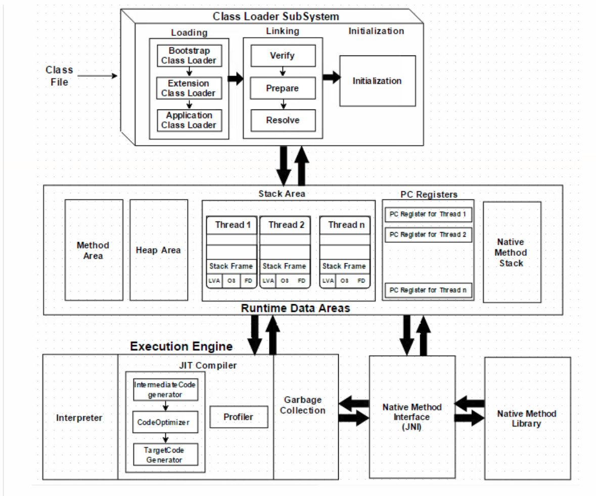

- A **Virtual Machine** is a software implementation of a physical machine. Java was developed with the concept of **WORA (Write Once Run Anywhere)**, which runs on a **VM**. The **compiler** compiles the Java file into Java **.class** file, then that **.class** file is input into the JVM, which loads and executes the class file.



## How does the JVM work

- As shown in the architecture diagramm JVM is divided into three main subsystems:
  - Class Loader Subsystem
  - Runtime Data Area
  - Execution Engine

### Class Loader Subsystem

- Java's dynamic class loading functionality is handled by the class loader subsystem. It loads, links. and initializes the class file when it refers to a class for the first time at **runtime**, not **compile time**.
- **Loading**
  - Classes will be loaded by this component. Boot Strap class Loader, Extension class Loader, and Application class Loader are the three class loader which will help in achieving it.
    1. **Bootstrap ClassLoader** – Responsible for loading classes from the bootstrap classpath, nothing but **rt.jar**. Highest priority will be given to this loader.
    2. **Extension ClassLoader** – Responsible for loading classes which are inside **ext** folder **(jre\lib)**.
    3. **Application ClassLoader** - Responsible for loading **Application Level Classpath**,path mentioned Environment Variable etc.
  - The above **Class Loaders** will follow **Delegation Hierarchy Algorithm** while loading the class files
- **Linking**
  - **Verify** – Bytecode verifier will verify whether the generated bytecode is proper or not if verification fails we will get the **verification error**.
  - **Prepare** – For all static variables memory will be allocated and assigned with **default values.**
  - **Resolve** – All **symbolic memory references** are replaced with the **original references** from **Method Area**.
- **Initialization**
  - This is the final phase of Class Loading, here all static variables will be assigned with the original values,and the static block will be executed.

### Runtime Data Area

- The Runtime Data Area is divided into 5 major components:
  1. **Method Area** - All the **class level data** will be stored here, including static variables. There is only one method area per JVM, and it is a shared resource.
  2. **Heap Area** – All the **Objects** and their corresponding **instance variables** and **arrays** will be stored here. There is also one Heap Area per JVM. Since the **Method** and **Heap areas** share memory for multiple threads, the data stored is not thread safe.
  3. **Stack Area** - For every thread, a separate **runtime stack** will be created. For every **method call**, one entry will be made in the stack memory which is called as **Stack Frame**. All **local variables** will be created in the stack memory. The stack area is thread safe since it is not a shared resource. The stack fram is sub-divided into three entities:
     1. **Local Variable Array** - Related to the method how many **local variables** are involved and the corresponding values will be stored here.
     2. **Operand stack** - If any intermediate operation is required to perform, **operand stack** acts as runtime workspace to perform the operation
     3. **Frame data** - All symbols corresponding to the method is stored here. In the case of any **exception**, the catch block information will be maintained in the frame data.
  4. **PC Registers** - Each thread will have separate **PC Registers**, to hold the address of **current executing instruction** once the instruction is executed the PC register will be **updated** with the next instruction.
  5. **Native Method stack** - Native method stack holds native method information, FOr very thread, a separate native method stack will be created.

### Execution Engine

- The bytecode which is assigned to the **Runtime Data Area** will be executed by the Execution Engine. The Execution Engine reads the bytecode and executes it piece by piece.
  1. **Interpreter** – The interpreter interprets the bytecode faster, but executes slowly. The disadvantage of the interpreter is that when one method is called multiple times, every time a new interpretation is required.
  2. **JIT Compiler** – The JIT Compiler neutralizes the disadvantage of the interpreter. The Execution Engine will be using the help of the interpreter in converting byte code, but when it finds repeated code it uses the JIT compiler, which compiles the entire bytecode and changes it to native code. This native code will be used directly for repeated method calls, which improve the performance of the system.
     1. **Intermediate Code generator** - Produces intermediate code
     2. **Code Optimizer** – Responsible for optimizing the intermediate code generated above
     3. **Target Code Generator** – Responsible for Generating Machine Code or Native Code
     4. **Profiler** A special component, responsible for finding hotspots, i.e. whether the method is called multiple times or not.
  3. Garbage Collector: Collects and removes unreferenced objects. Garbage Collection can be triggered by calling `System.gc()`, but the execution is not guaranteed. Garbage collection of the JVM collects the objects that are created.
- **Java Native Interface (JNI)**: **JNI** will be interacting with the **Native Method Libraries** and provides the Native Libraries required for the Execution Engine.
- **Native Method Libraries** : It is a collection of the Native Libraries which is required for the Execution Engine.

### What is difference between Heap and Stack Memory in java?

- **Heap Space**
  - Java Heap space is used by java runtime to allocate memory to Objects and JRE classes. Whenever we create any object, it’s always created in the Heap space.
  - Garbage Collection runs on the heap memory to free the memory used by objects that doesn’t have any reference. Any object created in the heap space has global access and can be referenced from anywhere of the application.
  - In the heap the JVM stores all objects created by the Java application, e.g by using the "new" operator.
  - The Java GC can logically separate the heap into different areas, so that GC can identify objects faster which needs to be removed.
- **Stack Memory**
  - It is where the method invocations and the local variables are stored.
  - The memory allocation on the stack is cheaper than the memory allocation in the heap, deallocation on the stack is free and the stack is efficiently managed by the runtime.
  - Stack in java is a section of memory which contains methods, local variables and reference variables. Local variables are created in the stack.
  - Stack memory is always referenced in LIFO (Last-In-First-Out) order. Whenever a method is invoked, a new block is created in the stack memory for the method to hold local primitive values and reference to other objects in the method.
  - As soon as method ends, the block becomes unused and become available for next method. Stack memory size is very less compared to Heap memory.

| Parameter               | Stack Memory                                                                                             | Heap Space                                                                                                                                           |
| ----------------------- | -------------------------------------------------------------------------------------------------------- | ---------------------------------------------------------------------------------------------------------------------------------------------------- |
| Application             | Stack is used in parts, one at a time during execution of a thread                                       | The entire application uses Heap space during runtime                                                                                                |
| Size                    | Stack has size limits depending upon OS and is usually smaller then Heap                                 | There is no size limit on Heap                                                                                                                       |
| Storage                 | Stores only primitive variables and references to objects that are created in Heap Space                 | All the newly created objects are stored here                                                                                                        |
| Order                   | It is accessed using Last-in First-out (LIFO) memory allocation system                                   | This memory is accessed via complex memory management techniques that include Young Generation, Old or Tenured Generation, and Permanent Generation. |
| Life                    | Stack memory only exists as long as the current method is running                                        | Heap space exists as long as the application runs                                                                                                    |
| Efficiency              | Comparatively much faster to allocate when compared to heap                                              | Slower to allocate when compared to stack                                                                                                            |
| Allocation/Deallocation | This Memory is automatically allocated and deallocated when a method is called and returned respectively | Heap space is allocated when new objects are created and deallocated by Gargabe Collector when they are no longer referenced                         |

### What is JIT compiler in Java?

- The Just-In-Time (JIT) compiler is a component of the runtime environment that improves the performance of Java applications by compiling bytecodes to native machine code at run time.
- Java programs consists of classes, which contain platform-neutral bytecodes that can be interpreted by a JVM on many different computer architectures. At run time, the JVM loads the class files, determines the semantics of each individual bytecode, and performs the appropriate computation. The additional processor and memory usage during interpretation means that a Java application performs more slowly than a native application. The JIT compiler helps improve the performance of Java programs by compiling bytecodes into native machine code at run time. The JIT compiler is enabled by default. When a method has been compiled, the JVM calls the compiled code of that method directly instead of interpreting it.

### How bootstrap class loader works in java?

- Bootstrap **ClassLoader** is repsonsible for loading standard JDK classs files from **rt.jar** and it is parent of all class loaders in java.
- There are three types of built-in ClassLoader in Java:
  1. **Bootstrap Class Loader** – It loads JDK internal classes, typically loads rt.jar and other core classes for example java.lang.\* package classes
  2. **Extensions Class Loader** – It loads classes from the JDK extensions directory, usually $JAVA_HOME/lib/ext directory.
  3. **System Class Loader** – It loads classes from the current classpath that can be set while invoking a program using -cp or -classpath command line options.

```java
import java.util.logging.Level;
import java.util.logging.Logger;

/** Java program to demonstrate How ClassLoader works in Java **/

public class ClassLoaderTest {

    public static void main(String args[]) {
        try {
            //printing ClassLoader of this class
            System.out.println("ClassLoader : "+ ClassLoaderTest.class.getClassLoader());

            //trying to explicitly load this class again using Extension class loader
            Class.forName("Explicitly load class", true
                            ,  ClassLoaderTest.class.getClassLoader().getParent());
        } catch (ClassNotFoundException ex) {
            Logger.getLogger(ClassLoaderTest.class.getName()).log(Level.SEVERE, null, ex);
        }
    }
}
```

### Java Performance

- Factors influencing the performance of a Java program can be separated into two main parts:
  - Memory Consumption of the Java program
  - Total runtime of a program
- Threads have their own call stack.
- Escape Analysis : JVM internally uses escape analysis to check if an object is used only with a thread or a method. Based on that JVM may decide to create the object on the stack.
- add `-verbose:gc` to command line to see working of garbage collector.
- `-Xms1024m` : set the minimum available memory for the JVM to 1024 MB
- `-Xmx1800m` : set the maximum available memory for the JVM to 1800 MB
- `-XX:+PrintCompilation` : what kind of compilation is happening
- The columns resulting from PrintCompilation are
  - number of millis since the VM started
  - Order in which the method/code block was compiled.
  - s : synchronized method
  - n : native method
  - ! : exception handling going
  - % : the code is natively compiled and is running in the special part of memory called _code cache_
  - 0-4 : represents the level of compilation. 4 is the highest level
- There are two compilers built into the JVM, **c1** known as client compiler & **c2** known as server compiler.
- There are 4 tiers of compilation 1 to 4.
  - c1 does upto 3rd tier; c2 does tier 4 compilation
- `java -XX:+UnlockDiagnosticVMOptions -XX:+LogCompilation Main $num`
- `-XX:+PrintCodeCache` : To see the code cache size
- We can change the code cache size with three flags:
  - InitialCodeCacheSize : is the size of the code cache when application starts
  - ReservedCodeCacheSize : is the maxmimum size of the code cache upto which it can grow.
  - CodeCacheExpansionSize : how quickly should code cache grow
- If the compilation is at highest level then it is stored in code cache
- JVM compiler flags:
  - `-client` to force the client compiler.
  - `-server` selects the 32 bit server compiler
  - `-d64` selects the 64bit server compiler
- `-XX:-TieredCompilation` : will make run in interpreter mode only. Off the tiered compilation
- Native Compilation Tuning:
  - `java -XX:+PrintFlagsFinal`
  - `-XX:CICompilerCount=n`
  - `-XX:CompileThreshold=n` : The number of times a method needs to run before it is natively compiled.
- Java's Memory is divided into three seciton **Stack**, **Heap** and **Metaspace**. Heap is absolutely huge. Metaspace is used to store metadata about classes.
- In Metaspace static variables are stored. Static primitives are stored entirely in the metaspace. But static objects are stored on the heap with the reference stored in the Metaspace.
- String pools are implemented using HashMap
- `-XX:+PrintStringTableStatistics` : Gives information about the strings. How big our string pool is. No. of buckets.
- `-XX:+StringTableSize=$prime_num` : to increase the string pool size
- String pool lives in the Heap.
- `java -XX:+UnlockDiagnosticVMOptions -XX:+PrintFlagsFinal`
- `java -XX:InitialHeapSize=1g -XX:+PrintStringTableStatistics -XX:StringTableSize=120121 performance.ExploringStrings`
- `java -XX:MaxHeapSize=600m -XX:+PrintStringTableStatistics -XX:StringTableSize=120121 performance.ExploringStrings` **14753ms**
- `-Xms: InitialHeapSize`, `-Xmx: MaximumHeapSize`
- Any object on the heap which cannot be reached through a reference from the stack or metaspace is "eligible for garbage collection".
- finalize() method is deprecated now.
- Heap dump : a file containing info about heap.
- `-XX:+HeapDumpOnOutOfMemoryError` : Generate a file
- `-XX:+HeapDumpPath=someFilePath` : specify the file path, include the file name as well
- CopyOnWriteArrayList : Consider using it when
  - Multi-threaded application
  - Multiple threads accessing the same list
  - Lots of iterations / reads
  - Few writes / additions / deletions
- Rather than searching for all the objects to remove, the GC looks for all of the objects that need to be retained. The general algo GC used is called "Mark and Sweep". During Marking the program's execution is first paused and this is sometimes called StopTheWorldEvent. After unmarked references are removed the referenced one are move to contiguous memory to help prevent the heap from getting fragmented.
- Generational GC : **Heap** is organized into two section. **Young** and **Old**. Young is smaller and can be tuned. The idea of young versus old is that new objects are created in young. Because most objects don't live for long young generation is mostly garbage. Any surviving object is moved to old generation. The GC of young generation is known as minor collection.
- The **young** generation is split into three sections : **Eden**, **s0**, and **s1**.
- s0 and s1 are called the survivor spaces.
- When object is created it is placed in eden spaces. Once it's full the surviving is moved to s0.
- `-verbose:gc`
- `-XX:-UseAdaptiveSizePolicy` -> Is enabled by default. It enables java to automatically adjust the size of eden, s0 and s1.
- `jinfo -flag UseAdaptiveSizePolicy $PID` : to see a flag's status
- Young Gen GC are quick and efficient.
- Tuning Garbage Collection
  - `-XX:NewRatio=n` -> How many times bigger should the old generation be compared to the young generation?
  - `-XX:SurvivorRatio=n` -> How much of the young generation should be taken up by survivor ratio s0 and s1.
  - `-XX:MaxTenuringThreshold=n` -> How many generations should an object survive before it becomes part of old generation. Not of much use. JVM can set this to be lower than the default 15.
- Three types of Garbage Collector
  - **Serial** : Single threaded collector. Most common use case is when Java program is doing some background task. -XX:+UseSerialGC
  - **Parallel** : Performs GC on the young generation in parallel. -XX:+UseParallelGC
  - **Mostly Concurrent** : Closest we can get to Real Time GC. Two choices :
    - `-XX:+UseConcMarkSweepGC`
    - `-XX:+UseG1GC`
- How G1 GC works
  - The heap is split into regions. By default there's 2048 of them. Initially some of these regions are allocated to different parts of the heap.
  - `-XX:ConcGCThreads=n` -> no. of concurrent threads available for smaller regional collection.
  - `-XX:InitiatingHeapOccupancyPercent=n` -> when g1 runs depending on the % of heap full
- `-XX:UseStringDeDuplication` (only available if using G1)
- Profilers attach to JVM and get information.
- LiveSet + Fragmentation : dial tells us how much a heap is free after a garbage collection. If this value gets close to 100.00 % that means there's a memory leak because even after garbage collection there's memory used by heap
- If there's memory leak, generate heap dump and use memory analyzer to find out what is using the memory
- If we synchronize parts of code that don't need to be synchronized, threads get blocked which degrades the application performance.
- We really want all of our threads to be in RUNNABLE state as much as possible.
- For live performance we use the MBean mode and for looking at historical performance in the run up to an application crashing we will be using FlightRecorder Mode.
- `-XX:+FlightRecorder`
- `-XX:+UnlockCommercialFeatures` -> if using Oracle JDK also need to be added in case of flight recording
- JMH Benchmarking
- create the methods that need to be micro benchmarked
- `@Benchmark` annotation
- `java -jar target/benchmarks.jar [-h]` : will run the benchmarks. This takes a lot of time, -h will give the command line options.
- `java -jar bechmarks.jar -bm avgt` (average time to run)
- GraalVM : Native Compiler (no JVM required)
- Flags to enable Graal Compiler
  - `-XX:+UnlockExperimentalVMOptions`
  - `-XX:+EnableJVMCI`
  - `-XX:+UseJVMCICompiler`
- `javap` could give a readable bytecode instruction
- Important tools to understand JVM : `jmc`, `visualvm`, `jconsole`
- `-XX:InitialRAMPercentage` : The InitialRAMPercentage JVM parameter allows us to **configure the initial heap size** of the Java applications. It's a **percentage of the total memory of a phyiscal server or container**, passed as a double value.
- JVM ignores _InitialRAMPercentage_ when we configure the -Xms option.
- The MinRAMPercentage parameter, unlike its name, allows **setting the maximum heap size for a JVM running with a small amount of memory** (less than 200MB).
- The MaxRAMPercentage parameter allows **setting the maximum heap size for a JVM running with a large amount of memory**(greater than 200 MB).

### JVM Run-Time Data Areas

- Shared Data Areas
  - The **Heap** is the runtime data area where all Java objects are stored
  - The **Method Area** is a shared data area in the JVM that stores class and interface definitions. Method area is a logical concept. As a result, it may be part of the Heap in a concrete JVM implementation.
  - The **Run-Time Constant Pool** is an area within the Method Area that contains symbolic references to the class and interface names, field names, and method names.
- Per-thread Data Areas
  - Each JVM thread has its **PC (program counter) register**. Each thread executes the code of a single method at any given time.
  - Similarly, each JVM thread has its private **Stack**. The JVM Stack is a data structure that stores method invocation information. Each method call triggers the creation of a new frame on the stack to store the method's local variables and the return address
  - The **Native Method Stack** is very similar to the JVM Stack but is only dedicated to native methods.

### JVM Field Guide

- There are five fundamental resources that can affect JVMs runtime : Memory, CPU, Disk IO, Network, and thread synchronization
-
