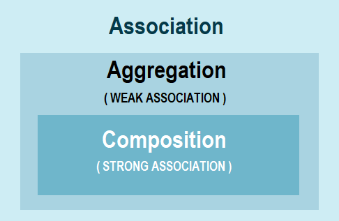

### OOPS Concepts

- **Class** : A class is blueprint which contains state and behaviour which acts on that state.
- **Object** : Objects are instances of a class with particular values for state on which methods can act. `Square obj = new Square()`
- **Polymorphism** : Polymorphism is the ability to process objects differently based on the data type or class. `overloading`, `overriding` methods
- In object-oriented programming concept, polymorphism refers to the ability of an object to take on many forms.
- In Java, polymorphic behaviour is achieved thorugh overriding parent class method with child class method. If one child class object is assigned to parent class reference, and the method is invoked on the parent class reference, then child class method will be called at runtime.
- Information about what an object looks like is called its state.
- The most common relation ships between classes are:
  - _Dependence_ ("uses-a") most obvious and most general. e.g, Order class uses the Account class because Order objects need to access Account objects to check for credit status.
  - _Aggregation_ ("has-a") e.g, Order object contains Item objects.
  - _Inheritance_ ("is-a") e.g, a RushOrder class inherits from an Order class.
- `Objects.requireNonNullElse(n, 'unknown')`
- `Objects.requireNonNull(n, 'The name can't be null')`
- Be careful not to write accessor methods that return references to mutable objects.
- As a rule of thumb, always use `clone` to return a copy of a mutable field.
- Use static methods in two situations:
  - When a method doesn't need to access the object state because all needed parameters are supplied as explicit parameters.
  - When a method only needs to access static fields of the class.
- `finalize` method is deprecated. It was intended to be called before the garbage collector sweeps away an object.
- If the subclass constructor doesn't call a superclass constructor, the no-arg constructor of the superclass is invoked. If the superclass doesn't have a no-arg constructor and subclass constructor doesn't call another superclass constructor explicitly, the compiler reports and error.
- The fact that an object variable can refer to multiple actual types is called _polymorphism_. Automatically selecting the appropriate method at runtime is called _dynamic binding_

### What is Inheritance in Java?

- Inheritance allows classes to imbibe certain properties and behaviours from parent class. `extends`, `implements`
- Inheritance can be defined as the process where one class acquires the properties (methods and fields) of another. With the use of inheritance the information is made manageable in a hierarchical order.
- The class which inherits the properties of other is known as subclass (derived class, child class) and the class whose properties are inherited is known as superclass (base class, parent class).
- The keyword used for inheritance is **extends**.
- `super` keyword is similar to this keyword. Following are the scenarios where the `super` keyword is used.
  - It is used to differentiate the members of superclass from the members of subclass, if they have same names. If a class is inheriting the properties of another class and if the members of the superclass have the names same as the sub class, to differentiate these variables we use super keyword
  - It is used to invoke the superclass constructor from subclass.
- **Important facts about inheritance in Java**
  - **Default superclass**: Except Object class, which has no superclass, every class has one and only one direct superclass (single inheritance).
  - **Superclass can only be one**: A superclass can have any number of subclasses. But a subclass can have only one superclass. This is because Java does not support multiple inheritance with classes. Although with interfaces, multiple inheritance is supported by Java.
  - **Inheriting Constructors**: A subclass inherits all the members (fields, methods, and nested classes) from its superclass. Constructors are not members, so they are not inherited by subclasses, but the constructor of the superclass can be invoked from the subclass.
  - **Private member inheritance**: A subclass does not inherit the private members of its parent class. However, if the superclass has public or protected methods(like getters and setters) for accessing its private fields, these can also be used by the subclass.
  - **Note** : a class can’t directly access the members from grand parent class.
- **Few important Points** :
  1. **The overriding method must not have more restrictive access modifier.**
     - If the overridden method has default access, then the overriding one must be default, protected or public.
     - If the overridden method is protected, then the overriding one must be protected or public.
     - If the overridden method is public, then the overriding one must be only public.
  2. **The synchronized modifier has no effect on the rules of overriding.**
  3. **Constructors cannot be overridden.**
     - Because constructors are not methods and a subclass’ constructor cannot have same name as a superclass’ one, so there’s nothing related between constructors and overriding.
  4. **The overriding method must not throw new or broader checked exceptions.**
     - In other words, the overriding method may throw fewer or narrower checked exceptions, or any unchecked exceptions.

```java
public class Animal {
    protected void move() throws IOException {
        // animal moving code
    }
}
```

```java
/*
The following subclass - Dog, correctly overrides the move() method because the `FileNotFoundException` is a subclass of the `FileIOException`:
*/
public class Dog extends Animal {
    protected void move() throws FileNotFoundException {
        // dog moving code
    }
}
```

```java
/*
The following example shows an illegal overriding attempt because the `InterruptedException` is a new and checked exception:
*/
public class Dog extends Animal {
    protected void move() throws IOException, InterruptedException {
        // dog moving code
    }
}
```

### Can we override a method which throws runtime exception without throws clause?

- Yes, there is no restriction on unchecked exception while overriding. On the other hand, in the case of checked exception, an overriding exception cannot throw a checked exception which comes higher in type hierarchy e.g. if original method is throwing IOException than overriding method cannot throw Java.lang.Exception or Java.lang.Throwable.

### Can we prevent overriding a method without using the final modifier?

- Yes, you can prevent the method overriding in Java without using the final modifier. In fact, there are several ways to accomplish it e.g. you can mark the method private or static, those cannot be overridden.

### Can you overload or override static method in Java?

- **Can we overload static methods?**
  - The answer is ‘Yes’. We can have two or more static methods with same name, but differences in input parameters.
- **Can we overload methods that differ only by static keyword?**
  - We cannot overload two methods in Java if they differ only by static keyword (number of parameters and types of parameters is same)

```java
public class Test {
    public static void foo() {
        System.out.println(“Test.foo() called”);
    }

    public void foo() {	// Compiler Error : cannot redefine foo()
        System.out.println(“Test.foo(int) called”);
    }

    public static void main(String args[]) {
        Test.foo();
    }
}
```

- **Can we Override static methods in Java?**
  - We can declare static methods with same signature in subclass, but it is not considered overriding as there won’t be any run-time polymorphism. Hence the answer is ‘No’.
  - If a child class defines a static method with same signature as a static method in parent class, the method in the parent class hides the method in the child class. Which means if we do inheritance test, it will call parent method.

```java
class Parent{
    public static void MethodA() {
        System.out.println("Parent");
    }
}

class Child extends Parent{
    public static void MethodA() {
        System.out.println("Child");
    }
}

public class InheritanceTest {
	public static void main(String[] args) {
       //  As per overriding rules child method should be called. Since static
       //  method can not be overridden, it will call parent method.
       Parent pc = new Child();
       pc.methodA();
    }
}

// Output : Parent
```

- **Can we override constructor in Java?**
  - No, you cannot override constructor in Java because they are not inherited. Remember, we are talking about overriding here not overloading, you can overload construct but you cannot override them. Overriding always happens at child class and since constructor are not inherited and their name is always same as the class name its not possible to override them in Java

### Can you overload or override private method in Java?

- **Yes we can overload a private method** just like normal overloading in a class.
- **You can't override a private method**, but you can introduce one in a child class without a problem. But when we try to override it, it will gives a compile time error.

```java
class Base {
    private void fun() {
        System.out.println("Base fun");
    }
}

class Derived extends Base {
    private void fun() {
		System.out.println("Derived fun");
	}

	public static void main(String[] args) {
      Base obj = new Derived();
	  obj.fun();
    }
}
```

- We get compiler error **fun() has private access in Base**. So the compiler tries to call base class function, not derived class, means fun() is not overridden.

### Can you overload or override final method in Java?

- Overloading final methods is legal in a similar way of overloading non-final methods.
- Overriding : A final method means that it cannot be re-implemented by a subclass, thus it cannot be overridden. Final keyword will lost its existence if it would have been overridden. We can **Inherit** the final method but can not override final method inside child class.

```java
public class Animal {
    final void sleep() {
        // animal code...
    }
}

public class Dog extends Animal {
    public void sleep() {
		// Dog code...
	}
}
```

- Here, the Animal’s `sleep()` method is marked as `final`, therefore the Dog class won’t compile. The compiler will complain:

```
Cannot override the final method from Parent
error: sleep() in Dog cannot override sleep() in Animal
```

- We can **Inherit** the final method but can not override final method inside child class.

```java
class Parent{
    final void PrintMessage() {
        System.out.println("I am Inherited");
    }

class Child extends Parent{
}

    public static void main(String[] args) {
        Child c1 = new  Child();
	    c1.PrintMessage ();
    }
}
// O/p : I am inherited
```

### What is covariant method overriding in Java?

- Before JDK 5.0, it was not possible to override a method by changing the return type. When we override a parent class method, the name, argument types and return type of the overriding method in child class has to be exactly same as that of parent class method. Overriding method was said to be **invariant** with respect to return type.
  Java 5.0 onwards it is possible to have different return type for a overriding method in child class, but child’s return type should be **sub-type** of parent’s return type. Overriding method becomes **variant** with respect to return type.
- **Advantages**:
  - It helps to avoid confusing type casts present in the class hierarchy and thus making the code readable, usable and maintainable.
  - We get a liberty to have more specific return types when overriding methods.
  - Helps in preventing run-time ClassCastExceptions on returns
- **Clone example explained**
  - The clone method of class Object illustrates the advantages of covariant overriding:
  - In Java 1.4, any class that overrides clone must give it exactly the same return type, namely Object
  - In Java 5, it is possible to give the clone method a return type that is more to the point.

### What is association?

- Association is a relationship where all object have their own lifecycle and there is no owner. Let’s take an example of Teacher and Student. Multiple students can associate with a single teacher and a single student can associate with multiple teachers but there is no ownership between the objects and both have their own lifecycle. These relationship can be one to one, One to many, many to one and many to many.

### What do you mean by aggregation?

- When objects depend on each other, but they have their own independent existence. Person has a Car and both can exist independently.
- Aggregation is a specialized form of Association where all object have their own lifecycle but there is ownership and child object can not belongs to another parent object. Let’s take an example of Department and teacher. A single teacher can not belongs to multiple departments, but if we delete the department, teacher object will not destroy.
- It is a special form of Association where:
  - It represents **Has-A** relationship.
  - It is a **unidirectional association** i.e. a one way relationship. For example, department can have students but vice versa is not possible and thus unidirectional in nature.
- In Aggregation, **both the entries can survive individually** which means ending one entity will not effect the other entity
- Code reuse is best achieved by aggregation.

### What is composition in Java?

- When one object contains another object & outer object cannot exist without the other. e.g Car contains Engine and engine can't exist independently
- Composition is again specialized form of Aggregation and we can call this as a “death” relationship. It is a strong type of Aggregation. Child object does not have their lifecycle and if parent object is deleted all child object will also be deleted. Let’s take again an example of relationship between House and rooms. House can contain multiple rooms there is no independent life of room and any room can not belongs to two different house if we delete the house, room will automatically delete.
- Composition is a restricted form of Aggregation in which two entities are highly dependent on each other.
  - It represents **part-of** relationship.
  - In composition, both the entities are dependent on each other.
- When there is a composition between two entities, the composed object **cannot exist** without the other entity.

### What is the difference between aggregation and composition?



- **Aggregation**: We call aggregation those relationships whose **objects have an independent lifecycle, but there is ownership**, and child objects cannot belong to another parent object.
- Example: Since Organization has Person as employees, the relationship between them is Aggregation. Here is how they look like in terms of Java classes

```java
public class Organization {
   private List<Person> employees;
}

public class Person {
   private String name;
}
```

- **Composition**: We use the term composition to refer to relationships whose objects **don’t have an independent lifecycle**, and if the parent object is deleted, all child objects will also be deleted.
- Example: Since Engine is-part-of Car, the relationship between them is Composition. Here is how they are implemented between Java classes.

```java
public class Car {
    //final will make sure engine is initialized
    private final Engine engine;

    public Car(){
       engine  = new Engine();
    }
}

class Engine {
    private String type;
}
```

| Aggregation                                                                                                                                                                                                                                                                                                                                                             | Composition                                       |
| ----------------------------------------------------------------------------------------------------------------------------------------------------------------------------------------------------------------------------------------------------------------------------------------------------------------------------------------------------------------------- | ------------------------------------------------- |
| Aggregation is a weak Association.                                                                                                                                                                                                                                                                                                                                      | Composition is a strong Association.              |
| Class can exist independently without owner.                                                                                                                                                                                                                                                                                                                            | Class can not meaningfully exist without owner.   |
| Have their own Life Time.                                                                                                                                                                                                                                                                                                                                               | Life Time depends on the Owner.                   |
| A uses B.                                                                                                                                                                                                                                                                                                                                                               | A owns B.                                         |
| Child is not owned by 1 owner.                                                                                                                                                                                                                                                                                                                                          | Child can have only 1 owner.                      |
| Has-A relationship. A has B.                                                                                                                                                                                                                                                                                                                                            | Part-Of relationship. B is part of A.             |
| Denoted by a empty diamond in UML.                                                                                                                                                                                                                                                                                                                                      | Denoted by a filled diamond in UML.               |
| We do not use "final" keyword for Aggregation.                                                                                                                                                                                                                                                                                                                          | "final" keyword is used to represent Composition. |
| Examples:<br>- Car has a Driver.<br>- A Human uses Clothes.<br>- A Company is an aggregation of People.<br>- A Text Editor uses a File.<br>- Mobile has a SIM Card.</td><td>Examples:<br>- Engine is a part of Car.<br>- A Human owns the Heart.<br>- A Company is a composition of Accounts.<br>- A Text Editor owns a Buffer.<br>- IMEI Number is a part of a Mobile. |

_Note: "final" keyword is used in Composition to make sure child variable is initialized._

### What is encapsulation? What is the primary benefit of encapsulation?

- Concept of binding data with member functions. Aims at hiding class members from outside interference and misuse. `public`, `protected`, `private`, `default`
- It is the technique of making the fields in a class private and providing access to these fields with the help of public methods. If a field is declared private, it cannot be accessed by anyone outside the class, thereby hiding the fields within the class. Therefore encapsulation is also referred to as data hiding.
- The main benefit of encapsulation is the ability to modify the implemented code without breaking the code of others who use our code. It also provides us with maintainability, flexibility and makes our code extensible.
- Encapsulation means combining the data of our application and its manipulation at one place. Encapsulation allows the state of an object to be accessed and modified through behaviour. It reduces the coupling of modules and increases the cohesion inside them.
- **Advantages of using encapsulation while writing code in Java** :
  1. More flexible and easy to change with new requirements. The fields of a class can be made read-only or write-only.
  2. It makes unit testing easy.
  3. It allows you to control who can access what. A class can have total control over what is stored in its fields.
  4. It also helps to write immutable classes in Java which is a good choice in multi-threading environment.
  5. It reduces coupling of modules and increases cohesion inside a module because all the pieces of one thing are encapsulated in one place.
  6. It allows you to change one part of code without affecting other part of code. The users of a class do not know how the class stores its data. A class can change the datatype of a field and users of the class do not need to make any changes to their code.
- **What should you encapsulate in code?**
  - Anything which can be changed or which is more likely to be changed in near future is candidate of encapsulation. This also helps to write more specific and cohesive code. For instance object creation code, code which can be improved in future like sorting and searching logic.
- **To achieve encapsulation in Java:**
  - Declare the variables of a class as 'private'.
  - Provide public setter and getter methods to modify and view the variable's values.

### What is Abstraction? Explain in details.

- **Hiding internal details and showing functionality** is known as abstraction. For example: phone call, we don't know the internal processing. In Java, we use abstract class and interface to achieve abstraction.
- **Abstract class**: These classes cannot be **instantiated** and are either partially implemented or not at all implemented. We can not create the object of it. This class contains one or more abstract methods which are simply method declarations without a body.
- **Interface**: In Java an interface just defines the methods and not implement them. Interface can include constants. A class that implements the interfaces is bound to implement all the methods defined in an interface.
- **Interface cannot be instantiated**. An interface does not contain any constructors.
- Abstract classes are useful in a situation where general methods need to be implemented while specialization behavior should be implemented by child classes.
- Interfaces are useful in a situation where all properties need to be implemented.
- Difference between an interface and an abstract class is as follows:
  - Interfaces provide a kind of multiple inheritance. A class can extend only one class.
  - Interfaces are limited to public methods and constants with no implementation of methods. Abstract classes can have a partial implementation, protected methods, static methods, etc.
  - A class may implement several interfaces. But in case of an abstract class, a class may extend only one abstract class.
  - Interfaces are slow as it requires extra direction to find corresponding method in the actual class whereas abstract classes are fast.

### What is the difference between abstraction and encapsulation?

- Abstraction solves the problem at design level while Encapsulation solves it implementation level.
- In Java, Abstraction is supported using `interface` and `abstract class` while Encapsulation is supported using access modifiers e.g. public, private and protected.
- Abstraction is about hiding unwanted details while giving out most essential details, while Encapsulation means hiding the code and data into a single unit e.g. class or method to protect inner working of an object from outside world.

| Abstraction                                                                  | Encapsulation                                                                   |
| ---------------------------------------------------------------------------- | ------------------------------------------------------------------------------- |
| hiding the implementation details and showing only functionality to the user | wrapping code and data together into a single unit                              |
| lets you focus on what the object does instead of how it does it.            | provides you the control over the data and keeping it safe from outside misuse. |
| solves the problem in the Design Level                                       | solves the problem in the Implementation Level                                  |
| implemented by using Interfaces and Abstract Classes                         | implemented by using Access Modifiers (private, default, protected, public)     |

### What is a marker or tagged interface?

- Marker interface is an interface with no fields or methods in Java.
- Uses of marker interface are as follows:
  - We use marker interface to tell Java compiler to add special behavior to the class implementing it.
  - Java marker interface has no members in it.
  - It is implemented by classes in order to get some functionality.
- For instance when we want to save the state of an object then we can implement serializable interface.
- For example: Serializable, Cloneable, Remote etc

### Can we have a non-abstract method inside interface?

- From Java 8 onward you can have a non-abstract method inside interface, prior to that it was not allowed as all method was implicitly public abstract. From JDK 8, you can add static and default method inside an interface.

### What is the default method of Java 8?

- Default method, also known as extension method are new types of the method which you can add on the interface now. These method has implementation and intended to be used by default. By using this method, JDK 8 managed to provide common functionality related to lambda expression and stream API without breaking all the clients which implement their interfaces. If you look Java 8 API documentation you will find several useful default method on key Java interface like Iterator, Map etc.

### Can we make a class both final and abstract at the same time?

- No, you cannot apply both final and abstract keyword at the class same time because they are exactly opposite of each other. A final class in Java cannot be extended and you cannot use an abstract class without extending and make it a concrete class. As per Java specification, the compiler will throw an error if you try to make a class abstract and final at the same time.

### What is Coupling and Cohesion in Java?

- **Coupling** is the degree to which one class knows about another class. If class A knows class B through its interface only i.e it interacts with class B through its API then class A and class B are said to be loosely coupled. So its always a good OO design principle to use loose coupling between the classes i.e all interactions between the objects in OO system should use the APIs. An aspect of good class and API design is that classes should be well encapsulated.
- **Cohesion** is used to indicate the degree to which a class has a single, well-focused purpose. Coupling is all about how classes interact with each other, on the other hand cohesion focuses on how single class is designed. Higher the cohesiveness of the class, better is the OO design.
- Benefits of Higher Cohesion:
  - Highly cohesive classes are much easier to maintain and less frequently changed.
  - Such classes are more usable than others as they are designed with a well-focused purpose.
- **Best design is loose coupling and high cohesiveness**

### What is method hiding in Java?

- static method cannot be overridden in Java because their method calls are resolved at compile time but it didn't prevent you from declaring method with same name in sub class. In this case we say that method in sub class hid static method from parent class. If you have a case where variable of Parent class is pointing to object of Child class then also static method from Parent class is called because overloading is resolved at compile time.

### If you have a big application having many classes. Now you have a class Application.java which is having scope as prototype. Now I have started the application , How many objects of that class will be created ?

- We can keep track of the number of objects that have been created in a class using a static variable Because a static variable is linked to a class and not to an object. We will create a static variable count and keep incrementing it inside it’s default constructor inside that class and keep a `System.out.println(“Count is = ”+ count++)`, then it will give you the number of objects created for that class, wherever this class is getting called and its object is getting created because as constructor is called every time an object is instantiated.

```java
class Students{

    public String name;
    public int age;
    public static int numberofobjects = 0;

    Students (String name, int age){
        this.name= name;
    	this.age= age;
    	numberofobjects++;
    }
}
```

### Can you prevent overriding a method without using final modifier?

- We can use private keyword to prevent method overriding. In order to override a method, the class must be extensible. If you make the constructor of parent class private then its not possible to extend that class because its constructor will not be accessible in sub class, which is automatically invoked by sub class constructor, hence its not possible to override any method from that class. This technique is used in Singleton design pattern, where constructor is purposefully made private and a static getInstance() method is provided to access singleton instance.

### In a class, one method has two overloaded forms. One form is defined as static and another form is defined as non-static. Is that method properly overloaded?

- Yes. Compiler checks only method signature to verify whether a particular method is properly overloaded or not. It doesn’t check static or non-static feature of the method.
- **Method signature consists of** - Method Name, Number Of Arguments, Types Of Arguments and Order Of Arguments

### Method Overloading mechanism

- If more than one member method is both accessible and applicable to a method invocation, it is necessary to choose one to provide the descriptor for the run-time method dispatch. The Java programming language uses the rule that the most specific method is chosen
- **Note**: `int` is primitive type in Java but `int[]` is not primitive and it is class which extends Object class.
  you can pass null to int[] because it is object and passing null to int will give compiler error.

```java
Object ref=new int[]{1,2,3};   // valid statement?
Object[] ref=new int[]{1,2,3}; // valid statement?
```

- 1st line is perfectly valid because int[] extends Object and Object is base class.
- 2nd line is invalid statement because int[] extends Object class and not Object[] class.
- **Note**: Rules that applies for evaluating method call in overloading.
  1. Widening wins over boxing eg. `test(10)` will call `test(long)` instead of `test(Integer)` if both are available.
  2. Widening wins over var-args eg test(byte,byte) will call test(int,int) instead of test(byte...x) method.
  3. Boxing beats var-args eg `test(byte, byte)` will call `test(Byte, Byte)` instead of `test(byte...x)` method.
  4. Widening of reference variable depends on inheritance tree (so, Integer cannot be widened to Long. But, Integer widened to Number because they are in same inheritance hierarchy).
  5. You **cannot** widen and then box. Eg. `test(int)` cannot call `test(Long)` since to call `test(Long)` the compiler need to convert `int` to `Integer` then `Integer` to `Long` which is not possible.
  6. You **can** box and then widen. Eg. An `int` can boxed to `Integer` and then widen to `Object`.
  7. var-args can be combined with either boxing or widening.
- Java's widening conversions rules are,
  - From a byte ---> short ---> int ---> long ---> float ---> double
  - From a short ---> int ---> long ---> float ---> double
  - From a char ---> int ---> long ---> float ---> double
  - From an int ---> long ---> float ---> double
  - From a long ---> float ---> double
  - From a float ---> double
- Logical reason behind Var-args having least priority is because varargs were added late in Java API. Giving variable arguments an extremely low priority is also necessary for backwards-compatibility, otherwise giving high priority to variable argument will break already written overloaded methods.
- **Java overloaded method call is resolved using 3 steps**
  1. Compiler will try to resolve call without boxing and unboxing and variable argument.
  2. Compiler will try to resolve call by using boxing and unboxing.
  3. Compiler will try to resolve call by using boxing/unboxing and variable argument.
- If call is not resolved by using any of the 3 ways then it gives compile error.

### Can a Static method be called using instance variable?

- Yes, We can call the static method using instance variable. It will give the warning but it will run fine.

```java
class Parent {
    public static void print() {
        System.out.println("I am Parent");
    }
}

public class MainClass {
    public static void main(String args[]) {
        Parent parent = new Parent();
        parent.print();
    }
//output : I am Parent
}
```

- What if that instance variable is null, will it throw Null pointer exception? In above code if `Parent parent = null;` `Output : I am Parent`

**Explanation**:

```java
Parent parent = null;
parent.print();
```

- So internally what Compiler does is it checks whether print() method is static, if yes, then it replace the instance to instance type.
- parent object is of type Parent, so it replaces it to, Parent.print(); at compile time itself and at runtime there is no Null Pointer Exception.

### What do you mean by instance method of Subclass cannot override static method of Base class?

```java
class Parent{
    public static void print(){
        System.out.println("I am Parent");
    }
}

class Child extends Parent{
    public void print(){
        System.out.println("I am Child");
    }
}

public class MainClass {
    public static void main(String args[]) {
        Parent parent = new Child();
        parent.print();
    }
}
```

- **Output** : Compilation Error at line 8. Error says: "This instance method cannot override the static method from Parent"
- **Explanation**: An instance method from subclass cannot override `static(class)` method from super class.
  - Lets say Java allows instance method overriding static method from parent class, then `parent.print();` will call `print()` method of Parent or Child class?
  - `print()` method is static in Parent class, so call should be evaluated to `Parent.print()` but at the same time `print()` method in subclass is not static and it supports polymorphic behavior. so what to do?
  - that is why it gives compile error and doesn't supports instance method overriding static methods from Super class.

### What is the output of below program? will there be any error/exception? if yes then compile time or run time and why?

```java
interface SInterface1 {}

class SampleClass1 {}

class MainTest1 {
    public static void main(String[] args) {
        SampleClass1 sc1 = new SampleClass1();
        SInterface1 sc2 = (SInterface1) sc1;
    }
}
```

Answer : It will **NOT** give Compile Time Error but will give Runtime Exception:
"Java.lang.ClassCastException: SampleClass cannot be cast to SInterface1".

- **Question here is why it didn't gave Compile time error?**
  - Compiler is really not sure here to give compile error because sc1 at runtime can be reference of class SampleClass2, say (class SampleClass2 extends SampleClass1 implements SInterface1) in that case typecasting is perfectly valid. So Compiler doesn't give Compile error in this case, but when you run the program it sees that sc1 doesn't point to class that implements SInterface1 and that is why it cannot be typecasted.
- Valid typecase possible at runtime,

```java
interface SInterface1 {}

class SampleClass1 {}

class SampleClass2 extends SampleClass1 implements SInterface1{}

class MainTest1 {
    public static void main(String[] args) {
        SampleClass1 sc1 = new SampleClass1();
        sc1 = new SampleClass2();
        SInterface1 sc2 = (SInterface1) sc1;
    }
}
```

### What is the output of below program? will there be any error/exception? if yes then compile time or run time and why?

```java
class ClassA{}
class ClassB{}

interface InterfaceI{}

class MainTest11 {
    public static void main(String[] args) {
        InterfaceI i = (InterfaceI)(new ClassA());
        ClassA b = (ClassB)(new ClassA());
    }
}
```

It will give Compile Time Error: "Cannot cast from ClassA to ClassB" at line 9.
It will give Runt Time ClassCastException: "ClassA cannot be cast to InterfaceI" at line 8.

### What is the output of below program? will there be any error/exception? if yes then compile time or run time and why?

```java
interface Interface1 { }
interface Interface2 { }
class Class1 implements Interface1 { }

class Test{
 public static void main(){
  Class1 c1 = new Class1();
  String str = new String("Hello"); //OR Integer str = new Integer(1);

  Interface2 x = (Interface2) c1;  //why compiler does not complain here?
  Interface2 y = (Interface2) str; //why compiler complains here?
 }}
```

- It will not give Compile time Error at line 10 but gives Compile error at line 11, why?
- According to previous question, which explains rules of typecasting, `Interface2 x = (Interface2) c1;`
- Compiler will not care what c1 is, it just validates "whether c1 can be object of a Class which is subclass of c1's class type and implements Interface2"?
- For line 10, that is possible because there can be class like,

```java
Class A extends Class1 implements Interface2{}
c1 = new A();
Interface2 x = (Interface2) c1;
```

- For line 9, that is not possible, str can't be object of class,
  1. which extends String class and (This is not possible)
  2. Implements Interface2. (This is possible)
- String is as final class, So no class can be subclass of (extends) String class, that is why compiler is sure and gave compile error at line 11.
- If we declare Class1 final, then compiler will complain at line 10 as well.

### Can Interface access methods of Object class? What is the output of below program? Will it compile and run properly?

```java
interface ITest{
 String abc();
}

class CTest implements ITest{
    @Override
    public String abc() {
       return "hello";
    }
}
class Test{
    public static void main(String[] args) {
        ITest i = new CTest();
        System.out.println(i.abc());
        System.out.println(i.toString());
    }
}
```

hello
CTest@4e44ac6a

- Call to i.abc() is fine but call to i.toString() method should work or should not work as toString() method is not declared in interface ITest.
- Yes. It should work because all the public methods of Object class are accessible through interface object.
- **Note**: Interface doesn't extends Object class by default.
- Every Interface (that doesn't explicitly extend another interface) has an implicit method declaration for each public method in Object class thats is why you can see all the Object class methods accessible on "i" in above program.
- **Details**:
  - If an interface has no direct superinterfaces, then the interface implicitly declares a public abstract member method m with signature s, return type r, and throws clause t corresponding to each public instance method m with signature s, return type r, and throws clause t declared in Object, unless a method with the same signature, same return type, and a compatible throws clause is explicitly declared by the interface.

### What is Java Reflection API?

- **Java Reflection** is a process of examining or modifying the run time behavior of a class at run time.
- The `java.lang.class` class provides many methods that can be used to get metadata, examine and change the run time behavior of a class.
- The java.lang and java.lang.reflect packages provide classes for Java reflection.
- Reflection can be used to get information about –
  1. **Class** The getClass() method is used to get the name of the class to which an object belongs.
  2. **Constructors** The getConstructors() method is used to get the public constructors of the class to which an object belongs.
  3. **Methods** The getMethods() method is used to get the public methods of the class to which an objects belongs.
- The Reflection API is mainly used in:
  - IDE (Integrated Development Environment) e.g. Eclipse, MyEclipse, NetBeans etc.
  - Debugger
  - Test Tools etc.
- **Important observations** :
  1. We can invoke any method through reflection if we know its name and parameter types. We use below two methods for this purpose `getDeclaredMethod()` : To create an object of method to be invoked. The syntax for this method is `Class.getDeclaredMethod(name, parametertype)`
     - name - the name of method whose object is to be created
     - parametertype - parameter is an array of Class objects
     - `invoke()` : To invoke a method of the class at runtime we use following method `Method.invoke(Object, parameter)`
     - If the method of the class doesn’t accepts any parameter then null is passed as argument.
  2. Through reflection we can access the private variables and methods of a class with the help of its class object and invoke the method by using the object as discussed above. We use below two methods for this purpose.
     - `Class.getDeclaredField(FieldName)` : Used to get the private field. Returns an object of type Field for specified field name.
     - `Field.setAccessible(true)` : Allows to access the field irrespective of the access modifier used with the field.
- **newInstance() method**
  - The **newInstance()** method of Class class and Constructor class is used to create a new instance of the class.
  - The newInstance() method of Class class can invoke zero-argument constructor whereas newInstance() method of Constructor class can invoke any number of arguments. So Constructor class is preferred over Class class.

```java
class Simple{
    void message(){
        System.out.println("Hello Java");
    }
}

class Test{
    public static void main(String args[]){
        try {
            Class c=Class.forName("Simple");
            Simple s=(Simple)c.newInstance();
            s.message();
        } catch(Exception e){
            System.out.println(e);
        }
    }
}
```

### What are different ways to get the instance of Class class

1. **forName() method of Class class**
   - is used to load the class dynamically.
   - returns the instance of Class class.
   - It should be used if you know the fully qualified name of class. This cannot be used for primitive types.
2. **getClass() method of Object class**
   - It returns the instance of Class class. It should be used if you know the type. Moreover, it can be used with primitives.

```java
class Simple{}

class Test {
  void printName(Object obj) {
    Class c=obj.getClass();
    System.out.println(c.getName());
  }
  public static void main(String args[]) {
    Simple s=new Simple();
    Test t=new Test();
    t.printName(s);
  }
}
// o/p : Simple
```

3.  **The .class syntax**
    - If a type is available but there is no instance then it is possible to obtain a Class by appending ".class" to the name of the type. It can be used for primitive data type also.

```java
class Test {
  public static void main(String args[]) {
   Class c = boolean.class;
   System.out.println(c.getName());

   Class c2 = Test.class;
   System.out.println(c2.getName());
 }
}
```

Output

```
boolean
Test
```

### What is the output of below program? Is it valid overriding of method test() of interface ITest?

```java
interface ITest{
    Object test(Object o) throws IOException;
}

class CTest implements ITest{
    @Override
    public synchronized String test(Object o) throws IOException, FileNotFoundException, EOFException, StackOverflowError,IndexOutOfBoundsException {
        return "hello";
    }
}
```

- Yes. It is perfectly valid method overriding.
  1. Access specifier of method cannot be changed which is public in class CTest and is valid.
  2. Adding or removing synchronized keyword doesn't take part in overriding as it is upto implementer whether they want several threads to allow method execution simultaneously or one after another. So it is valid.
  3. Return type should be same or compatible(belong from hierarchy). String(all class) by default extends Object, so belongs from hierarchy and is valid.
  4. Name of method should be exactly same and it is valid.
  5. Parameter should be exactly same and it is valid.
     - **Note**: Compatible parameters that is parameter from same hierarchy tree is Invalid and it should be exactly same.(In our case, decaring parameter as String for test() in CTest is invalid).
  6. For Exception, If overriding method choose not to throw any Exception is perfectly valid even if overriden method in interface is throwing.
- So in our case if overriding test() method choose not to throw any Exception then also it is perfectly valid.
- If it throws then it should be same or any number of compatible exceptions.
- Runtime exception will not take part in overriding, it is upto overriding method to throw or not to throw Runtime exception.

### How to call private method from another class in Java?

- You can call the private method from outside the class by changing the runtime behaviour of the class.
- By the help of Java.lang.Class class and Java.lang.reflect.Method class, we can call private method from any other class.
- Required methods of Method class :
  1. public void setAccessible(boolean status) throws SecurityException sets the accessibility of the method.
  2. public Object invoke(Object method, Object... args) throws IllegalAccessException, IllegalArgumentException, InvocationTargetException is used to invoke the method.
- Required method of Class class.
  public Method getDeclaredMethod(String name,Class[] parameterTypes)throws NoSuchMethodException,SecurityException: returns a Method object that reflects the specified declared method of the class or interface represented by this Class object.
- Example of calling private method from another class

```java
public class A {
    private void message(){
        System.out.println("hello Java");
    }
}


public class MethodCall {
    public static void main(String[] args)throws Exception{
        Class c = Class.forName("A");
        Object o= c.newInstance();
        Method m =c.getDeclaredMethod("message", null);
        m.setAccessible(true);
        m.invoke(o, null);
    }
}
```

### Why we should write override explicitly.

- It lets the compiler double-check for you when you say (by annotating) that a specified method is supposed to override a superclass method (or implement an interface method in Java 6 or later). If the method does not, in fact, override a superclass method (or implement an interface method), the compiler will flag this as an error.
- This often indicates that you have a typo in the method name or made a mistake in the method signature.
  Its not mandatery but It's recommended since it helps to manage consistence.
- Imagine someone will change the name of superclass method (and only there, without performing name-changes in classes depending on it which is quite hypothetical, then you will be the first one to know due to compilation errors.
